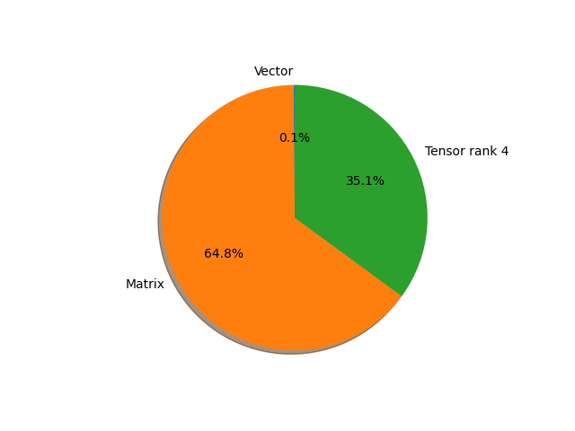

# regnet_y_32gf parameter information

**Number of layers: [ 277 ]**

**Number of parameters: [ 145.05M ]**

**Proportional of each form** (%)

| Vector | Matrix | Tensor rank 4 | 
|  --- | --- | --- |
| 61.73 | 30.69 | 7.58 | 

**Proportional of parameters by form** (%)

| Vector | Matrix | Tensor rank 4 | 
|  --- | --- | --- |
| 0.13 | 64.80 | 35.07 | 

**Layer information**

| Name | Shape | Squeezed shape | Number of parameters | Form |
| --- | --- | --- | --- | --- |
| stem.0.weight | (32, 3, 3, 3) | (32, 3, 3, 3) | 864 | Tensor rank 4 |
| stem.1.weight | (32,) | (32,) | 32 | Vector |
| stem.1.bias | (32,) | (32,) | 32 | Vector |
| trunk_output.block1.block1-0.proj.0.weight | (232, 32, 1, 1) | (232, 32) | 7424 | Matrix |
| trunk_output.block1.block1-0.proj.1.weight | (232,) | (232,) | 232 | Vector |
| trunk_output.block1.block1-0.proj.1.bias | (232,) | (232,) | 232 | Vector |
| trunk_output.block1.block1-0.f.a.0.weight | (232, 32, 1, 1) | (232, 32) | 7424 | Matrix |
| trunk_output.block1.block1-0.f.a.1.weight | (232,) | (232,) | 232 | Vector |
| trunk_output.block1.block1-0.f.a.1.bias | (232,) | (232,) | 232 | Vector |
| trunk_output.block1.block1-0.f.b.0.weight | (232, 232, 3, 3) | (232, 232, 3, 3) | 484416 | Tensor rank 4 |
| trunk_output.block1.block1-0.f.b.1.weight | (232,) | (232,) | 232 | Vector |
| trunk_output.block1.block1-0.f.b.1.bias | (232,) | (232,) | 232 | Vector |
| trunk_output.block1.block1-0.f.se.fc1.weight | (8, 232, 1, 1) | (8, 232) | 1856 | Matrix |
| trunk_output.block1.block1-0.f.se.fc1.bias | (8,) | (8,) | 8 | Vector |
| trunk_output.block1.block1-0.f.se.fc2.weight | (232, 8, 1, 1) | (232, 8) | 1856 | Matrix |
| trunk_output.block1.block1-0.f.se.fc2.bias | (232,) | (232,) | 232 | Vector |
| trunk_output.block1.block1-0.f.c.0.weight | (232, 232, 1, 1) | (232, 232) | 53824 | Matrix |
| trunk_output.block1.block1-0.f.c.1.weight | (232,) | (232,) | 232 | Vector |
| trunk_output.block1.block1-0.f.c.1.bias | (232,) | (232,) | 232 | Vector |
| trunk_output.block1.block1-1.f.a.0.weight | (232, 232, 1, 1) | (232, 232) | 53824 | Matrix |
| trunk_output.block1.block1-1.f.a.1.weight | (232,) | (232,) | 232 | Vector |
| trunk_output.block1.block1-1.f.a.1.bias | (232,) | (232,) | 232 | Vector |
| trunk_output.block1.block1-1.f.b.0.weight | (232, 232, 3, 3) | (232, 232, 3, 3) | 484416 | Tensor rank 4 |
| trunk_output.block1.block1-1.f.b.1.weight | (232,) | (232,) | 232 | Vector |
| trunk_output.block1.block1-1.f.b.1.bias | (232,) | (232,) | 232 | Vector |
| trunk_output.block1.block1-1.f.se.fc1.weight | (58, 232, 1, 1) | (58, 232) | 13456 | Matrix |
| trunk_output.block1.block1-1.f.se.fc1.bias | (58,) | (58,) | 58 | Vector |
| trunk_output.block1.block1-1.f.se.fc2.weight | (232, 58, 1, 1) | (232, 58) | 13456 | Matrix |
| trunk_output.block1.block1-1.f.se.fc2.bias | (232,) | (232,) | 232 | Vector |
| trunk_output.block1.block1-1.f.c.0.weight | (232, 232, 1, 1) | (232, 232) | 53824 | Matrix |
| trunk_output.block1.block1-1.f.c.1.weight | (232,) | (232,) | 232 | Vector |
| trunk_output.block1.block1-1.f.c.1.bias | (232,) | (232,) | 232 | Vector |
| trunk_output.block2.block2-0.proj.0.weight | (696, 232, 1, 1) | (696, 232) | 161472 | Matrix |
| trunk_output.block2.block2-0.proj.1.weight | (696,) | (696,) | 696 | Vector |
| trunk_output.block2.block2-0.proj.1.bias | (696,) | (696,) | 696 | Vector |
| trunk_output.block2.block2-0.f.a.0.weight | (696, 232, 1, 1) | (696, 232) | 161472 | Matrix |
| trunk_output.block2.block2-0.f.a.1.weight | (696,) | (696,) | 696 | Vector |
| trunk_output.block2.block2-0.f.a.1.bias | (696,) | (696,) | 696 | Vector |
| trunk_output.block2.block2-0.f.b.0.weight | (696, 232, 3, 3) | (696, 232, 3, 3) | 1453248 | Tensor rank 4 |
| trunk_output.block2.block2-0.f.b.1.weight | (696,) | (696,) | 696 | Vector |
| trunk_output.block2.block2-0.f.b.1.bias | (696,) | (696,) | 696 | Vector |
| trunk_output.block2.block2-0.f.se.fc1.weight | (58, 696, 1, 1) | (58, 696) | 40368 | Matrix |
| trunk_output.block2.block2-0.f.se.fc1.bias | (58,) | (58,) | 58 | Vector |
| trunk_output.block2.block2-0.f.se.fc2.weight | (696, 58, 1, 1) | (696, 58) | 40368 | Matrix |
| trunk_output.block2.block2-0.f.se.fc2.bias | (696,) | (696,) | 696 | Vector |
| trunk_output.block2.block2-0.f.c.0.weight | (696, 696, 1, 1) | (696, 696) | 484416 | Matrix |
| trunk_output.block2.block2-0.f.c.1.weight | (696,) | (696,) | 696 | Vector |
| trunk_output.block2.block2-0.f.c.1.bias | (696,) | (696,) | 696 | Vector |
| trunk_output.block2.block2-1.f.a.0.weight | (696, 696, 1, 1) | (696, 696) | 484416 | Matrix |
| trunk_output.block2.block2-1.f.a.1.weight | (696,) | (696,) | 696 | Vector |
| trunk_output.block2.block2-1.f.a.1.bias | (696,) | (696,) | 696 | Vector |
| trunk_output.block2.block2-1.f.b.0.weight | (696, 232, 3, 3) | (696, 232, 3, 3) | 1453248 | Tensor rank 4 |
| trunk_output.block2.block2-1.f.b.1.weight | (696,) | (696,) | 696 | Vector |
| trunk_output.block2.block2-1.f.b.1.bias | (696,) | (696,) | 696 | Vector |
| trunk_output.block2.block2-1.f.se.fc1.weight | (174, 696, 1, 1) | (174, 696) | 121104 | Matrix |
| trunk_output.block2.block2-1.f.se.fc1.bias | (174,) | (174,) | 174 | Vector |
| trunk_output.block2.block2-1.f.se.fc2.weight | (696, 174, 1, 1) | (696, 174) | 121104 | Matrix |
| trunk_output.block2.block2-1.f.se.fc2.bias | (696,) | (696,) | 696 | Vector |
| trunk_output.block2.block2-1.f.c.0.weight | (696, 696, 1, 1) | (696, 696) | 484416 | Matrix |
| trunk_output.block2.block2-1.f.c.1.weight | (696,) | (696,) | 696 | Vector |
| trunk_output.block2.block2-1.f.c.1.bias | (696,) | (696,) | 696 | Vector |
| trunk_output.block2.block2-2.f.a.0.weight | (696, 696, 1, 1) | (696, 696) | 484416 | Matrix |
| trunk_output.block2.block2-2.f.a.1.weight | (696,) | (696,) | 696 | Vector |
| trunk_output.block2.block2-2.f.a.1.bias | (696,) | (696,) | 696 | Vector |
| trunk_output.block2.block2-2.f.b.0.weight | (696, 232, 3, 3) | (696, 232, 3, 3) | 1453248 | Tensor rank 4 |
| trunk_output.block2.block2-2.f.b.1.weight | (696,) | (696,) | 696 | Vector |
| trunk_output.block2.block2-2.f.b.1.bias | (696,) | (696,) | 696 | Vector |
| trunk_output.block2.block2-2.f.se.fc1.weight | (174, 696, 1, 1) | (174, 696) | 121104 | Matrix |
| trunk_output.block2.block2-2.f.se.fc1.bias | (174,) | (174,) | 174 | Vector |
| trunk_output.block2.block2-2.f.se.fc2.weight | (696, 174, 1, 1) | (696, 174) | 121104 | Matrix |
| trunk_output.block2.block2-2.f.se.fc2.bias | (696,) | (696,) | 696 | Vector |
| trunk_output.block2.block2-2.f.c.0.weight | (696, 696, 1, 1) | (696, 696) | 484416 | Matrix |
| trunk_output.block2.block2-2.f.c.1.weight | (696,) | (696,) | 696 | Vector |
| trunk_output.block2.block2-2.f.c.1.bias | (696,) | (696,) | 696 | Vector |
| trunk_output.block2.block2-3.f.a.0.weight | (696, 696, 1, 1) | (696, 696) | 484416 | Matrix |
| trunk_output.block2.block2-3.f.a.1.weight | (696,) | (696,) | 696 | Vector |
| trunk_output.block2.block2-3.f.a.1.bias | (696,) | (696,) | 696 | Vector |
| trunk_output.block2.block2-3.f.b.0.weight | (696, 232, 3, 3) | (696, 232, 3, 3) | 1453248 | Tensor rank 4 |
| trunk_output.block2.block2-3.f.b.1.weight | (696,) | (696,) | 696 | Vector |
| trunk_output.block2.block2-3.f.b.1.bias | (696,) | (696,) | 696 | Vector |
| trunk_output.block2.block2-3.f.se.fc1.weight | (174, 696, 1, 1) | (174, 696) | 121104 | Matrix |
| trunk_output.block2.block2-3.f.se.fc1.bias | (174,) | (174,) | 174 | Vector |
| trunk_output.block2.block2-3.f.se.fc2.weight | (696, 174, 1, 1) | (696, 174) | 121104 | Matrix |
| trunk_output.block2.block2-3.f.se.fc2.bias | (696,) | (696,) | 696 | Vector |
| trunk_output.block2.block2-3.f.c.0.weight | (696, 696, 1, 1) | (696, 696) | 484416 | Matrix |
| trunk_output.block2.block2-3.f.c.1.weight | (696,) | (696,) | 696 | Vector |
| trunk_output.block2.block2-3.f.c.1.bias | (696,) | (696,) | 696 | Vector |
| trunk_output.block2.block2-4.f.a.0.weight | (696, 696, 1, 1) | (696, 696) | 484416 | Matrix |
| trunk_output.block2.block2-4.f.a.1.weight | (696,) | (696,) | 696 | Vector |
| trunk_output.block2.block2-4.f.a.1.bias | (696,) | (696,) | 696 | Vector |
| trunk_output.block2.block2-4.f.b.0.weight | (696, 232, 3, 3) | (696, 232, 3, 3) | 1453248 | Tensor rank 4 |
| trunk_output.block2.block2-4.f.b.1.weight | (696,) | (696,) | 696 | Vector |
| trunk_output.block2.block2-4.f.b.1.bias | (696,) | (696,) | 696 | Vector |
| trunk_output.block2.block2-4.f.se.fc1.weight | (174, 696, 1, 1) | (174, 696) | 121104 | Matrix |
| trunk_output.block2.block2-4.f.se.fc1.bias | (174,) | (174,) | 174 | Vector |
| trunk_output.block2.block2-4.f.se.fc2.weight | (696, 174, 1, 1) | (696, 174) | 121104 | Matrix |
| trunk_output.block2.block2-4.f.se.fc2.bias | (696,) | (696,) | 696 | Vector |
| trunk_output.block2.block2-4.f.c.0.weight | (696, 696, 1, 1) | (696, 696) | 484416 | Matrix |
| trunk_output.block2.block2-4.f.c.1.weight | (696,) | (696,) | 696 | Vector |
| trunk_output.block2.block2-4.f.c.1.bias | (696,) | (696,) | 696 | Vector |
| trunk_output.block3.block3-0.proj.0.weight | (1392, 696, 1, 1) | (1392, 696) | 968832 | Matrix |
| trunk_output.block3.block3-0.proj.1.weight | (1392,) | (1392,) | 1392 | Vector |
| trunk_output.block3.block3-0.proj.1.bias | (1392,) | (1392,) | 1392 | Vector |
| trunk_output.block3.block3-0.f.a.0.weight | (1392, 696, 1, 1) | (1392, 696) | 968832 | Matrix |
| trunk_output.block3.block3-0.f.a.1.weight | (1392,) | (1392,) | 1392 | Vector |
| trunk_output.block3.block3-0.f.a.1.bias | (1392,) | (1392,) | 1392 | Vector |
| trunk_output.block3.block3-0.f.b.0.weight | (1392, 232, 3, 3) | (1392, 232, 3, 3) | 2906496 | Tensor rank 4 |
| trunk_output.block3.block3-0.f.b.1.weight | (1392,) | (1392,) | 1392 | Vector |
| trunk_output.block3.block3-0.f.b.1.bias | (1392,) | (1392,) | 1392 | Vector |
| trunk_output.block3.block3-0.f.se.fc1.weight | (174, 1392, 1, 1) | (174, 1392) | 242208 | Matrix |
| trunk_output.block3.block3-0.f.se.fc1.bias | (174,) | (174,) | 174 | Vector |
| trunk_output.block3.block3-0.f.se.fc2.weight | (1392, 174, 1, 1) | (1392, 174) | 242208 | Matrix |
| trunk_output.block3.block3-0.f.se.fc2.bias | (1392,) | (1392,) | 1392 | Vector |
| trunk_output.block3.block3-0.f.c.0.weight | (1392, 1392, 1, 1) | (1392, 1392) | 1937664 | Matrix |
| trunk_output.block3.block3-0.f.c.1.weight | (1392,) | (1392,) | 1392 | Vector |
| trunk_output.block3.block3-0.f.c.1.bias | (1392,) | (1392,) | 1392 | Vector |
| trunk_output.block3.block3-1.f.a.0.weight | (1392, 1392, 1, 1) | (1392, 1392) | 1937664 | Matrix |
| trunk_output.block3.block3-1.f.a.1.weight | (1392,) | (1392,) | 1392 | Vector |
| trunk_output.block3.block3-1.f.a.1.bias | (1392,) | (1392,) | 1392 | Vector |
| trunk_output.block3.block3-1.f.b.0.weight | (1392, 232, 3, 3) | (1392, 232, 3, 3) | 2906496 | Tensor rank 4 |
| trunk_output.block3.block3-1.f.b.1.weight | (1392,) | (1392,) | 1392 | Vector |
| trunk_output.block3.block3-1.f.b.1.bias | (1392,) | (1392,) | 1392 | Vector |
| trunk_output.block3.block3-1.f.se.fc1.weight | (348, 1392, 1, 1) | (348, 1392) | 484416 | Matrix |
| trunk_output.block3.block3-1.f.se.fc1.bias | (348,) | (348,) | 348 | Vector |
| trunk_output.block3.block3-1.f.se.fc2.weight | (1392, 348, 1, 1) | (1392, 348) | 484416 | Matrix |
| trunk_output.block3.block3-1.f.se.fc2.bias | (1392,) | (1392,) | 1392 | Vector |
| trunk_output.block3.block3-1.f.c.0.weight | (1392, 1392, 1, 1) | (1392, 1392) | 1937664 | Matrix |
| trunk_output.block3.block3-1.f.c.1.weight | (1392,) | (1392,) | 1392 | Vector |
| trunk_output.block3.block3-1.f.c.1.bias | (1392,) | (1392,) | 1392 | Vector |
| trunk_output.block3.block3-2.f.a.0.weight | (1392, 1392, 1, 1) | (1392, 1392) | 1937664 | Matrix |
| trunk_output.block3.block3-2.f.a.1.weight | (1392,) | (1392,) | 1392 | Vector |
| trunk_output.block3.block3-2.f.a.1.bias | (1392,) | (1392,) | 1392 | Vector |
| trunk_output.block3.block3-2.f.b.0.weight | (1392, 232, 3, 3) | (1392, 232, 3, 3) | 2906496 | Tensor rank 4 |
| trunk_output.block3.block3-2.f.b.1.weight | (1392,) | (1392,) | 1392 | Vector |
| trunk_output.block3.block3-2.f.b.1.bias | (1392,) | (1392,) | 1392 | Vector |
| trunk_output.block3.block3-2.f.se.fc1.weight | (348, 1392, 1, 1) | (348, 1392) | 484416 | Matrix |
| trunk_output.block3.block3-2.f.se.fc1.bias | (348,) | (348,) | 348 | Vector |
| trunk_output.block3.block3-2.f.se.fc2.weight | (1392, 348, 1, 1) | (1392, 348) | 484416 | Matrix |
| trunk_output.block3.block3-2.f.se.fc2.bias | (1392,) | (1392,) | 1392 | Vector |
| trunk_output.block3.block3-2.f.c.0.weight | (1392, 1392, 1, 1) | (1392, 1392) | 1937664 | Matrix |
| trunk_output.block3.block3-2.f.c.1.weight | (1392,) | (1392,) | 1392 | Vector |
| trunk_output.block3.block3-2.f.c.1.bias | (1392,) | (1392,) | 1392 | Vector |
| trunk_output.block3.block3-3.f.a.0.weight | (1392, 1392, 1, 1) | (1392, 1392) | 1937664 | Matrix |
| trunk_output.block3.block3-3.f.a.1.weight | (1392,) | (1392,) | 1392 | Vector |
| trunk_output.block3.block3-3.f.a.1.bias | (1392,) | (1392,) | 1392 | Vector |
| trunk_output.block3.block3-3.f.b.0.weight | (1392, 232, 3, 3) | (1392, 232, 3, 3) | 2906496 | Tensor rank 4 |
| trunk_output.block3.block3-3.f.b.1.weight | (1392,) | (1392,) | 1392 | Vector |
| trunk_output.block3.block3-3.f.b.1.bias | (1392,) | (1392,) | 1392 | Vector |
| trunk_output.block3.block3-3.f.se.fc1.weight | (348, 1392, 1, 1) | (348, 1392) | 484416 | Matrix |
| trunk_output.block3.block3-3.f.se.fc1.bias | (348,) | (348,) | 348 | Vector |
| trunk_output.block3.block3-3.f.se.fc2.weight | (1392, 348, 1, 1) | (1392, 348) | 484416 | Matrix |
| trunk_output.block3.block3-3.f.se.fc2.bias | (1392,) | (1392,) | 1392 | Vector |
| trunk_output.block3.block3-3.f.c.0.weight | (1392, 1392, 1, 1) | (1392, 1392) | 1937664 | Matrix |
| trunk_output.block3.block3-3.f.c.1.weight | (1392,) | (1392,) | 1392 | Vector |
| trunk_output.block3.block3-3.f.c.1.bias | (1392,) | (1392,) | 1392 | Vector |
| trunk_output.block3.block3-4.f.a.0.weight | (1392, 1392, 1, 1) | (1392, 1392) | 1937664 | Matrix |
| trunk_output.block3.block3-4.f.a.1.weight | (1392,) | (1392,) | 1392 | Vector |
| trunk_output.block3.block3-4.f.a.1.bias | (1392,) | (1392,) | 1392 | Vector |
| trunk_output.block3.block3-4.f.b.0.weight | (1392, 232, 3, 3) | (1392, 232, 3, 3) | 2906496 | Tensor rank 4 |
| trunk_output.block3.block3-4.f.b.1.weight | (1392,) | (1392,) | 1392 | Vector |
| trunk_output.block3.block3-4.f.b.1.bias | (1392,) | (1392,) | 1392 | Vector |
| trunk_output.block3.block3-4.f.se.fc1.weight | (348, 1392, 1, 1) | (348, 1392) | 484416 | Matrix |
| trunk_output.block3.block3-4.f.se.fc1.bias | (348,) | (348,) | 348 | Vector |
| trunk_output.block3.block3-4.f.se.fc2.weight | (1392, 348, 1, 1) | (1392, 348) | 484416 | Matrix |
| trunk_output.block3.block3-4.f.se.fc2.bias | (1392,) | (1392,) | 1392 | Vector |
| trunk_output.block3.block3-4.f.c.0.weight | (1392, 1392, 1, 1) | (1392, 1392) | 1937664 | Matrix |
| trunk_output.block3.block3-4.f.c.1.weight | (1392,) | (1392,) | 1392 | Vector |
| trunk_output.block3.block3-4.f.c.1.bias | (1392,) | (1392,) | 1392 | Vector |
| trunk_output.block3.block3-5.f.a.0.weight | (1392, 1392, 1, 1) | (1392, 1392) | 1937664 | Matrix |
| trunk_output.block3.block3-5.f.a.1.weight | (1392,) | (1392,) | 1392 | Vector |
| trunk_output.block3.block3-5.f.a.1.bias | (1392,) | (1392,) | 1392 | Vector |
| trunk_output.block3.block3-5.f.b.0.weight | (1392, 232, 3, 3) | (1392, 232, 3, 3) | 2906496 | Tensor rank 4 |
| trunk_output.block3.block3-5.f.b.1.weight | (1392,) | (1392,) | 1392 | Vector |
| trunk_output.block3.block3-5.f.b.1.bias | (1392,) | (1392,) | 1392 | Vector |
| trunk_output.block3.block3-5.f.se.fc1.weight | (348, 1392, 1, 1) | (348, 1392) | 484416 | Matrix |
| trunk_output.block3.block3-5.f.se.fc1.bias | (348,) | (348,) | 348 | Vector |
| trunk_output.block3.block3-5.f.se.fc2.weight | (1392, 348, 1, 1) | (1392, 348) | 484416 | Matrix |
| trunk_output.block3.block3-5.f.se.fc2.bias | (1392,) | (1392,) | 1392 | Vector |
| trunk_output.block3.block3-5.f.c.0.weight | (1392, 1392, 1, 1) | (1392, 1392) | 1937664 | Matrix |
| trunk_output.block3.block3-5.f.c.1.weight | (1392,) | (1392,) | 1392 | Vector |
| trunk_output.block3.block3-5.f.c.1.bias | (1392,) | (1392,) | 1392 | Vector |
| trunk_output.block3.block3-6.f.a.0.weight | (1392, 1392, 1, 1) | (1392, 1392) | 1937664 | Matrix |
| trunk_output.block3.block3-6.f.a.1.weight | (1392,) | (1392,) | 1392 | Vector |
| trunk_output.block3.block3-6.f.a.1.bias | (1392,) | (1392,) | 1392 | Vector |
| trunk_output.block3.block3-6.f.b.0.weight | (1392, 232, 3, 3) | (1392, 232, 3, 3) | 2906496 | Tensor rank 4 |
| trunk_output.block3.block3-6.f.b.1.weight | (1392,) | (1392,) | 1392 | Vector |
| trunk_output.block3.block3-6.f.b.1.bias | (1392,) | (1392,) | 1392 | Vector |
| trunk_output.block3.block3-6.f.se.fc1.weight | (348, 1392, 1, 1) | (348, 1392) | 484416 | Matrix |
| trunk_output.block3.block3-6.f.se.fc1.bias | (348,) | (348,) | 348 | Vector |
| trunk_output.block3.block3-6.f.se.fc2.weight | (1392, 348, 1, 1) | (1392, 348) | 484416 | Matrix |
| trunk_output.block3.block3-6.f.se.fc2.bias | (1392,) | (1392,) | 1392 | Vector |
| trunk_output.block3.block3-6.f.c.0.weight | (1392, 1392, 1, 1) | (1392, 1392) | 1937664 | Matrix |
| trunk_output.block3.block3-6.f.c.1.weight | (1392,) | (1392,) | 1392 | Vector |
| trunk_output.block3.block3-6.f.c.1.bias | (1392,) | (1392,) | 1392 | Vector |
| trunk_output.block3.block3-7.f.a.0.weight | (1392, 1392, 1, 1) | (1392, 1392) | 1937664 | Matrix |
| trunk_output.block3.block3-7.f.a.1.weight | (1392,) | (1392,) | 1392 | Vector |
| trunk_output.block3.block3-7.f.a.1.bias | (1392,) | (1392,) | 1392 | Vector |
| trunk_output.block3.block3-7.f.b.0.weight | (1392, 232, 3, 3) | (1392, 232, 3, 3) | 2906496 | Tensor rank 4 |
| trunk_output.block3.block3-7.f.b.1.weight | (1392,) | (1392,) | 1392 | Vector |
| trunk_output.block3.block3-7.f.b.1.bias | (1392,) | (1392,) | 1392 | Vector |
| trunk_output.block3.block3-7.f.se.fc1.weight | (348, 1392, 1, 1) | (348, 1392) | 484416 | Matrix |
| trunk_output.block3.block3-7.f.se.fc1.bias | (348,) | (348,) | 348 | Vector |
| trunk_output.block3.block3-7.f.se.fc2.weight | (1392, 348, 1, 1) | (1392, 348) | 484416 | Matrix |
| trunk_output.block3.block3-7.f.se.fc2.bias | (1392,) | (1392,) | 1392 | Vector |
| trunk_output.block3.block3-7.f.c.0.weight | (1392, 1392, 1, 1) | (1392, 1392) | 1937664 | Matrix |
| trunk_output.block3.block3-7.f.c.1.weight | (1392,) | (1392,) | 1392 | Vector |
| trunk_output.block3.block3-7.f.c.1.bias | (1392,) | (1392,) | 1392 | Vector |
| trunk_output.block3.block3-8.f.a.0.weight | (1392, 1392, 1, 1) | (1392, 1392) | 1937664 | Matrix |
| trunk_output.block3.block3-8.f.a.1.weight | (1392,) | (1392,) | 1392 | Vector |
| trunk_output.block3.block3-8.f.a.1.bias | (1392,) | (1392,) | 1392 | Vector |
| trunk_output.block3.block3-8.f.b.0.weight | (1392, 232, 3, 3) | (1392, 232, 3, 3) | 2906496 | Tensor rank 4 |
| trunk_output.block3.block3-8.f.b.1.weight | (1392,) | (1392,) | 1392 | Vector |
| trunk_output.block3.block3-8.f.b.1.bias | (1392,) | (1392,) | 1392 | Vector |
| trunk_output.block3.block3-8.f.se.fc1.weight | (348, 1392, 1, 1) | (348, 1392) | 484416 | Matrix |
| trunk_output.block3.block3-8.f.se.fc1.bias | (348,) | (348,) | 348 | Vector |
| trunk_output.block3.block3-8.f.se.fc2.weight | (1392, 348, 1, 1) | (1392, 348) | 484416 | Matrix |
| trunk_output.block3.block3-8.f.se.fc2.bias | (1392,) | (1392,) | 1392 | Vector |
| trunk_output.block3.block3-8.f.c.0.weight | (1392, 1392, 1, 1) | (1392, 1392) | 1937664 | Matrix |
| trunk_output.block3.block3-8.f.c.1.weight | (1392,) | (1392,) | 1392 | Vector |
| trunk_output.block3.block3-8.f.c.1.bias | (1392,) | (1392,) | 1392 | Vector |
| trunk_output.block3.block3-9.f.a.0.weight | (1392, 1392, 1, 1) | (1392, 1392) | 1937664 | Matrix |
| trunk_output.block3.block3-9.f.a.1.weight | (1392,) | (1392,) | 1392 | Vector |
| trunk_output.block3.block3-9.f.a.1.bias | (1392,) | (1392,) | 1392 | Vector |
| trunk_output.block3.block3-9.f.b.0.weight | (1392, 232, 3, 3) | (1392, 232, 3, 3) | 2906496 | Tensor rank 4 |
| trunk_output.block3.block3-9.f.b.1.weight | (1392,) | (1392,) | 1392 | Vector |
| trunk_output.block3.block3-9.f.b.1.bias | (1392,) | (1392,) | 1392 | Vector |
| trunk_output.block3.block3-9.f.se.fc1.weight | (348, 1392, 1, 1) | (348, 1392) | 484416 | Matrix |
| trunk_output.block3.block3-9.f.se.fc1.bias | (348,) | (348,) | 348 | Vector |
| trunk_output.block3.block3-9.f.se.fc2.weight | (1392, 348, 1, 1) | (1392, 348) | 484416 | Matrix |
| trunk_output.block3.block3-9.f.se.fc2.bias | (1392,) | (1392,) | 1392 | Vector |
| trunk_output.block3.block3-9.f.c.0.weight | (1392, 1392, 1, 1) | (1392, 1392) | 1937664 | Matrix |
| trunk_output.block3.block3-9.f.c.1.weight | (1392,) | (1392,) | 1392 | Vector |
| trunk_output.block3.block3-9.f.c.1.bias | (1392,) | (1392,) | 1392 | Vector |
| trunk_output.block3.block3-10.f.a.0.weight | (1392, 1392, 1, 1) | (1392, 1392) | 1937664 | Matrix |
| trunk_output.block3.block3-10.f.a.1.weight | (1392,) | (1392,) | 1392 | Vector |
| trunk_output.block3.block3-10.f.a.1.bias | (1392,) | (1392,) | 1392 | Vector |
| trunk_output.block3.block3-10.f.b.0.weight | (1392, 232, 3, 3) | (1392, 232, 3, 3) | 2906496 | Tensor rank 4 |
| trunk_output.block3.block3-10.f.b.1.weight | (1392,) | (1392,) | 1392 | Vector |
| trunk_output.block3.block3-10.f.b.1.bias | (1392,) | (1392,) | 1392 | Vector |
| trunk_output.block3.block3-10.f.se.fc1.weight | (348, 1392, 1, 1) | (348, 1392) | 484416 | Matrix |
| trunk_output.block3.block3-10.f.se.fc1.bias | (348,) | (348,) | 348 | Vector |
| trunk_output.block3.block3-10.f.se.fc2.weight | (1392, 348, 1, 1) | (1392, 348) | 484416 | Matrix |
| trunk_output.block3.block3-10.f.se.fc2.bias | (1392,) | (1392,) | 1392 | Vector |
| trunk_output.block3.block3-10.f.c.0.weight | (1392, 1392, 1, 1) | (1392, 1392) | 1937664 | Matrix |
| trunk_output.block3.block3-10.f.c.1.weight | (1392,) | (1392,) | 1392 | Vector |
| trunk_output.block3.block3-10.f.c.1.bias | (1392,) | (1392,) | 1392 | Vector |
| trunk_output.block3.block3-11.f.a.0.weight | (1392, 1392, 1, 1) | (1392, 1392) | 1937664 | Matrix |
| trunk_output.block3.block3-11.f.a.1.weight | (1392,) | (1392,) | 1392 | Vector |
| trunk_output.block3.block3-11.f.a.1.bias | (1392,) | (1392,) | 1392 | Vector |
| trunk_output.block3.block3-11.f.b.0.weight | (1392, 232, 3, 3) | (1392, 232, 3, 3) | 2906496 | Tensor rank 4 |
| trunk_output.block3.block3-11.f.b.1.weight | (1392,) | (1392,) | 1392 | Vector |
| trunk_output.block3.block3-11.f.b.1.bias | (1392,) | (1392,) | 1392 | Vector |
| trunk_output.block3.block3-11.f.se.fc1.weight | (348, 1392, 1, 1) | (348, 1392) | 484416 | Matrix |
| trunk_output.block3.block3-11.f.se.fc1.bias | (348,) | (348,) | 348 | Vector |
| trunk_output.block3.block3-11.f.se.fc2.weight | (1392, 348, 1, 1) | (1392, 348) | 484416 | Matrix |
| trunk_output.block3.block3-11.f.se.fc2.bias | (1392,) | (1392,) | 1392 | Vector |
| trunk_output.block3.block3-11.f.c.0.weight | (1392, 1392, 1, 1) | (1392, 1392) | 1937664 | Matrix |
| trunk_output.block3.block3-11.f.c.1.weight | (1392,) | (1392,) | 1392 | Vector |
| trunk_output.block3.block3-11.f.c.1.bias | (1392,) | (1392,) | 1392 | Vector |
| trunk_output.block4.block4-0.proj.0.weight | (3712, 1392, 1, 1) | (3712, 1392) | 5167104 | Matrix |
| trunk_output.block4.block4-0.proj.1.weight | (3712,) | (3712,) | 3712 | Vector |
| trunk_output.block4.block4-0.proj.1.bias | (3712,) | (3712,) | 3712 | Vector |
| trunk_output.block4.block4-0.f.a.0.weight | (3712, 1392, 1, 1) | (3712, 1392) | 5167104 | Matrix |
| trunk_output.block4.block4-0.f.a.1.weight | (3712,) | (3712,) | 3712 | Vector |
| trunk_output.block4.block4-0.f.a.1.bias | (3712,) | (3712,) | 3712 | Vector |
| trunk_output.block4.block4-0.f.b.0.weight | (3712, 232, 3, 3) | (3712, 232, 3, 3) | 7750656 | Tensor rank 4 |
| trunk_output.block4.block4-0.f.b.1.weight | (3712,) | (3712,) | 3712 | Vector |
| trunk_output.block4.block4-0.f.b.1.bias | (3712,) | (3712,) | 3712 | Vector |
| trunk_output.block4.block4-0.f.se.fc1.weight | (348, 3712, 1, 1) | (348, 3712) | 1291776 | Matrix |
| trunk_output.block4.block4-0.f.se.fc1.bias | (348,) | (348,) | 348 | Vector |
| trunk_output.block4.block4-0.f.se.fc2.weight | (3712, 348, 1, 1) | (3712, 348) | 1291776 | Matrix |
| trunk_output.block4.block4-0.f.se.fc2.bias | (3712,) | (3712,) | 3712 | Vector |
| trunk_output.block4.block4-0.f.c.0.weight | (3712, 3712, 1, 1) | (3712, 3712) | 13778944 | Matrix |
| trunk_output.block4.block4-0.f.c.1.weight | (3712,) | (3712,) | 3712 | Vector |
| trunk_output.block4.block4-0.f.c.1.bias | (3712,) | (3712,) | 3712 | Vector |
| fc.weight | (1000, 3712) | (1000, 3712) | 3712000 | Matrix |
| fc.bias | (1000,) | (1000,) | 1000 | Vector |

