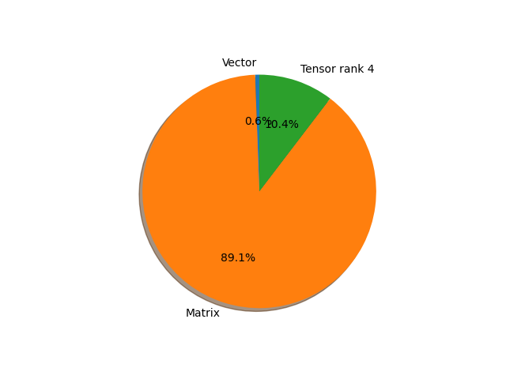

# regnet_y_800mf parameter information

**Number of layers: [ 199 ]**

**Number of parameters: [ 6.43M ]**

**Proportional of each form** (%)

| Vector | Matrix | Tensor rank 4 | 
|  --- | --- | --- |
| 61.81 | 30.65 | 7.54 | 

**Proportional of parameters by form** (%)

| Vector | Matrix | Tensor rank 4 | 
|  --- | --- | --- |
| 0.58 | 89.06 | 10.36 | 

**Layer information**

| Name | Shape | Squeezed shape | Number of parameters | Form |
| --- | --- | --- | --- | --- |
| stem.0.weight | (32, 3, 3, 3) | (32, 3, 3, 3) | 864 | Tensor rank 4 |
| stem.1.weight | (32,) | (32,) | 32 | Vector |
| stem.1.bias | (32,) | (32,) | 32 | Vector |
| trunk_output.block1.block1-0.proj.0.weight | (64, 32, 1, 1) | (64, 32) | 2048 | Matrix |
| trunk_output.block1.block1-0.proj.1.weight | (64,) | (64,) | 64 | Vector |
| trunk_output.block1.block1-0.proj.1.bias | (64,) | (64,) | 64 | Vector |
| trunk_output.block1.block1-0.f.a.0.weight | (64, 32, 1, 1) | (64, 32) | 2048 | Matrix |
| trunk_output.block1.block1-0.f.a.1.weight | (64,) | (64,) | 64 | Vector |
| trunk_output.block1.block1-0.f.a.1.bias | (64,) | (64,) | 64 | Vector |
| trunk_output.block1.block1-0.f.b.0.weight | (64, 16, 3, 3) | (64, 16, 3, 3) | 9216 | Tensor rank 4 |
| trunk_output.block1.block1-0.f.b.1.weight | (64,) | (64,) | 64 | Vector |
| trunk_output.block1.block1-0.f.b.1.bias | (64,) | (64,) | 64 | Vector |
| trunk_output.block1.block1-0.f.se.fc1.weight | (8, 64, 1, 1) | (8, 64) | 512 | Matrix |
| trunk_output.block1.block1-0.f.se.fc1.bias | (8,) | (8,) | 8 | Vector |
| trunk_output.block1.block1-0.f.se.fc2.weight | (64, 8, 1, 1) | (64, 8) | 512 | Matrix |
| trunk_output.block1.block1-0.f.se.fc2.bias | (64,) | (64,) | 64 | Vector |
| trunk_output.block1.block1-0.f.c.0.weight | (64, 64, 1, 1) | (64, 64) | 4096 | Matrix |
| trunk_output.block1.block1-0.f.c.1.weight | (64,) | (64,) | 64 | Vector |
| trunk_output.block1.block1-0.f.c.1.bias | (64,) | (64,) | 64 | Vector |
| trunk_output.block2.block2-0.proj.0.weight | (144, 64, 1, 1) | (144, 64) | 9216 | Matrix |
| trunk_output.block2.block2-0.proj.1.weight | (144,) | (144,) | 144 | Vector |
| trunk_output.block2.block2-0.proj.1.bias | (144,) | (144,) | 144 | Vector |
| trunk_output.block2.block2-0.f.a.0.weight | (144, 64, 1, 1) | (144, 64) | 9216 | Matrix |
| trunk_output.block2.block2-0.f.a.1.weight | (144,) | (144,) | 144 | Vector |
| trunk_output.block2.block2-0.f.a.1.bias | (144,) | (144,) | 144 | Vector |
| trunk_output.block2.block2-0.f.b.0.weight | (144, 16, 3, 3) | (144, 16, 3, 3) | 20736 | Tensor rank 4 |
| trunk_output.block2.block2-0.f.b.1.weight | (144,) | (144,) | 144 | Vector |
| trunk_output.block2.block2-0.f.b.1.bias | (144,) | (144,) | 144 | Vector |
| trunk_output.block2.block2-0.f.se.fc1.weight | (16, 144, 1, 1) | (16, 144) | 2304 | Matrix |
| trunk_output.block2.block2-0.f.se.fc1.bias | (16,) | (16,) | 16 | Vector |
| trunk_output.block2.block2-0.f.se.fc2.weight | (144, 16, 1, 1) | (144, 16) | 2304 | Matrix |
| trunk_output.block2.block2-0.f.se.fc2.bias | (144,) | (144,) | 144 | Vector |
| trunk_output.block2.block2-0.f.c.0.weight | (144, 144, 1, 1) | (144, 144) | 20736 | Matrix |
| trunk_output.block2.block2-0.f.c.1.weight | (144,) | (144,) | 144 | Vector |
| trunk_output.block2.block2-0.f.c.1.bias | (144,) | (144,) | 144 | Vector |
| trunk_output.block2.block2-1.f.a.0.weight | (144, 144, 1, 1) | (144, 144) | 20736 | Matrix |
| trunk_output.block2.block2-1.f.a.1.weight | (144,) | (144,) | 144 | Vector |
| trunk_output.block2.block2-1.f.a.1.bias | (144,) | (144,) | 144 | Vector |
| trunk_output.block2.block2-1.f.b.0.weight | (144, 16, 3, 3) | (144, 16, 3, 3) | 20736 | Tensor rank 4 |
| trunk_output.block2.block2-1.f.b.1.weight | (144,) | (144,) | 144 | Vector |
| trunk_output.block2.block2-1.f.b.1.bias | (144,) | (144,) | 144 | Vector |
| trunk_output.block2.block2-1.f.se.fc1.weight | (36, 144, 1, 1) | (36, 144) | 5184 | Matrix |
| trunk_output.block2.block2-1.f.se.fc1.bias | (36,) | (36,) | 36 | Vector |
| trunk_output.block2.block2-1.f.se.fc2.weight | (144, 36, 1, 1) | (144, 36) | 5184 | Matrix |
| trunk_output.block2.block2-1.f.se.fc2.bias | (144,) | (144,) | 144 | Vector |
| trunk_output.block2.block2-1.f.c.0.weight | (144, 144, 1, 1) | (144, 144) | 20736 | Matrix |
| trunk_output.block2.block2-1.f.c.1.weight | (144,) | (144,) | 144 | Vector |
| trunk_output.block2.block2-1.f.c.1.bias | (144,) | (144,) | 144 | Vector |
| trunk_output.block2.block2-2.f.a.0.weight | (144, 144, 1, 1) | (144, 144) | 20736 | Matrix |
| trunk_output.block2.block2-2.f.a.1.weight | (144,) | (144,) | 144 | Vector |
| trunk_output.block2.block2-2.f.a.1.bias | (144,) | (144,) | 144 | Vector |
| trunk_output.block2.block2-2.f.b.0.weight | (144, 16, 3, 3) | (144, 16, 3, 3) | 20736 | Tensor rank 4 |
| trunk_output.block2.block2-2.f.b.1.weight | (144,) | (144,) | 144 | Vector |
| trunk_output.block2.block2-2.f.b.1.bias | (144,) | (144,) | 144 | Vector |
| trunk_output.block2.block2-2.f.se.fc1.weight | (36, 144, 1, 1) | (36, 144) | 5184 | Matrix |
| trunk_output.block2.block2-2.f.se.fc1.bias | (36,) | (36,) | 36 | Vector |
| trunk_output.block2.block2-2.f.se.fc2.weight | (144, 36, 1, 1) | (144, 36) | 5184 | Matrix |
| trunk_output.block2.block2-2.f.se.fc2.bias | (144,) | (144,) | 144 | Vector |
| trunk_output.block2.block2-2.f.c.0.weight | (144, 144, 1, 1) | (144, 144) | 20736 | Matrix |
| trunk_output.block2.block2-2.f.c.1.weight | (144,) | (144,) | 144 | Vector |
| trunk_output.block2.block2-2.f.c.1.bias | (144,) | (144,) | 144 | Vector |
| trunk_output.block3.block3-0.proj.0.weight | (320, 144, 1, 1) | (320, 144) | 46080 | Matrix |
| trunk_output.block3.block3-0.proj.1.weight | (320,) | (320,) | 320 | Vector |
| trunk_output.block3.block3-0.proj.1.bias | (320,) | (320,) | 320 | Vector |
| trunk_output.block3.block3-0.f.a.0.weight | (320, 144, 1, 1) | (320, 144) | 46080 | Matrix |
| trunk_output.block3.block3-0.f.a.1.weight | (320,) | (320,) | 320 | Vector |
| trunk_output.block3.block3-0.f.a.1.bias | (320,) | (320,) | 320 | Vector |
| trunk_output.block3.block3-0.f.b.0.weight | (320, 16, 3, 3) | (320, 16, 3, 3) | 46080 | Tensor rank 4 |
| trunk_output.block3.block3-0.f.b.1.weight | (320,) | (320,) | 320 | Vector |
| trunk_output.block3.block3-0.f.b.1.bias | (320,) | (320,) | 320 | Vector |
| trunk_output.block3.block3-0.f.se.fc1.weight | (36, 320, 1, 1) | (36, 320) | 11520 | Matrix |
| trunk_output.block3.block3-0.f.se.fc1.bias | (36,) | (36,) | 36 | Vector |
| trunk_output.block3.block3-0.f.se.fc2.weight | (320, 36, 1, 1) | (320, 36) | 11520 | Matrix |
| trunk_output.block3.block3-0.f.se.fc2.bias | (320,) | (320,) | 320 | Vector |
| trunk_output.block3.block3-0.f.c.0.weight | (320, 320, 1, 1) | (320, 320) | 102400 | Matrix |
| trunk_output.block3.block3-0.f.c.1.weight | (320,) | (320,) | 320 | Vector |
| trunk_output.block3.block3-0.f.c.1.bias | (320,) | (320,) | 320 | Vector |
| trunk_output.block3.block3-1.f.a.0.weight | (320, 320, 1, 1) | (320, 320) | 102400 | Matrix |
| trunk_output.block3.block3-1.f.a.1.weight | (320,) | (320,) | 320 | Vector |
| trunk_output.block3.block3-1.f.a.1.bias | (320,) | (320,) | 320 | Vector |
| trunk_output.block3.block3-1.f.b.0.weight | (320, 16, 3, 3) | (320, 16, 3, 3) | 46080 | Tensor rank 4 |
| trunk_output.block3.block3-1.f.b.1.weight | (320,) | (320,) | 320 | Vector |
| trunk_output.block3.block3-1.f.b.1.bias | (320,) | (320,) | 320 | Vector |
| trunk_output.block3.block3-1.f.se.fc1.weight | (80, 320, 1, 1) | (80, 320) | 25600 | Matrix |
| trunk_output.block3.block3-1.f.se.fc1.bias | (80,) | (80,) | 80 | Vector |
| trunk_output.block3.block3-1.f.se.fc2.weight | (320, 80, 1, 1) | (320, 80) | 25600 | Matrix |
| trunk_output.block3.block3-1.f.se.fc2.bias | (320,) | (320,) | 320 | Vector |
| trunk_output.block3.block3-1.f.c.0.weight | (320, 320, 1, 1) | (320, 320) | 102400 | Matrix |
| trunk_output.block3.block3-1.f.c.1.weight | (320,) | (320,) | 320 | Vector |
| trunk_output.block3.block3-1.f.c.1.bias | (320,) | (320,) | 320 | Vector |
| trunk_output.block3.block3-2.f.a.0.weight | (320, 320, 1, 1) | (320, 320) | 102400 | Matrix |
| trunk_output.block3.block3-2.f.a.1.weight | (320,) | (320,) | 320 | Vector |
| trunk_output.block3.block3-2.f.a.1.bias | (320,) | (320,) | 320 | Vector |
| trunk_output.block3.block3-2.f.b.0.weight | (320, 16, 3, 3) | (320, 16, 3, 3) | 46080 | Tensor rank 4 |
| trunk_output.block3.block3-2.f.b.1.weight | (320,) | (320,) | 320 | Vector |
| trunk_output.block3.block3-2.f.b.1.bias | (320,) | (320,) | 320 | Vector |
| trunk_output.block3.block3-2.f.se.fc1.weight | (80, 320, 1, 1) | (80, 320) | 25600 | Matrix |
| trunk_output.block3.block3-2.f.se.fc1.bias | (80,) | (80,) | 80 | Vector |
| trunk_output.block3.block3-2.f.se.fc2.weight | (320, 80, 1, 1) | (320, 80) | 25600 | Matrix |
| trunk_output.block3.block3-2.f.se.fc2.bias | (320,) | (320,) | 320 | Vector |
| trunk_output.block3.block3-2.f.c.0.weight | (320, 320, 1, 1) | (320, 320) | 102400 | Matrix |
| trunk_output.block3.block3-2.f.c.1.weight | (320,) | (320,) | 320 | Vector |
| trunk_output.block3.block3-2.f.c.1.bias | (320,) | (320,) | 320 | Vector |
| trunk_output.block3.block3-3.f.a.0.weight | (320, 320, 1, 1) | (320, 320) | 102400 | Matrix |
| trunk_output.block3.block3-3.f.a.1.weight | (320,) | (320,) | 320 | Vector |
| trunk_output.block3.block3-3.f.a.1.bias | (320,) | (320,) | 320 | Vector |
| trunk_output.block3.block3-3.f.b.0.weight | (320, 16, 3, 3) | (320, 16, 3, 3) | 46080 | Tensor rank 4 |
| trunk_output.block3.block3-3.f.b.1.weight | (320,) | (320,) | 320 | Vector |
| trunk_output.block3.block3-3.f.b.1.bias | (320,) | (320,) | 320 | Vector |
| trunk_output.block3.block3-3.f.se.fc1.weight | (80, 320, 1, 1) | (80, 320) | 25600 | Matrix |
| trunk_output.block3.block3-3.f.se.fc1.bias | (80,) | (80,) | 80 | Vector |
| trunk_output.block3.block3-3.f.se.fc2.weight | (320, 80, 1, 1) | (320, 80) | 25600 | Matrix |
| trunk_output.block3.block3-3.f.se.fc2.bias | (320,) | (320,) | 320 | Vector |
| trunk_output.block3.block3-3.f.c.0.weight | (320, 320, 1, 1) | (320, 320) | 102400 | Matrix |
| trunk_output.block3.block3-3.f.c.1.weight | (320,) | (320,) | 320 | Vector |
| trunk_output.block3.block3-3.f.c.1.bias | (320,) | (320,) | 320 | Vector |
| trunk_output.block3.block3-4.f.a.0.weight | (320, 320, 1, 1) | (320, 320) | 102400 | Matrix |
| trunk_output.block3.block3-4.f.a.1.weight | (320,) | (320,) | 320 | Vector |
| trunk_output.block3.block3-4.f.a.1.bias | (320,) | (320,) | 320 | Vector |
| trunk_output.block3.block3-4.f.b.0.weight | (320, 16, 3, 3) | (320, 16, 3, 3) | 46080 | Tensor rank 4 |
| trunk_output.block3.block3-4.f.b.1.weight | (320,) | (320,) | 320 | Vector |
| trunk_output.block3.block3-4.f.b.1.bias | (320,) | (320,) | 320 | Vector |
| trunk_output.block3.block3-4.f.se.fc1.weight | (80, 320, 1, 1) | (80, 320) | 25600 | Matrix |
| trunk_output.block3.block3-4.f.se.fc1.bias | (80,) | (80,) | 80 | Vector |
| trunk_output.block3.block3-4.f.se.fc2.weight | (320, 80, 1, 1) | (320, 80) | 25600 | Matrix |
| trunk_output.block3.block3-4.f.se.fc2.bias | (320,) | (320,) | 320 | Vector |
| trunk_output.block3.block3-4.f.c.0.weight | (320, 320, 1, 1) | (320, 320) | 102400 | Matrix |
| trunk_output.block3.block3-4.f.c.1.weight | (320,) | (320,) | 320 | Vector |
| trunk_output.block3.block3-4.f.c.1.bias | (320,) | (320,) | 320 | Vector |
| trunk_output.block3.block3-5.f.a.0.weight | (320, 320, 1, 1) | (320, 320) | 102400 | Matrix |
| trunk_output.block3.block3-5.f.a.1.weight | (320,) | (320,) | 320 | Vector |
| trunk_output.block3.block3-5.f.a.1.bias | (320,) | (320,) | 320 | Vector |
| trunk_output.block3.block3-5.f.b.0.weight | (320, 16, 3, 3) | (320, 16, 3, 3) | 46080 | Tensor rank 4 |
| trunk_output.block3.block3-5.f.b.1.weight | (320,) | (320,) | 320 | Vector |
| trunk_output.block3.block3-5.f.b.1.bias | (320,) | (320,) | 320 | Vector |
| trunk_output.block3.block3-5.f.se.fc1.weight | (80, 320, 1, 1) | (80, 320) | 25600 | Matrix |
| trunk_output.block3.block3-5.f.se.fc1.bias | (80,) | (80,) | 80 | Vector |
| trunk_output.block3.block3-5.f.se.fc2.weight | (320, 80, 1, 1) | (320, 80) | 25600 | Matrix |
| trunk_output.block3.block3-5.f.se.fc2.bias | (320,) | (320,) | 320 | Vector |
| trunk_output.block3.block3-5.f.c.0.weight | (320, 320, 1, 1) | (320, 320) | 102400 | Matrix |
| trunk_output.block3.block3-5.f.c.1.weight | (320,) | (320,) | 320 | Vector |
| trunk_output.block3.block3-5.f.c.1.bias | (320,) | (320,) | 320 | Vector |
| trunk_output.block3.block3-6.f.a.0.weight | (320, 320, 1, 1) | (320, 320) | 102400 | Matrix |
| trunk_output.block3.block3-6.f.a.1.weight | (320,) | (320,) | 320 | Vector |
| trunk_output.block3.block3-6.f.a.1.bias | (320,) | (320,) | 320 | Vector |
| trunk_output.block3.block3-6.f.b.0.weight | (320, 16, 3, 3) | (320, 16, 3, 3) | 46080 | Tensor rank 4 |
| trunk_output.block3.block3-6.f.b.1.weight | (320,) | (320,) | 320 | Vector |
| trunk_output.block3.block3-6.f.b.1.bias | (320,) | (320,) | 320 | Vector |
| trunk_output.block3.block3-6.f.se.fc1.weight | (80, 320, 1, 1) | (80, 320) | 25600 | Matrix |
| trunk_output.block3.block3-6.f.se.fc1.bias | (80,) | (80,) | 80 | Vector |
| trunk_output.block3.block3-6.f.se.fc2.weight | (320, 80, 1, 1) | (320, 80) | 25600 | Matrix |
| trunk_output.block3.block3-6.f.se.fc2.bias | (320,) | (320,) | 320 | Vector |
| trunk_output.block3.block3-6.f.c.0.weight | (320, 320, 1, 1) | (320, 320) | 102400 | Matrix |
| trunk_output.block3.block3-6.f.c.1.weight | (320,) | (320,) | 320 | Vector |
| trunk_output.block3.block3-6.f.c.1.bias | (320,) | (320,) | 320 | Vector |
| trunk_output.block3.block3-7.f.a.0.weight | (320, 320, 1, 1) | (320, 320) | 102400 | Matrix |
| trunk_output.block3.block3-7.f.a.1.weight | (320,) | (320,) | 320 | Vector |
| trunk_output.block3.block3-7.f.a.1.bias | (320,) | (320,) | 320 | Vector |
| trunk_output.block3.block3-7.f.b.0.weight | (320, 16, 3, 3) | (320, 16, 3, 3) | 46080 | Tensor rank 4 |
| trunk_output.block3.block3-7.f.b.1.weight | (320,) | (320,) | 320 | Vector |
| trunk_output.block3.block3-7.f.b.1.bias | (320,) | (320,) | 320 | Vector |
| trunk_output.block3.block3-7.f.se.fc1.weight | (80, 320, 1, 1) | (80, 320) | 25600 | Matrix |
| trunk_output.block3.block3-7.f.se.fc1.bias | (80,) | (80,) | 80 | Vector |
| trunk_output.block3.block3-7.f.se.fc2.weight | (320, 80, 1, 1) | (320, 80) | 25600 | Matrix |
| trunk_output.block3.block3-7.f.se.fc2.bias | (320,) | (320,) | 320 | Vector |
| trunk_output.block3.block3-7.f.c.0.weight | (320, 320, 1, 1) | (320, 320) | 102400 | Matrix |
| trunk_output.block3.block3-7.f.c.1.weight | (320,) | (320,) | 320 | Vector |
| trunk_output.block3.block3-7.f.c.1.bias | (320,) | (320,) | 320 | Vector |
| trunk_output.block4.block4-0.proj.0.weight | (784, 320, 1, 1) | (784, 320) | 250880 | Matrix |
| trunk_output.block4.block4-0.proj.1.weight | (784,) | (784,) | 784 | Vector |
| trunk_output.block4.block4-0.proj.1.bias | (784,) | (784,) | 784 | Vector |
| trunk_output.block4.block4-0.f.a.0.weight | (784, 320, 1, 1) | (784, 320) | 250880 | Matrix |
| trunk_output.block4.block4-0.f.a.1.weight | (784,) | (784,) | 784 | Vector |
| trunk_output.block4.block4-0.f.a.1.bias | (784,) | (784,) | 784 | Vector |
| trunk_output.block4.block4-0.f.b.0.weight | (784, 16, 3, 3) | (784, 16, 3, 3) | 112896 | Tensor rank 4 |
| trunk_output.block4.block4-0.f.b.1.weight | (784,) | (784,) | 784 | Vector |
| trunk_output.block4.block4-0.f.b.1.bias | (784,) | (784,) | 784 | Vector |
| trunk_output.block4.block4-0.f.se.fc1.weight | (80, 784, 1, 1) | (80, 784) | 62720 | Matrix |
| trunk_output.block4.block4-0.f.se.fc1.bias | (80,) | (80,) | 80 | Vector |
| trunk_output.block4.block4-0.f.se.fc2.weight | (784, 80, 1, 1) | (784, 80) | 62720 | Matrix |
| trunk_output.block4.block4-0.f.se.fc2.bias | (784,) | (784,) | 784 | Vector |
| trunk_output.block4.block4-0.f.c.0.weight | (784, 784, 1, 1) | (784, 784) | 614656 | Matrix |
| trunk_output.block4.block4-0.f.c.1.weight | (784,) | (784,) | 784 | Vector |
| trunk_output.block4.block4-0.f.c.1.bias | (784,) | (784,) | 784 | Vector |
| trunk_output.block4.block4-1.f.a.0.weight | (784, 784, 1, 1) | (784, 784) | 614656 | Matrix |
| trunk_output.block4.block4-1.f.a.1.weight | (784,) | (784,) | 784 | Vector |
| trunk_output.block4.block4-1.f.a.1.bias | (784,) | (784,) | 784 | Vector |
| trunk_output.block4.block4-1.f.b.0.weight | (784, 16, 3, 3) | (784, 16, 3, 3) | 112896 | Tensor rank 4 |
| trunk_output.block4.block4-1.f.b.1.weight | (784,) | (784,) | 784 | Vector |
| trunk_output.block4.block4-1.f.b.1.bias | (784,) | (784,) | 784 | Vector |
| trunk_output.block4.block4-1.f.se.fc1.weight | (196, 784, 1, 1) | (196, 784) | 153664 | Matrix |
| trunk_output.block4.block4-1.f.se.fc1.bias | (196,) | (196,) | 196 | Vector |
| trunk_output.block4.block4-1.f.se.fc2.weight | (784, 196, 1, 1) | (784, 196) | 153664 | Matrix |
| trunk_output.block4.block4-1.f.se.fc2.bias | (784,) | (784,) | 784 | Vector |
| trunk_output.block4.block4-1.f.c.0.weight | (784, 784, 1, 1) | (784, 784) | 614656 | Matrix |
| trunk_output.block4.block4-1.f.c.1.weight | (784,) | (784,) | 784 | Vector |
| trunk_output.block4.block4-1.f.c.1.bias | (784,) | (784,) | 784 | Vector |
| fc.weight | (1000, 784) | (1000, 784) | 784000 | Matrix |
| fc.bias | (1000,) | (1000,) | 1000 | Vector |

