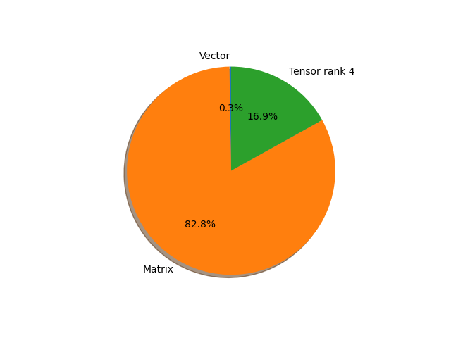

# regnet_y_8gf parameter information

**Number of layers: [ 238 ]**

**Number of parameters: [ 39.38M ]**

**Proportional of each form** (%)

| Vector | Matrix | Tensor rank 4 | 
|  --- | --- | --- |
| 61.76 | 30.67 | 7.56 | 

**Proportional of parameters by form** (%)

| Vector | Matrix | Tensor rank 4 | 
|  --- | --- | --- |
| 0.26 | 82.82 | 16.92 | 

**Layer information**

| Name | Shape | Squeezed shape | Number of parameters | Form |
| --- | --- | --- | --- | --- |
| stem.0.weight | (32, 3, 3, 3) | (32, 3, 3, 3) | 864 | Tensor rank 4 |
| stem.1.weight | (32,) | (32,) | 32 | Vector |
| stem.1.bias | (32,) | (32,) | 32 | Vector |
| trunk_output.block1.block1-0.proj.0.weight | (224, 32, 1, 1) | (224, 32) | 7168 | Matrix |
| trunk_output.block1.block1-0.proj.1.weight | (224,) | (224,) | 224 | Vector |
| trunk_output.block1.block1-0.proj.1.bias | (224,) | (224,) | 224 | Vector |
| trunk_output.block1.block1-0.f.a.0.weight | (224, 32, 1, 1) | (224, 32) | 7168 | Matrix |
| trunk_output.block1.block1-0.f.a.1.weight | (224,) | (224,) | 224 | Vector |
| trunk_output.block1.block1-0.f.a.1.bias | (224,) | (224,) | 224 | Vector |
| trunk_output.block1.block1-0.f.b.0.weight | (224, 56, 3, 3) | (224, 56, 3, 3) | 112896 | Tensor rank 4 |
| trunk_output.block1.block1-0.f.b.1.weight | (224,) | (224,) | 224 | Vector |
| trunk_output.block1.block1-0.f.b.1.bias | (224,) | (224,) | 224 | Vector |
| trunk_output.block1.block1-0.f.se.fc1.weight | (8, 224, 1, 1) | (8, 224) | 1792 | Matrix |
| trunk_output.block1.block1-0.f.se.fc1.bias | (8,) | (8,) | 8 | Vector |
| trunk_output.block1.block1-0.f.se.fc2.weight | (224, 8, 1, 1) | (224, 8) | 1792 | Matrix |
| trunk_output.block1.block1-0.f.se.fc2.bias | (224,) | (224,) | 224 | Vector |
| trunk_output.block1.block1-0.f.c.0.weight | (224, 224, 1, 1) | (224, 224) | 50176 | Matrix |
| trunk_output.block1.block1-0.f.c.1.weight | (224,) | (224,) | 224 | Vector |
| trunk_output.block1.block1-0.f.c.1.bias | (224,) | (224,) | 224 | Vector |
| trunk_output.block1.block1-1.f.a.0.weight | (224, 224, 1, 1) | (224, 224) | 50176 | Matrix |
| trunk_output.block1.block1-1.f.a.1.weight | (224,) | (224,) | 224 | Vector |
| trunk_output.block1.block1-1.f.a.1.bias | (224,) | (224,) | 224 | Vector |
| trunk_output.block1.block1-1.f.b.0.weight | (224, 56, 3, 3) | (224, 56, 3, 3) | 112896 | Tensor rank 4 |
| trunk_output.block1.block1-1.f.b.1.weight | (224,) | (224,) | 224 | Vector |
| trunk_output.block1.block1-1.f.b.1.bias | (224,) | (224,) | 224 | Vector |
| trunk_output.block1.block1-1.f.se.fc1.weight | (56, 224, 1, 1) | (56, 224) | 12544 | Matrix |
| trunk_output.block1.block1-1.f.se.fc1.bias | (56,) | (56,) | 56 | Vector |
| trunk_output.block1.block1-1.f.se.fc2.weight | (224, 56, 1, 1) | (224, 56) | 12544 | Matrix |
| trunk_output.block1.block1-1.f.se.fc2.bias | (224,) | (224,) | 224 | Vector |
| trunk_output.block1.block1-1.f.c.0.weight | (224, 224, 1, 1) | (224, 224) | 50176 | Matrix |
| trunk_output.block1.block1-1.f.c.1.weight | (224,) | (224,) | 224 | Vector |
| trunk_output.block1.block1-1.f.c.1.bias | (224,) | (224,) | 224 | Vector |
| trunk_output.block2.block2-0.proj.0.weight | (448, 224, 1, 1) | (448, 224) | 100352 | Matrix |
| trunk_output.block2.block2-0.proj.1.weight | (448,) | (448,) | 448 | Vector |
| trunk_output.block2.block2-0.proj.1.bias | (448,) | (448,) | 448 | Vector |
| trunk_output.block2.block2-0.f.a.0.weight | (448, 224, 1, 1) | (448, 224) | 100352 | Matrix |
| trunk_output.block2.block2-0.f.a.1.weight | (448,) | (448,) | 448 | Vector |
| trunk_output.block2.block2-0.f.a.1.bias | (448,) | (448,) | 448 | Vector |
| trunk_output.block2.block2-0.f.b.0.weight | (448, 56, 3, 3) | (448, 56, 3, 3) | 225792 | Tensor rank 4 |
| trunk_output.block2.block2-0.f.b.1.weight | (448,) | (448,) | 448 | Vector |
| trunk_output.block2.block2-0.f.b.1.bias | (448,) | (448,) | 448 | Vector |
| trunk_output.block2.block2-0.f.se.fc1.weight | (56, 448, 1, 1) | (56, 448) | 25088 | Matrix |
| trunk_output.block2.block2-0.f.se.fc1.bias | (56,) | (56,) | 56 | Vector |
| trunk_output.block2.block2-0.f.se.fc2.weight | (448, 56, 1, 1) | (448, 56) | 25088 | Matrix |
| trunk_output.block2.block2-0.f.se.fc2.bias | (448,) | (448,) | 448 | Vector |
| trunk_output.block2.block2-0.f.c.0.weight | (448, 448, 1, 1) | (448, 448) | 200704 | Matrix |
| trunk_output.block2.block2-0.f.c.1.weight | (448,) | (448,) | 448 | Vector |
| trunk_output.block2.block2-0.f.c.1.bias | (448,) | (448,) | 448 | Vector |
| trunk_output.block2.block2-1.f.a.0.weight | (448, 448, 1, 1) | (448, 448) | 200704 | Matrix |
| trunk_output.block2.block2-1.f.a.1.weight | (448,) | (448,) | 448 | Vector |
| trunk_output.block2.block2-1.f.a.1.bias | (448,) | (448,) | 448 | Vector |
| trunk_output.block2.block2-1.f.b.0.weight | (448, 56, 3, 3) | (448, 56, 3, 3) | 225792 | Tensor rank 4 |
| trunk_output.block2.block2-1.f.b.1.weight | (448,) | (448,) | 448 | Vector |
| trunk_output.block2.block2-1.f.b.1.bias | (448,) | (448,) | 448 | Vector |
| trunk_output.block2.block2-1.f.se.fc1.weight | (112, 448, 1, 1) | (112, 448) | 50176 | Matrix |
| trunk_output.block2.block2-1.f.se.fc1.bias | (112,) | (112,) | 112 | Vector |
| trunk_output.block2.block2-1.f.se.fc2.weight | (448, 112, 1, 1) | (448, 112) | 50176 | Matrix |
| trunk_output.block2.block2-1.f.se.fc2.bias | (448,) | (448,) | 448 | Vector |
| trunk_output.block2.block2-1.f.c.0.weight | (448, 448, 1, 1) | (448, 448) | 200704 | Matrix |
| trunk_output.block2.block2-1.f.c.1.weight | (448,) | (448,) | 448 | Vector |
| trunk_output.block2.block2-1.f.c.1.bias | (448,) | (448,) | 448 | Vector |
| trunk_output.block2.block2-2.f.a.0.weight | (448, 448, 1, 1) | (448, 448) | 200704 | Matrix |
| trunk_output.block2.block2-2.f.a.1.weight | (448,) | (448,) | 448 | Vector |
| trunk_output.block2.block2-2.f.a.1.bias | (448,) | (448,) | 448 | Vector |
| trunk_output.block2.block2-2.f.b.0.weight | (448, 56, 3, 3) | (448, 56, 3, 3) | 225792 | Tensor rank 4 |
| trunk_output.block2.block2-2.f.b.1.weight | (448,) | (448,) | 448 | Vector |
| trunk_output.block2.block2-2.f.b.1.bias | (448,) | (448,) | 448 | Vector |
| trunk_output.block2.block2-2.f.se.fc1.weight | (112, 448, 1, 1) | (112, 448) | 50176 | Matrix |
| trunk_output.block2.block2-2.f.se.fc1.bias | (112,) | (112,) | 112 | Vector |
| trunk_output.block2.block2-2.f.se.fc2.weight | (448, 112, 1, 1) | (448, 112) | 50176 | Matrix |
| trunk_output.block2.block2-2.f.se.fc2.bias | (448,) | (448,) | 448 | Vector |
| trunk_output.block2.block2-2.f.c.0.weight | (448, 448, 1, 1) | (448, 448) | 200704 | Matrix |
| trunk_output.block2.block2-2.f.c.1.weight | (448,) | (448,) | 448 | Vector |
| trunk_output.block2.block2-2.f.c.1.bias | (448,) | (448,) | 448 | Vector |
| trunk_output.block2.block2-3.f.a.0.weight | (448, 448, 1, 1) | (448, 448) | 200704 | Matrix |
| trunk_output.block2.block2-3.f.a.1.weight | (448,) | (448,) | 448 | Vector |
| trunk_output.block2.block2-3.f.a.1.bias | (448,) | (448,) | 448 | Vector |
| trunk_output.block2.block2-3.f.b.0.weight | (448, 56, 3, 3) | (448, 56, 3, 3) | 225792 | Tensor rank 4 |
| trunk_output.block2.block2-3.f.b.1.weight | (448,) | (448,) | 448 | Vector |
| trunk_output.block2.block2-3.f.b.1.bias | (448,) | (448,) | 448 | Vector |
| trunk_output.block2.block2-3.f.se.fc1.weight | (112, 448, 1, 1) | (112, 448) | 50176 | Matrix |
| trunk_output.block2.block2-3.f.se.fc1.bias | (112,) | (112,) | 112 | Vector |
| trunk_output.block2.block2-3.f.se.fc2.weight | (448, 112, 1, 1) | (448, 112) | 50176 | Matrix |
| trunk_output.block2.block2-3.f.se.fc2.bias | (448,) | (448,) | 448 | Vector |
| trunk_output.block2.block2-3.f.c.0.weight | (448, 448, 1, 1) | (448, 448) | 200704 | Matrix |
| trunk_output.block2.block2-3.f.c.1.weight | (448,) | (448,) | 448 | Vector |
| trunk_output.block2.block2-3.f.c.1.bias | (448,) | (448,) | 448 | Vector |
| trunk_output.block3.block3-0.proj.0.weight | (896, 448, 1, 1) | (896, 448) | 401408 | Matrix |
| trunk_output.block3.block3-0.proj.1.weight | (896,) | (896,) | 896 | Vector |
| trunk_output.block3.block3-0.proj.1.bias | (896,) | (896,) | 896 | Vector |
| trunk_output.block3.block3-0.f.a.0.weight | (896, 448, 1, 1) | (896, 448) | 401408 | Matrix |
| trunk_output.block3.block3-0.f.a.1.weight | (896,) | (896,) | 896 | Vector |
| trunk_output.block3.block3-0.f.a.1.bias | (896,) | (896,) | 896 | Vector |
| trunk_output.block3.block3-0.f.b.0.weight | (896, 56, 3, 3) | (896, 56, 3, 3) | 451584 | Tensor rank 4 |
| trunk_output.block3.block3-0.f.b.1.weight | (896,) | (896,) | 896 | Vector |
| trunk_output.block3.block3-0.f.b.1.bias | (896,) | (896,) | 896 | Vector |
| trunk_output.block3.block3-0.f.se.fc1.weight | (112, 896, 1, 1) | (112, 896) | 100352 | Matrix |
| trunk_output.block3.block3-0.f.se.fc1.bias | (112,) | (112,) | 112 | Vector |
| trunk_output.block3.block3-0.f.se.fc2.weight | (896, 112, 1, 1) | (896, 112) | 100352 | Matrix |
| trunk_output.block3.block3-0.f.se.fc2.bias | (896,) | (896,) | 896 | Vector |
| trunk_output.block3.block3-0.f.c.0.weight | (896, 896, 1, 1) | (896, 896) | 802816 | Matrix |
| trunk_output.block3.block3-0.f.c.1.weight | (896,) | (896,) | 896 | Vector |
| trunk_output.block3.block3-0.f.c.1.bias | (896,) | (896,) | 896 | Vector |
| trunk_output.block3.block3-1.f.a.0.weight | (896, 896, 1, 1) | (896, 896) | 802816 | Matrix |
| trunk_output.block3.block3-1.f.a.1.weight | (896,) | (896,) | 896 | Vector |
| trunk_output.block3.block3-1.f.a.1.bias | (896,) | (896,) | 896 | Vector |
| trunk_output.block3.block3-1.f.b.0.weight | (896, 56, 3, 3) | (896, 56, 3, 3) | 451584 | Tensor rank 4 |
| trunk_output.block3.block3-1.f.b.1.weight | (896,) | (896,) | 896 | Vector |
| trunk_output.block3.block3-1.f.b.1.bias | (896,) | (896,) | 896 | Vector |
| trunk_output.block3.block3-1.f.se.fc1.weight | (224, 896, 1, 1) | (224, 896) | 200704 | Matrix |
| trunk_output.block3.block3-1.f.se.fc1.bias | (224,) | (224,) | 224 | Vector |
| trunk_output.block3.block3-1.f.se.fc2.weight | (896, 224, 1, 1) | (896, 224) | 200704 | Matrix |
| trunk_output.block3.block3-1.f.se.fc2.bias | (896,) | (896,) | 896 | Vector |
| trunk_output.block3.block3-1.f.c.0.weight | (896, 896, 1, 1) | (896, 896) | 802816 | Matrix |
| trunk_output.block3.block3-1.f.c.1.weight | (896,) | (896,) | 896 | Vector |
| trunk_output.block3.block3-1.f.c.1.bias | (896,) | (896,) | 896 | Vector |
| trunk_output.block3.block3-2.f.a.0.weight | (896, 896, 1, 1) | (896, 896) | 802816 | Matrix |
| trunk_output.block3.block3-2.f.a.1.weight | (896,) | (896,) | 896 | Vector |
| trunk_output.block3.block3-2.f.a.1.bias | (896,) | (896,) | 896 | Vector |
| trunk_output.block3.block3-2.f.b.0.weight | (896, 56, 3, 3) | (896, 56, 3, 3) | 451584 | Tensor rank 4 |
| trunk_output.block3.block3-2.f.b.1.weight | (896,) | (896,) | 896 | Vector |
| trunk_output.block3.block3-2.f.b.1.bias | (896,) | (896,) | 896 | Vector |
| trunk_output.block3.block3-2.f.se.fc1.weight | (224, 896, 1, 1) | (224, 896) | 200704 | Matrix |
| trunk_output.block3.block3-2.f.se.fc1.bias | (224,) | (224,) | 224 | Vector |
| trunk_output.block3.block3-2.f.se.fc2.weight | (896, 224, 1, 1) | (896, 224) | 200704 | Matrix |
| trunk_output.block3.block3-2.f.se.fc2.bias | (896,) | (896,) | 896 | Vector |
| trunk_output.block3.block3-2.f.c.0.weight | (896, 896, 1, 1) | (896, 896) | 802816 | Matrix |
| trunk_output.block3.block3-2.f.c.1.weight | (896,) | (896,) | 896 | Vector |
| trunk_output.block3.block3-2.f.c.1.bias | (896,) | (896,) | 896 | Vector |
| trunk_output.block3.block3-3.f.a.0.weight | (896, 896, 1, 1) | (896, 896) | 802816 | Matrix |
| trunk_output.block3.block3-3.f.a.1.weight | (896,) | (896,) | 896 | Vector |
| trunk_output.block3.block3-3.f.a.1.bias | (896,) | (896,) | 896 | Vector |
| trunk_output.block3.block3-3.f.b.0.weight | (896, 56, 3, 3) | (896, 56, 3, 3) | 451584 | Tensor rank 4 |
| trunk_output.block3.block3-3.f.b.1.weight | (896,) | (896,) | 896 | Vector |
| trunk_output.block3.block3-3.f.b.1.bias | (896,) | (896,) | 896 | Vector |
| trunk_output.block3.block3-3.f.se.fc1.weight | (224, 896, 1, 1) | (224, 896) | 200704 | Matrix |
| trunk_output.block3.block3-3.f.se.fc1.bias | (224,) | (224,) | 224 | Vector |
| trunk_output.block3.block3-3.f.se.fc2.weight | (896, 224, 1, 1) | (896, 224) | 200704 | Matrix |
| trunk_output.block3.block3-3.f.se.fc2.bias | (896,) | (896,) | 896 | Vector |
| trunk_output.block3.block3-3.f.c.0.weight | (896, 896, 1, 1) | (896, 896) | 802816 | Matrix |
| trunk_output.block3.block3-3.f.c.1.weight | (896,) | (896,) | 896 | Vector |
| trunk_output.block3.block3-3.f.c.1.bias | (896,) | (896,) | 896 | Vector |
| trunk_output.block3.block3-4.f.a.0.weight | (896, 896, 1, 1) | (896, 896) | 802816 | Matrix |
| trunk_output.block3.block3-4.f.a.1.weight | (896,) | (896,) | 896 | Vector |
| trunk_output.block3.block3-4.f.a.1.bias | (896,) | (896,) | 896 | Vector |
| trunk_output.block3.block3-4.f.b.0.weight | (896, 56, 3, 3) | (896, 56, 3, 3) | 451584 | Tensor rank 4 |
| trunk_output.block3.block3-4.f.b.1.weight | (896,) | (896,) | 896 | Vector |
| trunk_output.block3.block3-4.f.b.1.bias | (896,) | (896,) | 896 | Vector |
| trunk_output.block3.block3-4.f.se.fc1.weight | (224, 896, 1, 1) | (224, 896) | 200704 | Matrix |
| trunk_output.block3.block3-4.f.se.fc1.bias | (224,) | (224,) | 224 | Vector |
| trunk_output.block3.block3-4.f.se.fc2.weight | (896, 224, 1, 1) | (896, 224) | 200704 | Matrix |
| trunk_output.block3.block3-4.f.se.fc2.bias | (896,) | (896,) | 896 | Vector |
| trunk_output.block3.block3-4.f.c.0.weight | (896, 896, 1, 1) | (896, 896) | 802816 | Matrix |
| trunk_output.block3.block3-4.f.c.1.weight | (896,) | (896,) | 896 | Vector |
| trunk_output.block3.block3-4.f.c.1.bias | (896,) | (896,) | 896 | Vector |
| trunk_output.block3.block3-5.f.a.0.weight | (896, 896, 1, 1) | (896, 896) | 802816 | Matrix |
| trunk_output.block3.block3-5.f.a.1.weight | (896,) | (896,) | 896 | Vector |
| trunk_output.block3.block3-5.f.a.1.bias | (896,) | (896,) | 896 | Vector |
| trunk_output.block3.block3-5.f.b.0.weight | (896, 56, 3, 3) | (896, 56, 3, 3) | 451584 | Tensor rank 4 |
| trunk_output.block3.block3-5.f.b.1.weight | (896,) | (896,) | 896 | Vector |
| trunk_output.block3.block3-5.f.b.1.bias | (896,) | (896,) | 896 | Vector |
| trunk_output.block3.block3-5.f.se.fc1.weight | (224, 896, 1, 1) | (224, 896) | 200704 | Matrix |
| trunk_output.block3.block3-5.f.se.fc1.bias | (224,) | (224,) | 224 | Vector |
| trunk_output.block3.block3-5.f.se.fc2.weight | (896, 224, 1, 1) | (896, 224) | 200704 | Matrix |
| trunk_output.block3.block3-5.f.se.fc2.bias | (896,) | (896,) | 896 | Vector |
| trunk_output.block3.block3-5.f.c.0.weight | (896, 896, 1, 1) | (896, 896) | 802816 | Matrix |
| trunk_output.block3.block3-5.f.c.1.weight | (896,) | (896,) | 896 | Vector |
| trunk_output.block3.block3-5.f.c.1.bias | (896,) | (896,) | 896 | Vector |
| trunk_output.block3.block3-6.f.a.0.weight | (896, 896, 1, 1) | (896, 896) | 802816 | Matrix |
| trunk_output.block3.block3-6.f.a.1.weight | (896,) | (896,) | 896 | Vector |
| trunk_output.block3.block3-6.f.a.1.bias | (896,) | (896,) | 896 | Vector |
| trunk_output.block3.block3-6.f.b.0.weight | (896, 56, 3, 3) | (896, 56, 3, 3) | 451584 | Tensor rank 4 |
| trunk_output.block3.block3-6.f.b.1.weight | (896,) | (896,) | 896 | Vector |
| trunk_output.block3.block3-6.f.b.1.bias | (896,) | (896,) | 896 | Vector |
| trunk_output.block3.block3-6.f.se.fc1.weight | (224, 896, 1, 1) | (224, 896) | 200704 | Matrix |
| trunk_output.block3.block3-6.f.se.fc1.bias | (224,) | (224,) | 224 | Vector |
| trunk_output.block3.block3-6.f.se.fc2.weight | (896, 224, 1, 1) | (896, 224) | 200704 | Matrix |
| trunk_output.block3.block3-6.f.se.fc2.bias | (896,) | (896,) | 896 | Vector |
| trunk_output.block3.block3-6.f.c.0.weight | (896, 896, 1, 1) | (896, 896) | 802816 | Matrix |
| trunk_output.block3.block3-6.f.c.1.weight | (896,) | (896,) | 896 | Vector |
| trunk_output.block3.block3-6.f.c.1.bias | (896,) | (896,) | 896 | Vector |
| trunk_output.block3.block3-7.f.a.0.weight | (896, 896, 1, 1) | (896, 896) | 802816 | Matrix |
| trunk_output.block3.block3-7.f.a.1.weight | (896,) | (896,) | 896 | Vector |
| trunk_output.block3.block3-7.f.a.1.bias | (896,) | (896,) | 896 | Vector |
| trunk_output.block3.block3-7.f.b.0.weight | (896, 56, 3, 3) | (896, 56, 3, 3) | 451584 | Tensor rank 4 |
| trunk_output.block3.block3-7.f.b.1.weight | (896,) | (896,) | 896 | Vector |
| trunk_output.block3.block3-7.f.b.1.bias | (896,) | (896,) | 896 | Vector |
| trunk_output.block3.block3-7.f.se.fc1.weight | (224, 896, 1, 1) | (224, 896) | 200704 | Matrix |
| trunk_output.block3.block3-7.f.se.fc1.bias | (224,) | (224,) | 224 | Vector |
| trunk_output.block3.block3-7.f.se.fc2.weight | (896, 224, 1, 1) | (896, 224) | 200704 | Matrix |
| trunk_output.block3.block3-7.f.se.fc2.bias | (896,) | (896,) | 896 | Vector |
| trunk_output.block3.block3-7.f.c.0.weight | (896, 896, 1, 1) | (896, 896) | 802816 | Matrix |
| trunk_output.block3.block3-7.f.c.1.weight | (896,) | (896,) | 896 | Vector |
| trunk_output.block3.block3-7.f.c.1.bias | (896,) | (896,) | 896 | Vector |
| trunk_output.block3.block3-8.f.a.0.weight | (896, 896, 1, 1) | (896, 896) | 802816 | Matrix |
| trunk_output.block3.block3-8.f.a.1.weight | (896,) | (896,) | 896 | Vector |
| trunk_output.block3.block3-8.f.a.1.bias | (896,) | (896,) | 896 | Vector |
| trunk_output.block3.block3-8.f.b.0.weight | (896, 56, 3, 3) | (896, 56, 3, 3) | 451584 | Tensor rank 4 |
| trunk_output.block3.block3-8.f.b.1.weight | (896,) | (896,) | 896 | Vector |
| trunk_output.block3.block3-8.f.b.1.bias | (896,) | (896,) | 896 | Vector |
| trunk_output.block3.block3-8.f.se.fc1.weight | (224, 896, 1, 1) | (224, 896) | 200704 | Matrix |
| trunk_output.block3.block3-8.f.se.fc1.bias | (224,) | (224,) | 224 | Vector |
| trunk_output.block3.block3-8.f.se.fc2.weight | (896, 224, 1, 1) | (896, 224) | 200704 | Matrix |
| trunk_output.block3.block3-8.f.se.fc2.bias | (896,) | (896,) | 896 | Vector |
| trunk_output.block3.block3-8.f.c.0.weight | (896, 896, 1, 1) | (896, 896) | 802816 | Matrix |
| trunk_output.block3.block3-8.f.c.1.weight | (896,) | (896,) | 896 | Vector |
| trunk_output.block3.block3-8.f.c.1.bias | (896,) | (896,) | 896 | Vector |
| trunk_output.block3.block3-9.f.a.0.weight | (896, 896, 1, 1) | (896, 896) | 802816 | Matrix |
| trunk_output.block3.block3-9.f.a.1.weight | (896,) | (896,) | 896 | Vector |
| trunk_output.block3.block3-9.f.a.1.bias | (896,) | (896,) | 896 | Vector |
| trunk_output.block3.block3-9.f.b.0.weight | (896, 56, 3, 3) | (896, 56, 3, 3) | 451584 | Tensor rank 4 |
| trunk_output.block3.block3-9.f.b.1.weight | (896,) | (896,) | 896 | Vector |
| trunk_output.block3.block3-9.f.b.1.bias | (896,) | (896,) | 896 | Vector |
| trunk_output.block3.block3-9.f.se.fc1.weight | (224, 896, 1, 1) | (224, 896) | 200704 | Matrix |
| trunk_output.block3.block3-9.f.se.fc1.bias | (224,) | (224,) | 224 | Vector |
| trunk_output.block3.block3-9.f.se.fc2.weight | (896, 224, 1, 1) | (896, 224) | 200704 | Matrix |
| trunk_output.block3.block3-9.f.se.fc2.bias | (896,) | (896,) | 896 | Vector |
| trunk_output.block3.block3-9.f.c.0.weight | (896, 896, 1, 1) | (896, 896) | 802816 | Matrix |
| trunk_output.block3.block3-9.f.c.1.weight | (896,) | (896,) | 896 | Vector |
| trunk_output.block3.block3-9.f.c.1.bias | (896,) | (896,) | 896 | Vector |
| trunk_output.block4.block4-0.proj.0.weight | (2016, 896, 1, 1) | (2016, 896) | 1806336 | Matrix |
| trunk_output.block4.block4-0.proj.1.weight | (2016,) | (2016,) | 2016 | Vector |
| trunk_output.block4.block4-0.proj.1.bias | (2016,) | (2016,) | 2016 | Vector |
| trunk_output.block4.block4-0.f.a.0.weight | (2016, 896, 1, 1) | (2016, 896) | 1806336 | Matrix |
| trunk_output.block4.block4-0.f.a.1.weight | (2016,) | (2016,) | 2016 | Vector |
| trunk_output.block4.block4-0.f.a.1.bias | (2016,) | (2016,) | 2016 | Vector |
| trunk_output.block4.block4-0.f.b.0.weight | (2016, 56, 3, 3) | (2016, 56, 3, 3) | 1016064 | Tensor rank 4 |
| trunk_output.block4.block4-0.f.b.1.weight | (2016,) | (2016,) | 2016 | Vector |
| trunk_output.block4.block4-0.f.b.1.bias | (2016,) | (2016,) | 2016 | Vector |
| trunk_output.block4.block4-0.f.se.fc1.weight | (224, 2016, 1, 1) | (224, 2016) | 451584 | Matrix |
| trunk_output.block4.block4-0.f.se.fc1.bias | (224,) | (224,) | 224 | Vector |
| trunk_output.block4.block4-0.f.se.fc2.weight | (2016, 224, 1, 1) | (2016, 224) | 451584 | Matrix |
| trunk_output.block4.block4-0.f.se.fc2.bias | (2016,) | (2016,) | 2016 | Vector |
| trunk_output.block4.block4-0.f.c.0.weight | (2016, 2016, 1, 1) | (2016, 2016) | 4064256 | Matrix |
| trunk_output.block4.block4-0.f.c.1.weight | (2016,) | (2016,) | 2016 | Vector |
| trunk_output.block4.block4-0.f.c.1.bias | (2016,) | (2016,) | 2016 | Vector |
| fc.weight | (1000, 2016) | (1000, 2016) | 2016000 | Matrix |
| fc.bias | (1000,) | (1000,) | 1000 | Vector |

