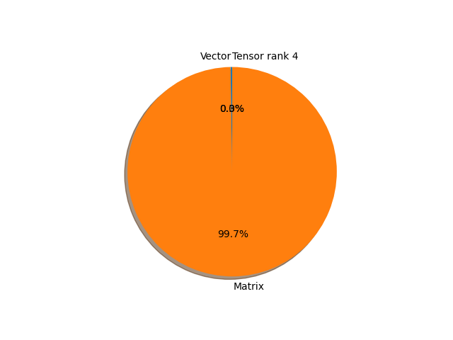

# swin_s parameter information

**Number of layers: [ 329 ]**

**Number of parameters: [ 49.61M ]**

**Proportional of each form** (%)

| Vector | Matrix | Tensor rank 4 | 
|  --- | --- | --- |
| 62.01 | 37.69 | 0.30 | 

**Proportional of parameters by form** (%)

| Vector | Matrix | Tensor rank 4 | 
|  --- | --- | --- |
| 0.25 | 99.74 | 0.01 | 

**Layer information**

| Name | Shape | Squeezed shape | Number of parameters | Form |
| --- | --- | --- | --- | --- |
| features.0.0.weight | (96, 3, 4, 4) | (96, 3, 4, 4) | 4608 | Tensor rank 4 |
| features.0.0.bias | (96,) | (96,) | 96 | Vector |
| features.0.2.weight | (96,) | (96,) | 96 | Vector |
| features.0.2.bias | (96,) | (96,) | 96 | Vector |
| features.1.0.norm1.weight | (96,) | (96,) | 96 | Vector |
| features.1.0.norm1.bias | (96,) | (96,) | 96 | Vector |
| features.1.0.attn.relative_position_bias_table | (169, 3) | (169, 3) | 507 | Matrix |
| features.1.0.attn.qkv.weight | (288, 96) | (288, 96) | 27648 | Matrix |
| features.1.0.attn.qkv.bias | (288,) | (288,) | 288 | Vector |
| features.1.0.attn.proj.weight | (96, 96) | (96, 96) | 9216 | Matrix |
| features.1.0.attn.proj.bias | (96,) | (96,) | 96 | Vector |
| features.1.0.norm2.weight | (96,) | (96,) | 96 | Vector |
| features.1.0.norm2.bias | (96,) | (96,) | 96 | Vector |
| features.1.0.mlp.0.weight | (384, 96) | (384, 96) | 36864 | Matrix |
| features.1.0.mlp.0.bias | (384,) | (384,) | 384 | Vector |
| features.1.0.mlp.3.weight | (96, 384) | (96, 384) | 36864 | Matrix |
| features.1.0.mlp.3.bias | (96,) | (96,) | 96 | Vector |
| features.1.1.norm1.weight | (96,) | (96,) | 96 | Vector |
| features.1.1.norm1.bias | (96,) | (96,) | 96 | Vector |
| features.1.1.attn.relative_position_bias_table | (169, 3) | (169, 3) | 507 | Matrix |
| features.1.1.attn.qkv.weight | (288, 96) | (288, 96) | 27648 | Matrix |
| features.1.1.attn.qkv.bias | (288,) | (288,) | 288 | Vector |
| features.1.1.attn.proj.weight | (96, 96) | (96, 96) | 9216 | Matrix |
| features.1.1.attn.proj.bias | (96,) | (96,) | 96 | Vector |
| features.1.1.norm2.weight | (96,) | (96,) | 96 | Vector |
| features.1.1.norm2.bias | (96,) | (96,) | 96 | Vector |
| features.1.1.mlp.0.weight | (384, 96) | (384, 96) | 36864 | Matrix |
| features.1.1.mlp.0.bias | (384,) | (384,) | 384 | Vector |
| features.1.1.mlp.3.weight | (96, 384) | (96, 384) | 36864 | Matrix |
| features.1.1.mlp.3.bias | (96,) | (96,) | 96 | Vector |
| features.2.reduction.weight | (192, 384) | (192, 384) | 73728 | Matrix |
| features.2.norm.weight | (384,) | (384,) | 384 | Vector |
| features.2.norm.bias | (384,) | (384,) | 384 | Vector |
| features.3.0.norm1.weight | (192,) | (192,) | 192 | Vector |
| features.3.0.norm1.bias | (192,) | (192,) | 192 | Vector |
| features.3.0.attn.relative_position_bias_table | (169, 6) | (169, 6) | 1014 | Matrix |
| features.3.0.attn.qkv.weight | (576, 192) | (576, 192) | 110592 | Matrix |
| features.3.0.attn.qkv.bias | (576,) | (576,) | 576 | Vector |
| features.3.0.attn.proj.weight | (192, 192) | (192, 192) | 36864 | Matrix |
| features.3.0.attn.proj.bias | (192,) | (192,) | 192 | Vector |
| features.3.0.norm2.weight | (192,) | (192,) | 192 | Vector |
| features.3.0.norm2.bias | (192,) | (192,) | 192 | Vector |
| features.3.0.mlp.0.weight | (768, 192) | (768, 192) | 147456 | Matrix |
| features.3.0.mlp.0.bias | (768,) | (768,) | 768 | Vector |
| features.3.0.mlp.3.weight | (192, 768) | (192, 768) | 147456 | Matrix |
| features.3.0.mlp.3.bias | (192,) | (192,) | 192 | Vector |
| features.3.1.norm1.weight | (192,) | (192,) | 192 | Vector |
| features.3.1.norm1.bias | (192,) | (192,) | 192 | Vector |
| features.3.1.attn.relative_position_bias_table | (169, 6) | (169, 6) | 1014 | Matrix |
| features.3.1.attn.qkv.weight | (576, 192) | (576, 192) | 110592 | Matrix |
| features.3.1.attn.qkv.bias | (576,) | (576,) | 576 | Vector |
| features.3.1.attn.proj.weight | (192, 192) | (192, 192) | 36864 | Matrix |
| features.3.1.attn.proj.bias | (192,) | (192,) | 192 | Vector |
| features.3.1.norm2.weight | (192,) | (192,) | 192 | Vector |
| features.3.1.norm2.bias | (192,) | (192,) | 192 | Vector |
| features.3.1.mlp.0.weight | (768, 192) | (768, 192) | 147456 | Matrix |
| features.3.1.mlp.0.bias | (768,) | (768,) | 768 | Vector |
| features.3.1.mlp.3.weight | (192, 768) | (192, 768) | 147456 | Matrix |
| features.3.1.mlp.3.bias | (192,) | (192,) | 192 | Vector |
| features.4.reduction.weight | (384, 768) | (384, 768) | 294912 | Matrix |
| features.4.norm.weight | (768,) | (768,) | 768 | Vector |
| features.4.norm.bias | (768,) | (768,) | 768 | Vector |
| features.5.0.norm1.weight | (384,) | (384,) | 384 | Vector |
| features.5.0.norm1.bias | (384,) | (384,) | 384 | Vector |
| features.5.0.attn.relative_position_bias_table | (169, 12) | (169, 12) | 2028 | Matrix |
| features.5.0.attn.qkv.weight | (1152, 384) | (1152, 384) | 442368 | Matrix |
| features.5.0.attn.qkv.bias | (1152,) | (1152,) | 1152 | Vector |
| features.5.0.attn.proj.weight | (384, 384) | (384, 384) | 147456 | Matrix |
| features.5.0.attn.proj.bias | (384,) | (384,) | 384 | Vector |
| features.5.0.norm2.weight | (384,) | (384,) | 384 | Vector |
| features.5.0.norm2.bias | (384,) | (384,) | 384 | Vector |
| features.5.0.mlp.0.weight | (1536, 384) | (1536, 384) | 589824 | Matrix |
| features.5.0.mlp.0.bias | (1536,) | (1536,) | 1536 | Vector |
| features.5.0.mlp.3.weight | (384, 1536) | (384, 1536) | 589824 | Matrix |
| features.5.0.mlp.3.bias | (384,) | (384,) | 384 | Vector |
| features.5.1.norm1.weight | (384,) | (384,) | 384 | Vector |
| features.5.1.norm1.bias | (384,) | (384,) | 384 | Vector |
| features.5.1.attn.relative_position_bias_table | (169, 12) | (169, 12) | 2028 | Matrix |
| features.5.1.attn.qkv.weight | (1152, 384) | (1152, 384) | 442368 | Matrix |
| features.5.1.attn.qkv.bias | (1152,) | (1152,) | 1152 | Vector |
| features.5.1.attn.proj.weight | (384, 384) | (384, 384) | 147456 | Matrix |
| features.5.1.attn.proj.bias | (384,) | (384,) | 384 | Vector |
| features.5.1.norm2.weight | (384,) | (384,) | 384 | Vector |
| features.5.1.norm2.bias | (384,) | (384,) | 384 | Vector |
| features.5.1.mlp.0.weight | (1536, 384) | (1536, 384) | 589824 | Matrix |
| features.5.1.mlp.0.bias | (1536,) | (1536,) | 1536 | Vector |
| features.5.1.mlp.3.weight | (384, 1536) | (384, 1536) | 589824 | Matrix |
| features.5.1.mlp.3.bias | (384,) | (384,) | 384 | Vector |
| features.5.2.norm1.weight | (384,) | (384,) | 384 | Vector |
| features.5.2.norm1.bias | (384,) | (384,) | 384 | Vector |
| features.5.2.attn.relative_position_bias_table | (169, 12) | (169, 12) | 2028 | Matrix |
| features.5.2.attn.qkv.weight | (1152, 384) | (1152, 384) | 442368 | Matrix |
| features.5.2.attn.qkv.bias | (1152,) | (1152,) | 1152 | Vector |
| features.5.2.attn.proj.weight | (384, 384) | (384, 384) | 147456 | Matrix |
| features.5.2.attn.proj.bias | (384,) | (384,) | 384 | Vector |
| features.5.2.norm2.weight | (384,) | (384,) | 384 | Vector |
| features.5.2.norm2.bias | (384,) | (384,) | 384 | Vector |
| features.5.2.mlp.0.weight | (1536, 384) | (1536, 384) | 589824 | Matrix |
| features.5.2.mlp.0.bias | (1536,) | (1536,) | 1536 | Vector |
| features.5.2.mlp.3.weight | (384, 1536) | (384, 1536) | 589824 | Matrix |
| features.5.2.mlp.3.bias | (384,) | (384,) | 384 | Vector |
| features.5.3.norm1.weight | (384,) | (384,) | 384 | Vector |
| features.5.3.norm1.bias | (384,) | (384,) | 384 | Vector |
| features.5.3.attn.relative_position_bias_table | (169, 12) | (169, 12) | 2028 | Matrix |
| features.5.3.attn.qkv.weight | (1152, 384) | (1152, 384) | 442368 | Matrix |
| features.5.3.attn.qkv.bias | (1152,) | (1152,) | 1152 | Vector |
| features.5.3.attn.proj.weight | (384, 384) | (384, 384) | 147456 | Matrix |
| features.5.3.attn.proj.bias | (384,) | (384,) | 384 | Vector |
| features.5.3.norm2.weight | (384,) | (384,) | 384 | Vector |
| features.5.3.norm2.bias | (384,) | (384,) | 384 | Vector |
| features.5.3.mlp.0.weight | (1536, 384) | (1536, 384) | 589824 | Matrix |
| features.5.3.mlp.0.bias | (1536,) | (1536,) | 1536 | Vector |
| features.5.3.mlp.3.weight | (384, 1536) | (384, 1536) | 589824 | Matrix |
| features.5.3.mlp.3.bias | (384,) | (384,) | 384 | Vector |
| features.5.4.norm1.weight | (384,) | (384,) | 384 | Vector |
| features.5.4.norm1.bias | (384,) | (384,) | 384 | Vector |
| features.5.4.attn.relative_position_bias_table | (169, 12) | (169, 12) | 2028 | Matrix |
| features.5.4.attn.qkv.weight | (1152, 384) | (1152, 384) | 442368 | Matrix |
| features.5.4.attn.qkv.bias | (1152,) | (1152,) | 1152 | Vector |
| features.5.4.attn.proj.weight | (384, 384) | (384, 384) | 147456 | Matrix |
| features.5.4.attn.proj.bias | (384,) | (384,) | 384 | Vector |
| features.5.4.norm2.weight | (384,) | (384,) | 384 | Vector |
| features.5.4.norm2.bias | (384,) | (384,) | 384 | Vector |
| features.5.4.mlp.0.weight | (1536, 384) | (1536, 384) | 589824 | Matrix |
| features.5.4.mlp.0.bias | (1536,) | (1536,) | 1536 | Vector |
| features.5.4.mlp.3.weight | (384, 1536) | (384, 1536) | 589824 | Matrix |
| features.5.4.mlp.3.bias | (384,) | (384,) | 384 | Vector |
| features.5.5.norm1.weight | (384,) | (384,) | 384 | Vector |
| features.5.5.norm1.bias | (384,) | (384,) | 384 | Vector |
| features.5.5.attn.relative_position_bias_table | (169, 12) | (169, 12) | 2028 | Matrix |
| features.5.5.attn.qkv.weight | (1152, 384) | (1152, 384) | 442368 | Matrix |
| features.5.5.attn.qkv.bias | (1152,) | (1152,) | 1152 | Vector |
| features.5.5.attn.proj.weight | (384, 384) | (384, 384) | 147456 | Matrix |
| features.5.5.attn.proj.bias | (384,) | (384,) | 384 | Vector |
| features.5.5.norm2.weight | (384,) | (384,) | 384 | Vector |
| features.5.5.norm2.bias | (384,) | (384,) | 384 | Vector |
| features.5.5.mlp.0.weight | (1536, 384) | (1536, 384) | 589824 | Matrix |
| features.5.5.mlp.0.bias | (1536,) | (1536,) | 1536 | Vector |
| features.5.5.mlp.3.weight | (384, 1536) | (384, 1536) | 589824 | Matrix |
| features.5.5.mlp.3.bias | (384,) | (384,) | 384 | Vector |
| features.5.6.norm1.weight | (384,) | (384,) | 384 | Vector |
| features.5.6.norm1.bias | (384,) | (384,) | 384 | Vector |
| features.5.6.attn.relative_position_bias_table | (169, 12) | (169, 12) | 2028 | Matrix |
| features.5.6.attn.qkv.weight | (1152, 384) | (1152, 384) | 442368 | Matrix |
| features.5.6.attn.qkv.bias | (1152,) | (1152,) | 1152 | Vector |
| features.5.6.attn.proj.weight | (384, 384) | (384, 384) | 147456 | Matrix |
| features.5.6.attn.proj.bias | (384,) | (384,) | 384 | Vector |
| features.5.6.norm2.weight | (384,) | (384,) | 384 | Vector |
| features.5.6.norm2.bias | (384,) | (384,) | 384 | Vector |
| features.5.6.mlp.0.weight | (1536, 384) | (1536, 384) | 589824 | Matrix |
| features.5.6.mlp.0.bias | (1536,) | (1536,) | 1536 | Vector |
| features.5.6.mlp.3.weight | (384, 1536) | (384, 1536) | 589824 | Matrix |
| features.5.6.mlp.3.bias | (384,) | (384,) | 384 | Vector |
| features.5.7.norm1.weight | (384,) | (384,) | 384 | Vector |
| features.5.7.norm1.bias | (384,) | (384,) | 384 | Vector |
| features.5.7.attn.relative_position_bias_table | (169, 12) | (169, 12) | 2028 | Matrix |
| features.5.7.attn.qkv.weight | (1152, 384) | (1152, 384) | 442368 | Matrix |
| features.5.7.attn.qkv.bias | (1152,) | (1152,) | 1152 | Vector |
| features.5.7.attn.proj.weight | (384, 384) | (384, 384) | 147456 | Matrix |
| features.5.7.attn.proj.bias | (384,) | (384,) | 384 | Vector |
| features.5.7.norm2.weight | (384,) | (384,) | 384 | Vector |
| features.5.7.norm2.bias | (384,) | (384,) | 384 | Vector |
| features.5.7.mlp.0.weight | (1536, 384) | (1536, 384) | 589824 | Matrix |
| features.5.7.mlp.0.bias | (1536,) | (1536,) | 1536 | Vector |
| features.5.7.mlp.3.weight | (384, 1536) | (384, 1536) | 589824 | Matrix |
| features.5.7.mlp.3.bias | (384,) | (384,) | 384 | Vector |
| features.5.8.norm1.weight | (384,) | (384,) | 384 | Vector |
| features.5.8.norm1.bias | (384,) | (384,) | 384 | Vector |
| features.5.8.attn.relative_position_bias_table | (169, 12) | (169, 12) | 2028 | Matrix |
| features.5.8.attn.qkv.weight | (1152, 384) | (1152, 384) | 442368 | Matrix |
| features.5.8.attn.qkv.bias | (1152,) | (1152,) | 1152 | Vector |
| features.5.8.attn.proj.weight | (384, 384) | (384, 384) | 147456 | Matrix |
| features.5.8.attn.proj.bias | (384,) | (384,) | 384 | Vector |
| features.5.8.norm2.weight | (384,) | (384,) | 384 | Vector |
| features.5.8.norm2.bias | (384,) | (384,) | 384 | Vector |
| features.5.8.mlp.0.weight | (1536, 384) | (1536, 384) | 589824 | Matrix |
| features.5.8.mlp.0.bias | (1536,) | (1536,) | 1536 | Vector |
| features.5.8.mlp.3.weight | (384, 1536) | (384, 1536) | 589824 | Matrix |
| features.5.8.mlp.3.bias | (384,) | (384,) | 384 | Vector |
| features.5.9.norm1.weight | (384,) | (384,) | 384 | Vector |
| features.5.9.norm1.bias | (384,) | (384,) | 384 | Vector |
| features.5.9.attn.relative_position_bias_table | (169, 12) | (169, 12) | 2028 | Matrix |
| features.5.9.attn.qkv.weight | (1152, 384) | (1152, 384) | 442368 | Matrix |
| features.5.9.attn.qkv.bias | (1152,) | (1152,) | 1152 | Vector |
| features.5.9.attn.proj.weight | (384, 384) | (384, 384) | 147456 | Matrix |
| features.5.9.attn.proj.bias | (384,) | (384,) | 384 | Vector |
| features.5.9.norm2.weight | (384,) | (384,) | 384 | Vector |
| features.5.9.norm2.bias | (384,) | (384,) | 384 | Vector |
| features.5.9.mlp.0.weight | (1536, 384) | (1536, 384) | 589824 | Matrix |
| features.5.9.mlp.0.bias | (1536,) | (1536,) | 1536 | Vector |
| features.5.9.mlp.3.weight | (384, 1536) | (384, 1536) | 589824 | Matrix |
| features.5.9.mlp.3.bias | (384,) | (384,) | 384 | Vector |
| features.5.10.norm1.weight | (384,) | (384,) | 384 | Vector |
| features.5.10.norm1.bias | (384,) | (384,) | 384 | Vector |
| features.5.10.attn.relative_position_bias_table | (169, 12) | (169, 12) | 2028 | Matrix |
| features.5.10.attn.qkv.weight | (1152, 384) | (1152, 384) | 442368 | Matrix |
| features.5.10.attn.qkv.bias | (1152,) | (1152,) | 1152 | Vector |
| features.5.10.attn.proj.weight | (384, 384) | (384, 384) | 147456 | Matrix |
| features.5.10.attn.proj.bias | (384,) | (384,) | 384 | Vector |
| features.5.10.norm2.weight | (384,) | (384,) | 384 | Vector |
| features.5.10.norm2.bias | (384,) | (384,) | 384 | Vector |
| features.5.10.mlp.0.weight | (1536, 384) | (1536, 384) | 589824 | Matrix |
| features.5.10.mlp.0.bias | (1536,) | (1536,) | 1536 | Vector |
| features.5.10.mlp.3.weight | (384, 1536) | (384, 1536) | 589824 | Matrix |
| features.5.10.mlp.3.bias | (384,) | (384,) | 384 | Vector |
| features.5.11.norm1.weight | (384,) | (384,) | 384 | Vector |
| features.5.11.norm1.bias | (384,) | (384,) | 384 | Vector |
| features.5.11.attn.relative_position_bias_table | (169, 12) | (169, 12) | 2028 | Matrix |
| features.5.11.attn.qkv.weight | (1152, 384) | (1152, 384) | 442368 | Matrix |
| features.5.11.attn.qkv.bias | (1152,) | (1152,) | 1152 | Vector |
| features.5.11.attn.proj.weight | (384, 384) | (384, 384) | 147456 | Matrix |
| features.5.11.attn.proj.bias | (384,) | (384,) | 384 | Vector |
| features.5.11.norm2.weight | (384,) | (384,) | 384 | Vector |
| features.5.11.norm2.bias | (384,) | (384,) | 384 | Vector |
| features.5.11.mlp.0.weight | (1536, 384) | (1536, 384) | 589824 | Matrix |
| features.5.11.mlp.0.bias | (1536,) | (1536,) | 1536 | Vector |
| features.5.11.mlp.3.weight | (384, 1536) | (384, 1536) | 589824 | Matrix |
| features.5.11.mlp.3.bias | (384,) | (384,) | 384 | Vector |
| features.5.12.norm1.weight | (384,) | (384,) | 384 | Vector |
| features.5.12.norm1.bias | (384,) | (384,) | 384 | Vector |
| features.5.12.attn.relative_position_bias_table | (169, 12) | (169, 12) | 2028 | Matrix |
| features.5.12.attn.qkv.weight | (1152, 384) | (1152, 384) | 442368 | Matrix |
| features.5.12.attn.qkv.bias | (1152,) | (1152,) | 1152 | Vector |
| features.5.12.attn.proj.weight | (384, 384) | (384, 384) | 147456 | Matrix |
| features.5.12.attn.proj.bias | (384,) | (384,) | 384 | Vector |
| features.5.12.norm2.weight | (384,) | (384,) | 384 | Vector |
| features.5.12.norm2.bias | (384,) | (384,) | 384 | Vector |
| features.5.12.mlp.0.weight | (1536, 384) | (1536, 384) | 589824 | Matrix |
| features.5.12.mlp.0.bias | (1536,) | (1536,) | 1536 | Vector |
| features.5.12.mlp.3.weight | (384, 1536) | (384, 1536) | 589824 | Matrix |
| features.5.12.mlp.3.bias | (384,) | (384,) | 384 | Vector |
| features.5.13.norm1.weight | (384,) | (384,) | 384 | Vector |
| features.5.13.norm1.bias | (384,) | (384,) | 384 | Vector |
| features.5.13.attn.relative_position_bias_table | (169, 12) | (169, 12) | 2028 | Matrix |
| features.5.13.attn.qkv.weight | (1152, 384) | (1152, 384) | 442368 | Matrix |
| features.5.13.attn.qkv.bias | (1152,) | (1152,) | 1152 | Vector |
| features.5.13.attn.proj.weight | (384, 384) | (384, 384) | 147456 | Matrix |
| features.5.13.attn.proj.bias | (384,) | (384,) | 384 | Vector |
| features.5.13.norm2.weight | (384,) | (384,) | 384 | Vector |
| features.5.13.norm2.bias | (384,) | (384,) | 384 | Vector |
| features.5.13.mlp.0.weight | (1536, 384) | (1536, 384) | 589824 | Matrix |
| features.5.13.mlp.0.bias | (1536,) | (1536,) | 1536 | Vector |
| features.5.13.mlp.3.weight | (384, 1536) | (384, 1536) | 589824 | Matrix |
| features.5.13.mlp.3.bias | (384,) | (384,) | 384 | Vector |
| features.5.14.norm1.weight | (384,) | (384,) | 384 | Vector |
| features.5.14.norm1.bias | (384,) | (384,) | 384 | Vector |
| features.5.14.attn.relative_position_bias_table | (169, 12) | (169, 12) | 2028 | Matrix |
| features.5.14.attn.qkv.weight | (1152, 384) | (1152, 384) | 442368 | Matrix |
| features.5.14.attn.qkv.bias | (1152,) | (1152,) | 1152 | Vector |
| features.5.14.attn.proj.weight | (384, 384) | (384, 384) | 147456 | Matrix |
| features.5.14.attn.proj.bias | (384,) | (384,) | 384 | Vector |
| features.5.14.norm2.weight | (384,) | (384,) | 384 | Vector |
| features.5.14.norm2.bias | (384,) | (384,) | 384 | Vector |
| features.5.14.mlp.0.weight | (1536, 384) | (1536, 384) | 589824 | Matrix |
| features.5.14.mlp.0.bias | (1536,) | (1536,) | 1536 | Vector |
| features.5.14.mlp.3.weight | (384, 1536) | (384, 1536) | 589824 | Matrix |
| features.5.14.mlp.3.bias | (384,) | (384,) | 384 | Vector |
| features.5.15.norm1.weight | (384,) | (384,) | 384 | Vector |
| features.5.15.norm1.bias | (384,) | (384,) | 384 | Vector |
| features.5.15.attn.relative_position_bias_table | (169, 12) | (169, 12) | 2028 | Matrix |
| features.5.15.attn.qkv.weight | (1152, 384) | (1152, 384) | 442368 | Matrix |
| features.5.15.attn.qkv.bias | (1152,) | (1152,) | 1152 | Vector |
| features.5.15.attn.proj.weight | (384, 384) | (384, 384) | 147456 | Matrix |
| features.5.15.attn.proj.bias | (384,) | (384,) | 384 | Vector |
| features.5.15.norm2.weight | (384,) | (384,) | 384 | Vector |
| features.5.15.norm2.bias | (384,) | (384,) | 384 | Vector |
| features.5.15.mlp.0.weight | (1536, 384) | (1536, 384) | 589824 | Matrix |
| features.5.15.mlp.0.bias | (1536,) | (1536,) | 1536 | Vector |
| features.5.15.mlp.3.weight | (384, 1536) | (384, 1536) | 589824 | Matrix |
| features.5.15.mlp.3.bias | (384,) | (384,) | 384 | Vector |
| features.5.16.norm1.weight | (384,) | (384,) | 384 | Vector |
| features.5.16.norm1.bias | (384,) | (384,) | 384 | Vector |
| features.5.16.attn.relative_position_bias_table | (169, 12) | (169, 12) | 2028 | Matrix |
| features.5.16.attn.qkv.weight | (1152, 384) | (1152, 384) | 442368 | Matrix |
| features.5.16.attn.qkv.bias | (1152,) | (1152,) | 1152 | Vector |
| features.5.16.attn.proj.weight | (384, 384) | (384, 384) | 147456 | Matrix |
| features.5.16.attn.proj.bias | (384,) | (384,) | 384 | Vector |
| features.5.16.norm2.weight | (384,) | (384,) | 384 | Vector |
| features.5.16.norm2.bias | (384,) | (384,) | 384 | Vector |
| features.5.16.mlp.0.weight | (1536, 384) | (1536, 384) | 589824 | Matrix |
| features.5.16.mlp.0.bias | (1536,) | (1536,) | 1536 | Vector |
| features.5.16.mlp.3.weight | (384, 1536) | (384, 1536) | 589824 | Matrix |
| features.5.16.mlp.3.bias | (384,) | (384,) | 384 | Vector |
| features.5.17.norm1.weight | (384,) | (384,) | 384 | Vector |
| features.5.17.norm1.bias | (384,) | (384,) | 384 | Vector |
| features.5.17.attn.relative_position_bias_table | (169, 12) | (169, 12) | 2028 | Matrix |
| features.5.17.attn.qkv.weight | (1152, 384) | (1152, 384) | 442368 | Matrix |
| features.5.17.attn.qkv.bias | (1152,) | (1152,) | 1152 | Vector |
| features.5.17.attn.proj.weight | (384, 384) | (384, 384) | 147456 | Matrix |
| features.5.17.attn.proj.bias | (384,) | (384,) | 384 | Vector |
| features.5.17.norm2.weight | (384,) | (384,) | 384 | Vector |
| features.5.17.norm2.bias | (384,) | (384,) | 384 | Vector |
| features.5.17.mlp.0.weight | (1536, 384) | (1536, 384) | 589824 | Matrix |
| features.5.17.mlp.0.bias | (1536,) | (1536,) | 1536 | Vector |
| features.5.17.mlp.3.weight | (384, 1536) | (384, 1536) | 589824 | Matrix |
| features.5.17.mlp.3.bias | (384,) | (384,) | 384 | Vector |
| features.6.reduction.weight | (768, 1536) | (768, 1536) | 1179648 | Matrix |
| features.6.norm.weight | (1536,) | (1536,) | 1536 | Vector |
| features.6.norm.bias | (1536,) | (1536,) | 1536 | Vector |
| features.7.0.norm1.weight | (768,) | (768,) | 768 | Vector |
| features.7.0.norm1.bias | (768,) | (768,) | 768 | Vector |
| features.7.0.attn.relative_position_bias_table | (169, 24) | (169, 24) | 4056 | Matrix |
| features.7.0.attn.qkv.weight | (2304, 768) | (2304, 768) | 1769472 | Matrix |
| features.7.0.attn.qkv.bias | (2304,) | (2304,) | 2304 | Vector |
| features.7.0.attn.proj.weight | (768, 768) | (768, 768) | 589824 | Matrix |
| features.7.0.attn.proj.bias | (768,) | (768,) | 768 | Vector |
| features.7.0.norm2.weight | (768,) | (768,) | 768 | Vector |
| features.7.0.norm2.bias | (768,) | (768,) | 768 | Vector |
| features.7.0.mlp.0.weight | (3072, 768) | (3072, 768) | 2359296 | Matrix |
| features.7.0.mlp.0.bias | (3072,) | (3072,) | 3072 | Vector |
| features.7.0.mlp.3.weight | (768, 3072) | (768, 3072) | 2359296 | Matrix |
| features.7.0.mlp.3.bias | (768,) | (768,) | 768 | Vector |
| features.7.1.norm1.weight | (768,) | (768,) | 768 | Vector |
| features.7.1.norm1.bias | (768,) | (768,) | 768 | Vector |
| features.7.1.attn.relative_position_bias_table | (169, 24) | (169, 24) | 4056 | Matrix |
| features.7.1.attn.qkv.weight | (2304, 768) | (2304, 768) | 1769472 | Matrix |
| features.7.1.attn.qkv.bias | (2304,) | (2304,) | 2304 | Vector |
| features.7.1.attn.proj.weight | (768, 768) | (768, 768) | 589824 | Matrix |
| features.7.1.attn.proj.bias | (768,) | (768,) | 768 | Vector |
| features.7.1.norm2.weight | (768,) | (768,) | 768 | Vector |
| features.7.1.norm2.bias | (768,) | (768,) | 768 | Vector |
| features.7.1.mlp.0.weight | (3072, 768) | (3072, 768) | 2359296 | Matrix |
| features.7.1.mlp.0.bias | (3072,) | (3072,) | 3072 | Vector |
| features.7.1.mlp.3.weight | (768, 3072) | (768, 3072) | 2359296 | Matrix |
| features.7.1.mlp.3.bias | (768,) | (768,) | 768 | Vector |
| norm.weight | (768,) | (768,) | 768 | Vector |
| norm.bias | (768,) | (768,) | 768 | Vector |
| head.weight | (1000, 768) | (1000, 768) | 768000 | Matrix |
| head.bias | (1000,) | (1000,) | 1000 | Vector |

