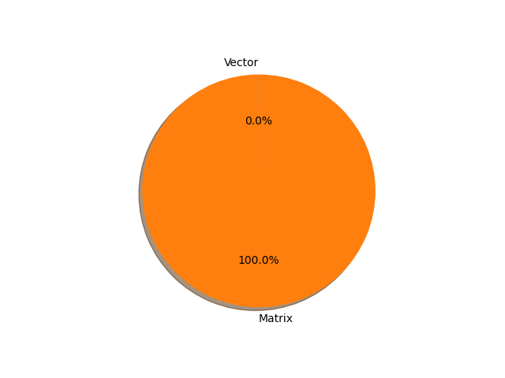

# t5-large parameter information

**Number of layers: [ 509 ]**

**Number of parameters: [ 737.67M ]**

**Proportional of each form** (%)

| Vector | Matrix | 
|  --- | --- |
| 23.97 | 76.03 | 

**Proportional of parameters by form** (%)

| Vector | Matrix | 
|  --- | --- |
| 0.02 | 99.98 | 

**Layer information**

| Name | Shape | Squeezed shape | Number of parameters | Form |
| --- | --- | --- | --- | --- |
| shared.weight | (32128, 1024) | (32128, 1024) | 32899072 | Matrix |
| encoder.block.0.layer.0.SelfAttention.q.weight | (1024, 1024) | (1024, 1024) | 1048576 | Matrix |
| encoder.block.0.layer.0.SelfAttention.k.weight | (1024, 1024) | (1024, 1024) | 1048576 | Matrix |
| encoder.block.0.layer.0.SelfAttention.v.weight | (1024, 1024) | (1024, 1024) | 1048576 | Matrix |
| encoder.block.0.layer.0.SelfAttention.o.weight | (1024, 1024) | (1024, 1024) | 1048576 | Matrix |
| encoder.block.0.layer.0.SelfAttention.relative_attention_bias.weight | (32, 16) | (32, 16) | 512 | Matrix |
| encoder.block.0.layer.0.layer_norm.weight | (1024,) | (1024,) | 1024 | Vector |
| encoder.block.0.layer.1.DenseReluDense.wi.weight | (4096, 1024) | (4096, 1024) | 4194304 | Matrix |
| encoder.block.0.layer.1.DenseReluDense.wo.weight | (1024, 4096) | (1024, 4096) | 4194304 | Matrix |
| encoder.block.0.layer.1.layer_norm.weight | (1024,) | (1024,) | 1024 | Vector |
| encoder.block.1.layer.0.SelfAttention.q.weight | (1024, 1024) | (1024, 1024) | 1048576 | Matrix |
| encoder.block.1.layer.0.SelfAttention.k.weight | (1024, 1024) | (1024, 1024) | 1048576 | Matrix |
| encoder.block.1.layer.0.SelfAttention.v.weight | (1024, 1024) | (1024, 1024) | 1048576 | Matrix |
| encoder.block.1.layer.0.SelfAttention.o.weight | (1024, 1024) | (1024, 1024) | 1048576 | Matrix |
| encoder.block.1.layer.0.layer_norm.weight | (1024,) | (1024,) | 1024 | Vector |
| encoder.block.1.layer.1.DenseReluDense.wi.weight | (4096, 1024) | (4096, 1024) | 4194304 | Matrix |
| encoder.block.1.layer.1.DenseReluDense.wo.weight | (1024, 4096) | (1024, 4096) | 4194304 | Matrix |
| encoder.block.1.layer.1.layer_norm.weight | (1024,) | (1024,) | 1024 | Vector |
| encoder.block.2.layer.0.SelfAttention.q.weight | (1024, 1024) | (1024, 1024) | 1048576 | Matrix |
| encoder.block.2.layer.0.SelfAttention.k.weight | (1024, 1024) | (1024, 1024) | 1048576 | Matrix |
| encoder.block.2.layer.0.SelfAttention.v.weight | (1024, 1024) | (1024, 1024) | 1048576 | Matrix |
| encoder.block.2.layer.0.SelfAttention.o.weight | (1024, 1024) | (1024, 1024) | 1048576 | Matrix |
| encoder.block.2.layer.0.layer_norm.weight | (1024,) | (1024,) | 1024 | Vector |
| encoder.block.2.layer.1.DenseReluDense.wi.weight | (4096, 1024) | (4096, 1024) | 4194304 | Matrix |
| encoder.block.2.layer.1.DenseReluDense.wo.weight | (1024, 4096) | (1024, 4096) | 4194304 | Matrix |
| encoder.block.2.layer.1.layer_norm.weight | (1024,) | (1024,) | 1024 | Vector |
| encoder.block.3.layer.0.SelfAttention.q.weight | (1024, 1024) | (1024, 1024) | 1048576 | Matrix |
| encoder.block.3.layer.0.SelfAttention.k.weight | (1024, 1024) | (1024, 1024) | 1048576 | Matrix |
| encoder.block.3.layer.0.SelfAttention.v.weight | (1024, 1024) | (1024, 1024) | 1048576 | Matrix |
| encoder.block.3.layer.0.SelfAttention.o.weight | (1024, 1024) | (1024, 1024) | 1048576 | Matrix |
| encoder.block.3.layer.0.layer_norm.weight | (1024,) | (1024,) | 1024 | Vector |
| encoder.block.3.layer.1.DenseReluDense.wi.weight | (4096, 1024) | (4096, 1024) | 4194304 | Matrix |
| encoder.block.3.layer.1.DenseReluDense.wo.weight | (1024, 4096) | (1024, 4096) | 4194304 | Matrix |
| encoder.block.3.layer.1.layer_norm.weight | (1024,) | (1024,) | 1024 | Vector |
| encoder.block.4.layer.0.SelfAttention.q.weight | (1024, 1024) | (1024, 1024) | 1048576 | Matrix |
| encoder.block.4.layer.0.SelfAttention.k.weight | (1024, 1024) | (1024, 1024) | 1048576 | Matrix |
| encoder.block.4.layer.0.SelfAttention.v.weight | (1024, 1024) | (1024, 1024) | 1048576 | Matrix |
| encoder.block.4.layer.0.SelfAttention.o.weight | (1024, 1024) | (1024, 1024) | 1048576 | Matrix |
| encoder.block.4.layer.0.layer_norm.weight | (1024,) | (1024,) | 1024 | Vector |
| encoder.block.4.layer.1.DenseReluDense.wi.weight | (4096, 1024) | (4096, 1024) | 4194304 | Matrix |
| encoder.block.4.layer.1.DenseReluDense.wo.weight | (1024, 4096) | (1024, 4096) | 4194304 | Matrix |
| encoder.block.4.layer.1.layer_norm.weight | (1024,) | (1024,) | 1024 | Vector |
| encoder.block.5.layer.0.SelfAttention.q.weight | (1024, 1024) | (1024, 1024) | 1048576 | Matrix |
| encoder.block.5.layer.0.SelfAttention.k.weight | (1024, 1024) | (1024, 1024) | 1048576 | Matrix |
| encoder.block.5.layer.0.SelfAttention.v.weight | (1024, 1024) | (1024, 1024) | 1048576 | Matrix |
| encoder.block.5.layer.0.SelfAttention.o.weight | (1024, 1024) | (1024, 1024) | 1048576 | Matrix |
| encoder.block.5.layer.0.layer_norm.weight | (1024,) | (1024,) | 1024 | Vector |
| encoder.block.5.layer.1.DenseReluDense.wi.weight | (4096, 1024) | (4096, 1024) | 4194304 | Matrix |
| encoder.block.5.layer.1.DenseReluDense.wo.weight | (1024, 4096) | (1024, 4096) | 4194304 | Matrix |
| encoder.block.5.layer.1.layer_norm.weight | (1024,) | (1024,) | 1024 | Vector |
| encoder.block.6.layer.0.SelfAttention.q.weight | (1024, 1024) | (1024, 1024) | 1048576 | Matrix |
| encoder.block.6.layer.0.SelfAttention.k.weight | (1024, 1024) | (1024, 1024) | 1048576 | Matrix |
| encoder.block.6.layer.0.SelfAttention.v.weight | (1024, 1024) | (1024, 1024) | 1048576 | Matrix |
| encoder.block.6.layer.0.SelfAttention.o.weight | (1024, 1024) | (1024, 1024) | 1048576 | Matrix |
| encoder.block.6.layer.0.layer_norm.weight | (1024,) | (1024,) | 1024 | Vector |
| encoder.block.6.layer.1.DenseReluDense.wi.weight | (4096, 1024) | (4096, 1024) | 4194304 | Matrix |
| encoder.block.6.layer.1.DenseReluDense.wo.weight | (1024, 4096) | (1024, 4096) | 4194304 | Matrix |
| encoder.block.6.layer.1.layer_norm.weight | (1024,) | (1024,) | 1024 | Vector |
| encoder.block.7.layer.0.SelfAttention.q.weight | (1024, 1024) | (1024, 1024) | 1048576 | Matrix |
| encoder.block.7.layer.0.SelfAttention.k.weight | (1024, 1024) | (1024, 1024) | 1048576 | Matrix |
| encoder.block.7.layer.0.SelfAttention.v.weight | (1024, 1024) | (1024, 1024) | 1048576 | Matrix |
| encoder.block.7.layer.0.SelfAttention.o.weight | (1024, 1024) | (1024, 1024) | 1048576 | Matrix |
| encoder.block.7.layer.0.layer_norm.weight | (1024,) | (1024,) | 1024 | Vector |
| encoder.block.7.layer.1.DenseReluDense.wi.weight | (4096, 1024) | (4096, 1024) | 4194304 | Matrix |
| encoder.block.7.layer.1.DenseReluDense.wo.weight | (1024, 4096) | (1024, 4096) | 4194304 | Matrix |
| encoder.block.7.layer.1.layer_norm.weight | (1024,) | (1024,) | 1024 | Vector |
| encoder.block.8.layer.0.SelfAttention.q.weight | (1024, 1024) | (1024, 1024) | 1048576 | Matrix |
| encoder.block.8.layer.0.SelfAttention.k.weight | (1024, 1024) | (1024, 1024) | 1048576 | Matrix |
| encoder.block.8.layer.0.SelfAttention.v.weight | (1024, 1024) | (1024, 1024) | 1048576 | Matrix |
| encoder.block.8.layer.0.SelfAttention.o.weight | (1024, 1024) | (1024, 1024) | 1048576 | Matrix |
| encoder.block.8.layer.0.layer_norm.weight | (1024,) | (1024,) | 1024 | Vector |
| encoder.block.8.layer.1.DenseReluDense.wi.weight | (4096, 1024) | (4096, 1024) | 4194304 | Matrix |
| encoder.block.8.layer.1.DenseReluDense.wo.weight | (1024, 4096) | (1024, 4096) | 4194304 | Matrix |
| encoder.block.8.layer.1.layer_norm.weight | (1024,) | (1024,) | 1024 | Vector |
| encoder.block.9.layer.0.SelfAttention.q.weight | (1024, 1024) | (1024, 1024) | 1048576 | Matrix |
| encoder.block.9.layer.0.SelfAttention.k.weight | (1024, 1024) | (1024, 1024) | 1048576 | Matrix |
| encoder.block.9.layer.0.SelfAttention.v.weight | (1024, 1024) | (1024, 1024) | 1048576 | Matrix |
| encoder.block.9.layer.0.SelfAttention.o.weight | (1024, 1024) | (1024, 1024) | 1048576 | Matrix |
| encoder.block.9.layer.0.layer_norm.weight | (1024,) | (1024,) | 1024 | Vector |
| encoder.block.9.layer.1.DenseReluDense.wi.weight | (4096, 1024) | (4096, 1024) | 4194304 | Matrix |
| encoder.block.9.layer.1.DenseReluDense.wo.weight | (1024, 4096) | (1024, 4096) | 4194304 | Matrix |
| encoder.block.9.layer.1.layer_norm.weight | (1024,) | (1024,) | 1024 | Vector |
| encoder.block.10.layer.0.SelfAttention.q.weight | (1024, 1024) | (1024, 1024) | 1048576 | Matrix |
| encoder.block.10.layer.0.SelfAttention.k.weight | (1024, 1024) | (1024, 1024) | 1048576 | Matrix |
| encoder.block.10.layer.0.SelfAttention.v.weight | (1024, 1024) | (1024, 1024) | 1048576 | Matrix |
| encoder.block.10.layer.0.SelfAttention.o.weight | (1024, 1024) | (1024, 1024) | 1048576 | Matrix |
| encoder.block.10.layer.0.layer_norm.weight | (1024,) | (1024,) | 1024 | Vector |
| encoder.block.10.layer.1.DenseReluDense.wi.weight | (4096, 1024) | (4096, 1024) | 4194304 | Matrix |
| encoder.block.10.layer.1.DenseReluDense.wo.weight | (1024, 4096) | (1024, 4096) | 4194304 | Matrix |
| encoder.block.10.layer.1.layer_norm.weight | (1024,) | (1024,) | 1024 | Vector |
| encoder.block.11.layer.0.SelfAttention.q.weight | (1024, 1024) | (1024, 1024) | 1048576 | Matrix |
| encoder.block.11.layer.0.SelfAttention.k.weight | (1024, 1024) | (1024, 1024) | 1048576 | Matrix |
| encoder.block.11.layer.0.SelfAttention.v.weight | (1024, 1024) | (1024, 1024) | 1048576 | Matrix |
| encoder.block.11.layer.0.SelfAttention.o.weight | (1024, 1024) | (1024, 1024) | 1048576 | Matrix |
| encoder.block.11.layer.0.layer_norm.weight | (1024,) | (1024,) | 1024 | Vector |
| encoder.block.11.layer.1.DenseReluDense.wi.weight | (4096, 1024) | (4096, 1024) | 4194304 | Matrix |
| encoder.block.11.layer.1.DenseReluDense.wo.weight | (1024, 4096) | (1024, 4096) | 4194304 | Matrix |
| encoder.block.11.layer.1.layer_norm.weight | (1024,) | (1024,) | 1024 | Vector |
| encoder.block.12.layer.0.SelfAttention.q.weight | (1024, 1024) | (1024, 1024) | 1048576 | Matrix |
| encoder.block.12.layer.0.SelfAttention.k.weight | (1024, 1024) | (1024, 1024) | 1048576 | Matrix |
| encoder.block.12.layer.0.SelfAttention.v.weight | (1024, 1024) | (1024, 1024) | 1048576 | Matrix |
| encoder.block.12.layer.0.SelfAttention.o.weight | (1024, 1024) | (1024, 1024) | 1048576 | Matrix |
| encoder.block.12.layer.0.layer_norm.weight | (1024,) | (1024,) | 1024 | Vector |
| encoder.block.12.layer.1.DenseReluDense.wi.weight | (4096, 1024) | (4096, 1024) | 4194304 | Matrix |
| encoder.block.12.layer.1.DenseReluDense.wo.weight | (1024, 4096) | (1024, 4096) | 4194304 | Matrix |
| encoder.block.12.layer.1.layer_norm.weight | (1024,) | (1024,) | 1024 | Vector |
| encoder.block.13.layer.0.SelfAttention.q.weight | (1024, 1024) | (1024, 1024) | 1048576 | Matrix |
| encoder.block.13.layer.0.SelfAttention.k.weight | (1024, 1024) | (1024, 1024) | 1048576 | Matrix |
| encoder.block.13.layer.0.SelfAttention.v.weight | (1024, 1024) | (1024, 1024) | 1048576 | Matrix |
| encoder.block.13.layer.0.SelfAttention.o.weight | (1024, 1024) | (1024, 1024) | 1048576 | Matrix |
| encoder.block.13.layer.0.layer_norm.weight | (1024,) | (1024,) | 1024 | Vector |
| encoder.block.13.layer.1.DenseReluDense.wi.weight | (4096, 1024) | (4096, 1024) | 4194304 | Matrix |
| encoder.block.13.layer.1.DenseReluDense.wo.weight | (1024, 4096) | (1024, 4096) | 4194304 | Matrix |
| encoder.block.13.layer.1.layer_norm.weight | (1024,) | (1024,) | 1024 | Vector |
| encoder.block.14.layer.0.SelfAttention.q.weight | (1024, 1024) | (1024, 1024) | 1048576 | Matrix |
| encoder.block.14.layer.0.SelfAttention.k.weight | (1024, 1024) | (1024, 1024) | 1048576 | Matrix |
| encoder.block.14.layer.0.SelfAttention.v.weight | (1024, 1024) | (1024, 1024) | 1048576 | Matrix |
| encoder.block.14.layer.0.SelfAttention.o.weight | (1024, 1024) | (1024, 1024) | 1048576 | Matrix |
| encoder.block.14.layer.0.layer_norm.weight | (1024,) | (1024,) | 1024 | Vector |
| encoder.block.14.layer.1.DenseReluDense.wi.weight | (4096, 1024) | (4096, 1024) | 4194304 | Matrix |
| encoder.block.14.layer.1.DenseReluDense.wo.weight | (1024, 4096) | (1024, 4096) | 4194304 | Matrix |
| encoder.block.14.layer.1.layer_norm.weight | (1024,) | (1024,) | 1024 | Vector |
| encoder.block.15.layer.0.SelfAttention.q.weight | (1024, 1024) | (1024, 1024) | 1048576 | Matrix |
| encoder.block.15.layer.0.SelfAttention.k.weight | (1024, 1024) | (1024, 1024) | 1048576 | Matrix |
| encoder.block.15.layer.0.SelfAttention.v.weight | (1024, 1024) | (1024, 1024) | 1048576 | Matrix |
| encoder.block.15.layer.0.SelfAttention.o.weight | (1024, 1024) | (1024, 1024) | 1048576 | Matrix |
| encoder.block.15.layer.0.layer_norm.weight | (1024,) | (1024,) | 1024 | Vector |
| encoder.block.15.layer.1.DenseReluDense.wi.weight | (4096, 1024) | (4096, 1024) | 4194304 | Matrix |
| encoder.block.15.layer.1.DenseReluDense.wo.weight | (1024, 4096) | (1024, 4096) | 4194304 | Matrix |
| encoder.block.15.layer.1.layer_norm.weight | (1024,) | (1024,) | 1024 | Vector |
| encoder.block.16.layer.0.SelfAttention.q.weight | (1024, 1024) | (1024, 1024) | 1048576 | Matrix |
| encoder.block.16.layer.0.SelfAttention.k.weight | (1024, 1024) | (1024, 1024) | 1048576 | Matrix |
| encoder.block.16.layer.0.SelfAttention.v.weight | (1024, 1024) | (1024, 1024) | 1048576 | Matrix |
| encoder.block.16.layer.0.SelfAttention.o.weight | (1024, 1024) | (1024, 1024) | 1048576 | Matrix |
| encoder.block.16.layer.0.layer_norm.weight | (1024,) | (1024,) | 1024 | Vector |
| encoder.block.16.layer.1.DenseReluDense.wi.weight | (4096, 1024) | (4096, 1024) | 4194304 | Matrix |
| encoder.block.16.layer.1.DenseReluDense.wo.weight | (1024, 4096) | (1024, 4096) | 4194304 | Matrix |
| encoder.block.16.layer.1.layer_norm.weight | (1024,) | (1024,) | 1024 | Vector |
| encoder.block.17.layer.0.SelfAttention.q.weight | (1024, 1024) | (1024, 1024) | 1048576 | Matrix |
| encoder.block.17.layer.0.SelfAttention.k.weight | (1024, 1024) | (1024, 1024) | 1048576 | Matrix |
| encoder.block.17.layer.0.SelfAttention.v.weight | (1024, 1024) | (1024, 1024) | 1048576 | Matrix |
| encoder.block.17.layer.0.SelfAttention.o.weight | (1024, 1024) | (1024, 1024) | 1048576 | Matrix |
| encoder.block.17.layer.0.layer_norm.weight | (1024,) | (1024,) | 1024 | Vector |
| encoder.block.17.layer.1.DenseReluDense.wi.weight | (4096, 1024) | (4096, 1024) | 4194304 | Matrix |
| encoder.block.17.layer.1.DenseReluDense.wo.weight | (1024, 4096) | (1024, 4096) | 4194304 | Matrix |
| encoder.block.17.layer.1.layer_norm.weight | (1024,) | (1024,) | 1024 | Vector |
| encoder.block.18.layer.0.SelfAttention.q.weight | (1024, 1024) | (1024, 1024) | 1048576 | Matrix |
| encoder.block.18.layer.0.SelfAttention.k.weight | (1024, 1024) | (1024, 1024) | 1048576 | Matrix |
| encoder.block.18.layer.0.SelfAttention.v.weight | (1024, 1024) | (1024, 1024) | 1048576 | Matrix |
| encoder.block.18.layer.0.SelfAttention.o.weight | (1024, 1024) | (1024, 1024) | 1048576 | Matrix |
| encoder.block.18.layer.0.layer_norm.weight | (1024,) | (1024,) | 1024 | Vector |
| encoder.block.18.layer.1.DenseReluDense.wi.weight | (4096, 1024) | (4096, 1024) | 4194304 | Matrix |
| encoder.block.18.layer.1.DenseReluDense.wo.weight | (1024, 4096) | (1024, 4096) | 4194304 | Matrix |
| encoder.block.18.layer.1.layer_norm.weight | (1024,) | (1024,) | 1024 | Vector |
| encoder.block.19.layer.0.SelfAttention.q.weight | (1024, 1024) | (1024, 1024) | 1048576 | Matrix |
| encoder.block.19.layer.0.SelfAttention.k.weight | (1024, 1024) | (1024, 1024) | 1048576 | Matrix |
| encoder.block.19.layer.0.SelfAttention.v.weight | (1024, 1024) | (1024, 1024) | 1048576 | Matrix |
| encoder.block.19.layer.0.SelfAttention.o.weight | (1024, 1024) | (1024, 1024) | 1048576 | Matrix |
| encoder.block.19.layer.0.layer_norm.weight | (1024,) | (1024,) | 1024 | Vector |
| encoder.block.19.layer.1.DenseReluDense.wi.weight | (4096, 1024) | (4096, 1024) | 4194304 | Matrix |
| encoder.block.19.layer.1.DenseReluDense.wo.weight | (1024, 4096) | (1024, 4096) | 4194304 | Matrix |
| encoder.block.19.layer.1.layer_norm.weight | (1024,) | (1024,) | 1024 | Vector |
| encoder.block.20.layer.0.SelfAttention.q.weight | (1024, 1024) | (1024, 1024) | 1048576 | Matrix |
| encoder.block.20.layer.0.SelfAttention.k.weight | (1024, 1024) | (1024, 1024) | 1048576 | Matrix |
| encoder.block.20.layer.0.SelfAttention.v.weight | (1024, 1024) | (1024, 1024) | 1048576 | Matrix |
| encoder.block.20.layer.0.SelfAttention.o.weight | (1024, 1024) | (1024, 1024) | 1048576 | Matrix |
| encoder.block.20.layer.0.layer_norm.weight | (1024,) | (1024,) | 1024 | Vector |
| encoder.block.20.layer.1.DenseReluDense.wi.weight | (4096, 1024) | (4096, 1024) | 4194304 | Matrix |
| encoder.block.20.layer.1.DenseReluDense.wo.weight | (1024, 4096) | (1024, 4096) | 4194304 | Matrix |
| encoder.block.20.layer.1.layer_norm.weight | (1024,) | (1024,) | 1024 | Vector |
| encoder.block.21.layer.0.SelfAttention.q.weight | (1024, 1024) | (1024, 1024) | 1048576 | Matrix |
| encoder.block.21.layer.0.SelfAttention.k.weight | (1024, 1024) | (1024, 1024) | 1048576 | Matrix |
| encoder.block.21.layer.0.SelfAttention.v.weight | (1024, 1024) | (1024, 1024) | 1048576 | Matrix |
| encoder.block.21.layer.0.SelfAttention.o.weight | (1024, 1024) | (1024, 1024) | 1048576 | Matrix |
| encoder.block.21.layer.0.layer_norm.weight | (1024,) | (1024,) | 1024 | Vector |
| encoder.block.21.layer.1.DenseReluDense.wi.weight | (4096, 1024) | (4096, 1024) | 4194304 | Matrix |
| encoder.block.21.layer.1.DenseReluDense.wo.weight | (1024, 4096) | (1024, 4096) | 4194304 | Matrix |
| encoder.block.21.layer.1.layer_norm.weight | (1024,) | (1024,) | 1024 | Vector |
| encoder.block.22.layer.0.SelfAttention.q.weight | (1024, 1024) | (1024, 1024) | 1048576 | Matrix |
| encoder.block.22.layer.0.SelfAttention.k.weight | (1024, 1024) | (1024, 1024) | 1048576 | Matrix |
| encoder.block.22.layer.0.SelfAttention.v.weight | (1024, 1024) | (1024, 1024) | 1048576 | Matrix |
| encoder.block.22.layer.0.SelfAttention.o.weight | (1024, 1024) | (1024, 1024) | 1048576 | Matrix |
| encoder.block.22.layer.0.layer_norm.weight | (1024,) | (1024,) | 1024 | Vector |
| encoder.block.22.layer.1.DenseReluDense.wi.weight | (4096, 1024) | (4096, 1024) | 4194304 | Matrix |
| encoder.block.22.layer.1.DenseReluDense.wo.weight | (1024, 4096) | (1024, 4096) | 4194304 | Matrix |
| encoder.block.22.layer.1.layer_norm.weight | (1024,) | (1024,) | 1024 | Vector |
| encoder.block.23.layer.0.SelfAttention.q.weight | (1024, 1024) | (1024, 1024) | 1048576 | Matrix |
| encoder.block.23.layer.0.SelfAttention.k.weight | (1024, 1024) | (1024, 1024) | 1048576 | Matrix |
| encoder.block.23.layer.0.SelfAttention.v.weight | (1024, 1024) | (1024, 1024) | 1048576 | Matrix |
| encoder.block.23.layer.0.SelfAttention.o.weight | (1024, 1024) | (1024, 1024) | 1048576 | Matrix |
| encoder.block.23.layer.0.layer_norm.weight | (1024,) | (1024,) | 1024 | Vector |
| encoder.block.23.layer.1.DenseReluDense.wi.weight | (4096, 1024) | (4096, 1024) | 4194304 | Matrix |
| encoder.block.23.layer.1.DenseReluDense.wo.weight | (1024, 4096) | (1024, 4096) | 4194304 | Matrix |
| encoder.block.23.layer.1.layer_norm.weight | (1024,) | (1024,) | 1024 | Vector |
| encoder.final_layer_norm.weight | (1024,) | (1024,) | 1024 | Vector |
| decoder.block.0.layer.0.SelfAttention.q.weight | (1024, 1024) | (1024, 1024) | 1048576 | Matrix |
| decoder.block.0.layer.0.SelfAttention.k.weight | (1024, 1024) | (1024, 1024) | 1048576 | Matrix |
| decoder.block.0.layer.0.SelfAttention.v.weight | (1024, 1024) | (1024, 1024) | 1048576 | Matrix |
| decoder.block.0.layer.0.SelfAttention.o.weight | (1024, 1024) | (1024, 1024) | 1048576 | Matrix |
| decoder.block.0.layer.0.SelfAttention.relative_attention_bias.weight | (32, 16) | (32, 16) | 512 | Matrix |
| decoder.block.0.layer.0.layer_norm.weight | (1024,) | (1024,) | 1024 | Vector |
| decoder.block.0.layer.1.EncDecAttention.q.weight | (1024, 1024) | (1024, 1024) | 1048576 | Matrix |
| decoder.block.0.layer.1.EncDecAttention.k.weight | (1024, 1024) | (1024, 1024) | 1048576 | Matrix |
| decoder.block.0.layer.1.EncDecAttention.v.weight | (1024, 1024) | (1024, 1024) | 1048576 | Matrix |
| decoder.block.0.layer.1.EncDecAttention.o.weight | (1024, 1024) | (1024, 1024) | 1048576 | Matrix |
| decoder.block.0.layer.1.layer_norm.weight | (1024,) | (1024,) | 1024 | Vector |
| decoder.block.0.layer.2.DenseReluDense.wi.weight | (4096, 1024) | (4096, 1024) | 4194304 | Matrix |
| decoder.block.0.layer.2.DenseReluDense.wo.weight | (1024, 4096) | (1024, 4096) | 4194304 | Matrix |
| decoder.block.0.layer.2.layer_norm.weight | (1024,) | (1024,) | 1024 | Vector |
| decoder.block.1.layer.0.SelfAttention.q.weight | (1024, 1024) | (1024, 1024) | 1048576 | Matrix |
| decoder.block.1.layer.0.SelfAttention.k.weight | (1024, 1024) | (1024, 1024) | 1048576 | Matrix |
| decoder.block.1.layer.0.SelfAttention.v.weight | (1024, 1024) | (1024, 1024) | 1048576 | Matrix |
| decoder.block.1.layer.0.SelfAttention.o.weight | (1024, 1024) | (1024, 1024) | 1048576 | Matrix |
| decoder.block.1.layer.0.layer_norm.weight | (1024,) | (1024,) | 1024 | Vector |
| decoder.block.1.layer.1.EncDecAttention.q.weight | (1024, 1024) | (1024, 1024) | 1048576 | Matrix |
| decoder.block.1.layer.1.EncDecAttention.k.weight | (1024, 1024) | (1024, 1024) | 1048576 | Matrix |
| decoder.block.1.layer.1.EncDecAttention.v.weight | (1024, 1024) | (1024, 1024) | 1048576 | Matrix |
| decoder.block.1.layer.1.EncDecAttention.o.weight | (1024, 1024) | (1024, 1024) | 1048576 | Matrix |
| decoder.block.1.layer.1.layer_norm.weight | (1024,) | (1024,) | 1024 | Vector |
| decoder.block.1.layer.2.DenseReluDense.wi.weight | (4096, 1024) | (4096, 1024) | 4194304 | Matrix |
| decoder.block.1.layer.2.DenseReluDense.wo.weight | (1024, 4096) | (1024, 4096) | 4194304 | Matrix |
| decoder.block.1.layer.2.layer_norm.weight | (1024,) | (1024,) | 1024 | Vector |
| decoder.block.2.layer.0.SelfAttention.q.weight | (1024, 1024) | (1024, 1024) | 1048576 | Matrix |
| decoder.block.2.layer.0.SelfAttention.k.weight | (1024, 1024) | (1024, 1024) | 1048576 | Matrix |
| decoder.block.2.layer.0.SelfAttention.v.weight | (1024, 1024) | (1024, 1024) | 1048576 | Matrix |
| decoder.block.2.layer.0.SelfAttention.o.weight | (1024, 1024) | (1024, 1024) | 1048576 | Matrix |
| decoder.block.2.layer.0.layer_norm.weight | (1024,) | (1024,) | 1024 | Vector |
| decoder.block.2.layer.1.EncDecAttention.q.weight | (1024, 1024) | (1024, 1024) | 1048576 | Matrix |
| decoder.block.2.layer.1.EncDecAttention.k.weight | (1024, 1024) | (1024, 1024) | 1048576 | Matrix |
| decoder.block.2.layer.1.EncDecAttention.v.weight | (1024, 1024) | (1024, 1024) | 1048576 | Matrix |
| decoder.block.2.layer.1.EncDecAttention.o.weight | (1024, 1024) | (1024, 1024) | 1048576 | Matrix |
| decoder.block.2.layer.1.layer_norm.weight | (1024,) | (1024,) | 1024 | Vector |
| decoder.block.2.layer.2.DenseReluDense.wi.weight | (4096, 1024) | (4096, 1024) | 4194304 | Matrix |
| decoder.block.2.layer.2.DenseReluDense.wo.weight | (1024, 4096) | (1024, 4096) | 4194304 | Matrix |
| decoder.block.2.layer.2.layer_norm.weight | (1024,) | (1024,) | 1024 | Vector |
| decoder.block.3.layer.0.SelfAttention.q.weight | (1024, 1024) | (1024, 1024) | 1048576 | Matrix |
| decoder.block.3.layer.0.SelfAttention.k.weight | (1024, 1024) | (1024, 1024) | 1048576 | Matrix |
| decoder.block.3.layer.0.SelfAttention.v.weight | (1024, 1024) | (1024, 1024) | 1048576 | Matrix |
| decoder.block.3.layer.0.SelfAttention.o.weight | (1024, 1024) | (1024, 1024) | 1048576 | Matrix |
| decoder.block.3.layer.0.layer_norm.weight | (1024,) | (1024,) | 1024 | Vector |
| decoder.block.3.layer.1.EncDecAttention.q.weight | (1024, 1024) | (1024, 1024) | 1048576 | Matrix |
| decoder.block.3.layer.1.EncDecAttention.k.weight | (1024, 1024) | (1024, 1024) | 1048576 | Matrix |
| decoder.block.3.layer.1.EncDecAttention.v.weight | (1024, 1024) | (1024, 1024) | 1048576 | Matrix |
| decoder.block.3.layer.1.EncDecAttention.o.weight | (1024, 1024) | (1024, 1024) | 1048576 | Matrix |
| decoder.block.3.layer.1.layer_norm.weight | (1024,) | (1024,) | 1024 | Vector |
| decoder.block.3.layer.2.DenseReluDense.wi.weight | (4096, 1024) | (4096, 1024) | 4194304 | Matrix |
| decoder.block.3.layer.2.DenseReluDense.wo.weight | (1024, 4096) | (1024, 4096) | 4194304 | Matrix |
| decoder.block.3.layer.2.layer_norm.weight | (1024,) | (1024,) | 1024 | Vector |
| decoder.block.4.layer.0.SelfAttention.q.weight | (1024, 1024) | (1024, 1024) | 1048576 | Matrix |
| decoder.block.4.layer.0.SelfAttention.k.weight | (1024, 1024) | (1024, 1024) | 1048576 | Matrix |
| decoder.block.4.layer.0.SelfAttention.v.weight | (1024, 1024) | (1024, 1024) | 1048576 | Matrix |
| decoder.block.4.layer.0.SelfAttention.o.weight | (1024, 1024) | (1024, 1024) | 1048576 | Matrix |
| decoder.block.4.layer.0.layer_norm.weight | (1024,) | (1024,) | 1024 | Vector |
| decoder.block.4.layer.1.EncDecAttention.q.weight | (1024, 1024) | (1024, 1024) | 1048576 | Matrix |
| decoder.block.4.layer.1.EncDecAttention.k.weight | (1024, 1024) | (1024, 1024) | 1048576 | Matrix |
| decoder.block.4.layer.1.EncDecAttention.v.weight | (1024, 1024) | (1024, 1024) | 1048576 | Matrix |
| decoder.block.4.layer.1.EncDecAttention.o.weight | (1024, 1024) | (1024, 1024) | 1048576 | Matrix |
| decoder.block.4.layer.1.layer_norm.weight | (1024,) | (1024,) | 1024 | Vector |
| decoder.block.4.layer.2.DenseReluDense.wi.weight | (4096, 1024) | (4096, 1024) | 4194304 | Matrix |
| decoder.block.4.layer.2.DenseReluDense.wo.weight | (1024, 4096) | (1024, 4096) | 4194304 | Matrix |
| decoder.block.4.layer.2.layer_norm.weight | (1024,) | (1024,) | 1024 | Vector |
| decoder.block.5.layer.0.SelfAttention.q.weight | (1024, 1024) | (1024, 1024) | 1048576 | Matrix |
| decoder.block.5.layer.0.SelfAttention.k.weight | (1024, 1024) | (1024, 1024) | 1048576 | Matrix |
| decoder.block.5.layer.0.SelfAttention.v.weight | (1024, 1024) | (1024, 1024) | 1048576 | Matrix |
| decoder.block.5.layer.0.SelfAttention.o.weight | (1024, 1024) | (1024, 1024) | 1048576 | Matrix |
| decoder.block.5.layer.0.layer_norm.weight | (1024,) | (1024,) | 1024 | Vector |
| decoder.block.5.layer.1.EncDecAttention.q.weight | (1024, 1024) | (1024, 1024) | 1048576 | Matrix |
| decoder.block.5.layer.1.EncDecAttention.k.weight | (1024, 1024) | (1024, 1024) | 1048576 | Matrix |
| decoder.block.5.layer.1.EncDecAttention.v.weight | (1024, 1024) | (1024, 1024) | 1048576 | Matrix |
| decoder.block.5.layer.1.EncDecAttention.o.weight | (1024, 1024) | (1024, 1024) | 1048576 | Matrix |
| decoder.block.5.layer.1.layer_norm.weight | (1024,) | (1024,) | 1024 | Vector |
| decoder.block.5.layer.2.DenseReluDense.wi.weight | (4096, 1024) | (4096, 1024) | 4194304 | Matrix |
| decoder.block.5.layer.2.DenseReluDense.wo.weight | (1024, 4096) | (1024, 4096) | 4194304 | Matrix |
| decoder.block.5.layer.2.layer_norm.weight | (1024,) | (1024,) | 1024 | Vector |
| decoder.block.6.layer.0.SelfAttention.q.weight | (1024, 1024) | (1024, 1024) | 1048576 | Matrix |
| decoder.block.6.layer.0.SelfAttention.k.weight | (1024, 1024) | (1024, 1024) | 1048576 | Matrix |
| decoder.block.6.layer.0.SelfAttention.v.weight | (1024, 1024) | (1024, 1024) | 1048576 | Matrix |
| decoder.block.6.layer.0.SelfAttention.o.weight | (1024, 1024) | (1024, 1024) | 1048576 | Matrix |
| decoder.block.6.layer.0.layer_norm.weight | (1024,) | (1024,) | 1024 | Vector |
| decoder.block.6.layer.1.EncDecAttention.q.weight | (1024, 1024) | (1024, 1024) | 1048576 | Matrix |
| decoder.block.6.layer.1.EncDecAttention.k.weight | (1024, 1024) | (1024, 1024) | 1048576 | Matrix |
| decoder.block.6.layer.1.EncDecAttention.v.weight | (1024, 1024) | (1024, 1024) | 1048576 | Matrix |
| decoder.block.6.layer.1.EncDecAttention.o.weight | (1024, 1024) | (1024, 1024) | 1048576 | Matrix |
| decoder.block.6.layer.1.layer_norm.weight | (1024,) | (1024,) | 1024 | Vector |
| decoder.block.6.layer.2.DenseReluDense.wi.weight | (4096, 1024) | (4096, 1024) | 4194304 | Matrix |
| decoder.block.6.layer.2.DenseReluDense.wo.weight | (1024, 4096) | (1024, 4096) | 4194304 | Matrix |
| decoder.block.6.layer.2.layer_norm.weight | (1024,) | (1024,) | 1024 | Vector |
| decoder.block.7.layer.0.SelfAttention.q.weight | (1024, 1024) | (1024, 1024) | 1048576 | Matrix |
| decoder.block.7.layer.0.SelfAttention.k.weight | (1024, 1024) | (1024, 1024) | 1048576 | Matrix |
| decoder.block.7.layer.0.SelfAttention.v.weight | (1024, 1024) | (1024, 1024) | 1048576 | Matrix |
| decoder.block.7.layer.0.SelfAttention.o.weight | (1024, 1024) | (1024, 1024) | 1048576 | Matrix |
| decoder.block.7.layer.0.layer_norm.weight | (1024,) | (1024,) | 1024 | Vector |
| decoder.block.7.layer.1.EncDecAttention.q.weight | (1024, 1024) | (1024, 1024) | 1048576 | Matrix |
| decoder.block.7.layer.1.EncDecAttention.k.weight | (1024, 1024) | (1024, 1024) | 1048576 | Matrix |
| decoder.block.7.layer.1.EncDecAttention.v.weight | (1024, 1024) | (1024, 1024) | 1048576 | Matrix |
| decoder.block.7.layer.1.EncDecAttention.o.weight | (1024, 1024) | (1024, 1024) | 1048576 | Matrix |
| decoder.block.7.layer.1.layer_norm.weight | (1024,) | (1024,) | 1024 | Vector |
| decoder.block.7.layer.2.DenseReluDense.wi.weight | (4096, 1024) | (4096, 1024) | 4194304 | Matrix |
| decoder.block.7.layer.2.DenseReluDense.wo.weight | (1024, 4096) | (1024, 4096) | 4194304 | Matrix |
| decoder.block.7.layer.2.layer_norm.weight | (1024,) | (1024,) | 1024 | Vector |
| decoder.block.8.layer.0.SelfAttention.q.weight | (1024, 1024) | (1024, 1024) | 1048576 | Matrix |
| decoder.block.8.layer.0.SelfAttention.k.weight | (1024, 1024) | (1024, 1024) | 1048576 | Matrix |
| decoder.block.8.layer.0.SelfAttention.v.weight | (1024, 1024) | (1024, 1024) | 1048576 | Matrix |
| decoder.block.8.layer.0.SelfAttention.o.weight | (1024, 1024) | (1024, 1024) | 1048576 | Matrix |
| decoder.block.8.layer.0.layer_norm.weight | (1024,) | (1024,) | 1024 | Vector |
| decoder.block.8.layer.1.EncDecAttention.q.weight | (1024, 1024) | (1024, 1024) | 1048576 | Matrix |
| decoder.block.8.layer.1.EncDecAttention.k.weight | (1024, 1024) | (1024, 1024) | 1048576 | Matrix |
| decoder.block.8.layer.1.EncDecAttention.v.weight | (1024, 1024) | (1024, 1024) | 1048576 | Matrix |
| decoder.block.8.layer.1.EncDecAttention.o.weight | (1024, 1024) | (1024, 1024) | 1048576 | Matrix |
| decoder.block.8.layer.1.layer_norm.weight | (1024,) | (1024,) | 1024 | Vector |
| decoder.block.8.layer.2.DenseReluDense.wi.weight | (4096, 1024) | (4096, 1024) | 4194304 | Matrix |
| decoder.block.8.layer.2.DenseReluDense.wo.weight | (1024, 4096) | (1024, 4096) | 4194304 | Matrix |
| decoder.block.8.layer.2.layer_norm.weight | (1024,) | (1024,) | 1024 | Vector |
| decoder.block.9.layer.0.SelfAttention.q.weight | (1024, 1024) | (1024, 1024) | 1048576 | Matrix |
| decoder.block.9.layer.0.SelfAttention.k.weight | (1024, 1024) | (1024, 1024) | 1048576 | Matrix |
| decoder.block.9.layer.0.SelfAttention.v.weight | (1024, 1024) | (1024, 1024) | 1048576 | Matrix |
| decoder.block.9.layer.0.SelfAttention.o.weight | (1024, 1024) | (1024, 1024) | 1048576 | Matrix |
| decoder.block.9.layer.0.layer_norm.weight | (1024,) | (1024,) | 1024 | Vector |
| decoder.block.9.layer.1.EncDecAttention.q.weight | (1024, 1024) | (1024, 1024) | 1048576 | Matrix |
| decoder.block.9.layer.1.EncDecAttention.k.weight | (1024, 1024) | (1024, 1024) | 1048576 | Matrix |
| decoder.block.9.layer.1.EncDecAttention.v.weight | (1024, 1024) | (1024, 1024) | 1048576 | Matrix |
| decoder.block.9.layer.1.EncDecAttention.o.weight | (1024, 1024) | (1024, 1024) | 1048576 | Matrix |
| decoder.block.9.layer.1.layer_norm.weight | (1024,) | (1024,) | 1024 | Vector |
| decoder.block.9.layer.2.DenseReluDense.wi.weight | (4096, 1024) | (4096, 1024) | 4194304 | Matrix |
| decoder.block.9.layer.2.DenseReluDense.wo.weight | (1024, 4096) | (1024, 4096) | 4194304 | Matrix |
| decoder.block.9.layer.2.layer_norm.weight | (1024,) | (1024,) | 1024 | Vector |
| decoder.block.10.layer.0.SelfAttention.q.weight | (1024, 1024) | (1024, 1024) | 1048576 | Matrix |
| decoder.block.10.layer.0.SelfAttention.k.weight | (1024, 1024) | (1024, 1024) | 1048576 | Matrix |
| decoder.block.10.layer.0.SelfAttention.v.weight | (1024, 1024) | (1024, 1024) | 1048576 | Matrix |
| decoder.block.10.layer.0.SelfAttention.o.weight | (1024, 1024) | (1024, 1024) | 1048576 | Matrix |
| decoder.block.10.layer.0.layer_norm.weight | (1024,) | (1024,) | 1024 | Vector |
| decoder.block.10.layer.1.EncDecAttention.q.weight | (1024, 1024) | (1024, 1024) | 1048576 | Matrix |
| decoder.block.10.layer.1.EncDecAttention.k.weight | (1024, 1024) | (1024, 1024) | 1048576 | Matrix |
| decoder.block.10.layer.1.EncDecAttention.v.weight | (1024, 1024) | (1024, 1024) | 1048576 | Matrix |
| decoder.block.10.layer.1.EncDecAttention.o.weight | (1024, 1024) | (1024, 1024) | 1048576 | Matrix |
| decoder.block.10.layer.1.layer_norm.weight | (1024,) | (1024,) | 1024 | Vector |
| decoder.block.10.layer.2.DenseReluDense.wi.weight | (4096, 1024) | (4096, 1024) | 4194304 | Matrix |
| decoder.block.10.layer.2.DenseReluDense.wo.weight | (1024, 4096) | (1024, 4096) | 4194304 | Matrix |
| decoder.block.10.layer.2.layer_norm.weight | (1024,) | (1024,) | 1024 | Vector |
| decoder.block.11.layer.0.SelfAttention.q.weight | (1024, 1024) | (1024, 1024) | 1048576 | Matrix |
| decoder.block.11.layer.0.SelfAttention.k.weight | (1024, 1024) | (1024, 1024) | 1048576 | Matrix |
| decoder.block.11.layer.0.SelfAttention.v.weight | (1024, 1024) | (1024, 1024) | 1048576 | Matrix |
| decoder.block.11.layer.0.SelfAttention.o.weight | (1024, 1024) | (1024, 1024) | 1048576 | Matrix |
| decoder.block.11.layer.0.layer_norm.weight | (1024,) | (1024,) | 1024 | Vector |
| decoder.block.11.layer.1.EncDecAttention.q.weight | (1024, 1024) | (1024, 1024) | 1048576 | Matrix |
| decoder.block.11.layer.1.EncDecAttention.k.weight | (1024, 1024) | (1024, 1024) | 1048576 | Matrix |
| decoder.block.11.layer.1.EncDecAttention.v.weight | (1024, 1024) | (1024, 1024) | 1048576 | Matrix |
| decoder.block.11.layer.1.EncDecAttention.o.weight | (1024, 1024) | (1024, 1024) | 1048576 | Matrix |
| decoder.block.11.layer.1.layer_norm.weight | (1024,) | (1024,) | 1024 | Vector |
| decoder.block.11.layer.2.DenseReluDense.wi.weight | (4096, 1024) | (4096, 1024) | 4194304 | Matrix |
| decoder.block.11.layer.2.DenseReluDense.wo.weight | (1024, 4096) | (1024, 4096) | 4194304 | Matrix |
| decoder.block.11.layer.2.layer_norm.weight | (1024,) | (1024,) | 1024 | Vector |
| decoder.block.12.layer.0.SelfAttention.q.weight | (1024, 1024) | (1024, 1024) | 1048576 | Matrix |
| decoder.block.12.layer.0.SelfAttention.k.weight | (1024, 1024) | (1024, 1024) | 1048576 | Matrix |
| decoder.block.12.layer.0.SelfAttention.v.weight | (1024, 1024) | (1024, 1024) | 1048576 | Matrix |
| decoder.block.12.layer.0.SelfAttention.o.weight | (1024, 1024) | (1024, 1024) | 1048576 | Matrix |
| decoder.block.12.layer.0.layer_norm.weight | (1024,) | (1024,) | 1024 | Vector |
| decoder.block.12.layer.1.EncDecAttention.q.weight | (1024, 1024) | (1024, 1024) | 1048576 | Matrix |
| decoder.block.12.layer.1.EncDecAttention.k.weight | (1024, 1024) | (1024, 1024) | 1048576 | Matrix |
| decoder.block.12.layer.1.EncDecAttention.v.weight | (1024, 1024) | (1024, 1024) | 1048576 | Matrix |
| decoder.block.12.layer.1.EncDecAttention.o.weight | (1024, 1024) | (1024, 1024) | 1048576 | Matrix |
| decoder.block.12.layer.1.layer_norm.weight | (1024,) | (1024,) | 1024 | Vector |
| decoder.block.12.layer.2.DenseReluDense.wi.weight | (4096, 1024) | (4096, 1024) | 4194304 | Matrix |
| decoder.block.12.layer.2.DenseReluDense.wo.weight | (1024, 4096) | (1024, 4096) | 4194304 | Matrix |
| decoder.block.12.layer.2.layer_norm.weight | (1024,) | (1024,) | 1024 | Vector |
| decoder.block.13.layer.0.SelfAttention.q.weight | (1024, 1024) | (1024, 1024) | 1048576 | Matrix |
| decoder.block.13.layer.0.SelfAttention.k.weight | (1024, 1024) | (1024, 1024) | 1048576 | Matrix |
| decoder.block.13.layer.0.SelfAttention.v.weight | (1024, 1024) | (1024, 1024) | 1048576 | Matrix |
| decoder.block.13.layer.0.SelfAttention.o.weight | (1024, 1024) | (1024, 1024) | 1048576 | Matrix |
| decoder.block.13.layer.0.layer_norm.weight | (1024,) | (1024,) | 1024 | Vector |
| decoder.block.13.layer.1.EncDecAttention.q.weight | (1024, 1024) | (1024, 1024) | 1048576 | Matrix |
| decoder.block.13.layer.1.EncDecAttention.k.weight | (1024, 1024) | (1024, 1024) | 1048576 | Matrix |
| decoder.block.13.layer.1.EncDecAttention.v.weight | (1024, 1024) | (1024, 1024) | 1048576 | Matrix |
| decoder.block.13.layer.1.EncDecAttention.o.weight | (1024, 1024) | (1024, 1024) | 1048576 | Matrix |
| decoder.block.13.layer.1.layer_norm.weight | (1024,) | (1024,) | 1024 | Vector |
| decoder.block.13.layer.2.DenseReluDense.wi.weight | (4096, 1024) | (4096, 1024) | 4194304 | Matrix |
| decoder.block.13.layer.2.DenseReluDense.wo.weight | (1024, 4096) | (1024, 4096) | 4194304 | Matrix |
| decoder.block.13.layer.2.layer_norm.weight | (1024,) | (1024,) | 1024 | Vector |
| decoder.block.14.layer.0.SelfAttention.q.weight | (1024, 1024) | (1024, 1024) | 1048576 | Matrix |
| decoder.block.14.layer.0.SelfAttention.k.weight | (1024, 1024) | (1024, 1024) | 1048576 | Matrix |
| decoder.block.14.layer.0.SelfAttention.v.weight | (1024, 1024) | (1024, 1024) | 1048576 | Matrix |
| decoder.block.14.layer.0.SelfAttention.o.weight | (1024, 1024) | (1024, 1024) | 1048576 | Matrix |
| decoder.block.14.layer.0.layer_norm.weight | (1024,) | (1024,) | 1024 | Vector |
| decoder.block.14.layer.1.EncDecAttention.q.weight | (1024, 1024) | (1024, 1024) | 1048576 | Matrix |
| decoder.block.14.layer.1.EncDecAttention.k.weight | (1024, 1024) | (1024, 1024) | 1048576 | Matrix |
| decoder.block.14.layer.1.EncDecAttention.v.weight | (1024, 1024) | (1024, 1024) | 1048576 | Matrix |
| decoder.block.14.layer.1.EncDecAttention.o.weight | (1024, 1024) | (1024, 1024) | 1048576 | Matrix |
| decoder.block.14.layer.1.layer_norm.weight | (1024,) | (1024,) | 1024 | Vector |
| decoder.block.14.layer.2.DenseReluDense.wi.weight | (4096, 1024) | (4096, 1024) | 4194304 | Matrix |
| decoder.block.14.layer.2.DenseReluDense.wo.weight | (1024, 4096) | (1024, 4096) | 4194304 | Matrix |
| decoder.block.14.layer.2.layer_norm.weight | (1024,) | (1024,) | 1024 | Vector |
| decoder.block.15.layer.0.SelfAttention.q.weight | (1024, 1024) | (1024, 1024) | 1048576 | Matrix |
| decoder.block.15.layer.0.SelfAttention.k.weight | (1024, 1024) | (1024, 1024) | 1048576 | Matrix |
| decoder.block.15.layer.0.SelfAttention.v.weight | (1024, 1024) | (1024, 1024) | 1048576 | Matrix |
| decoder.block.15.layer.0.SelfAttention.o.weight | (1024, 1024) | (1024, 1024) | 1048576 | Matrix |
| decoder.block.15.layer.0.layer_norm.weight | (1024,) | (1024,) | 1024 | Vector |
| decoder.block.15.layer.1.EncDecAttention.q.weight | (1024, 1024) | (1024, 1024) | 1048576 | Matrix |
| decoder.block.15.layer.1.EncDecAttention.k.weight | (1024, 1024) | (1024, 1024) | 1048576 | Matrix |
| decoder.block.15.layer.1.EncDecAttention.v.weight | (1024, 1024) | (1024, 1024) | 1048576 | Matrix |
| decoder.block.15.layer.1.EncDecAttention.o.weight | (1024, 1024) | (1024, 1024) | 1048576 | Matrix |
| decoder.block.15.layer.1.layer_norm.weight | (1024,) | (1024,) | 1024 | Vector |
| decoder.block.15.layer.2.DenseReluDense.wi.weight | (4096, 1024) | (4096, 1024) | 4194304 | Matrix |
| decoder.block.15.layer.2.DenseReluDense.wo.weight | (1024, 4096) | (1024, 4096) | 4194304 | Matrix |
| decoder.block.15.layer.2.layer_norm.weight | (1024,) | (1024,) | 1024 | Vector |
| decoder.block.16.layer.0.SelfAttention.q.weight | (1024, 1024) | (1024, 1024) | 1048576 | Matrix |
| decoder.block.16.layer.0.SelfAttention.k.weight | (1024, 1024) | (1024, 1024) | 1048576 | Matrix |
| decoder.block.16.layer.0.SelfAttention.v.weight | (1024, 1024) | (1024, 1024) | 1048576 | Matrix |
| decoder.block.16.layer.0.SelfAttention.o.weight | (1024, 1024) | (1024, 1024) | 1048576 | Matrix |
| decoder.block.16.layer.0.layer_norm.weight | (1024,) | (1024,) | 1024 | Vector |
| decoder.block.16.layer.1.EncDecAttention.q.weight | (1024, 1024) | (1024, 1024) | 1048576 | Matrix |
| decoder.block.16.layer.1.EncDecAttention.k.weight | (1024, 1024) | (1024, 1024) | 1048576 | Matrix |
| decoder.block.16.layer.1.EncDecAttention.v.weight | (1024, 1024) | (1024, 1024) | 1048576 | Matrix |
| decoder.block.16.layer.1.EncDecAttention.o.weight | (1024, 1024) | (1024, 1024) | 1048576 | Matrix |
| decoder.block.16.layer.1.layer_norm.weight | (1024,) | (1024,) | 1024 | Vector |
| decoder.block.16.layer.2.DenseReluDense.wi.weight | (4096, 1024) | (4096, 1024) | 4194304 | Matrix |
| decoder.block.16.layer.2.DenseReluDense.wo.weight | (1024, 4096) | (1024, 4096) | 4194304 | Matrix |
| decoder.block.16.layer.2.layer_norm.weight | (1024,) | (1024,) | 1024 | Vector |
| decoder.block.17.layer.0.SelfAttention.q.weight | (1024, 1024) | (1024, 1024) | 1048576 | Matrix |
| decoder.block.17.layer.0.SelfAttention.k.weight | (1024, 1024) | (1024, 1024) | 1048576 | Matrix |
| decoder.block.17.layer.0.SelfAttention.v.weight | (1024, 1024) | (1024, 1024) | 1048576 | Matrix |
| decoder.block.17.layer.0.SelfAttention.o.weight | (1024, 1024) | (1024, 1024) | 1048576 | Matrix |
| decoder.block.17.layer.0.layer_norm.weight | (1024,) | (1024,) | 1024 | Vector |
| decoder.block.17.layer.1.EncDecAttention.q.weight | (1024, 1024) | (1024, 1024) | 1048576 | Matrix |
| decoder.block.17.layer.1.EncDecAttention.k.weight | (1024, 1024) | (1024, 1024) | 1048576 | Matrix |
| decoder.block.17.layer.1.EncDecAttention.v.weight | (1024, 1024) | (1024, 1024) | 1048576 | Matrix |
| decoder.block.17.layer.1.EncDecAttention.o.weight | (1024, 1024) | (1024, 1024) | 1048576 | Matrix |
| decoder.block.17.layer.1.layer_norm.weight | (1024,) | (1024,) | 1024 | Vector |
| decoder.block.17.layer.2.DenseReluDense.wi.weight | (4096, 1024) | (4096, 1024) | 4194304 | Matrix |
| decoder.block.17.layer.2.DenseReluDense.wo.weight | (1024, 4096) | (1024, 4096) | 4194304 | Matrix |
| decoder.block.17.layer.2.layer_norm.weight | (1024,) | (1024,) | 1024 | Vector |
| decoder.block.18.layer.0.SelfAttention.q.weight | (1024, 1024) | (1024, 1024) | 1048576 | Matrix |
| decoder.block.18.layer.0.SelfAttention.k.weight | (1024, 1024) | (1024, 1024) | 1048576 | Matrix |
| decoder.block.18.layer.0.SelfAttention.v.weight | (1024, 1024) | (1024, 1024) | 1048576 | Matrix |
| decoder.block.18.layer.0.SelfAttention.o.weight | (1024, 1024) | (1024, 1024) | 1048576 | Matrix |
| decoder.block.18.layer.0.layer_norm.weight | (1024,) | (1024,) | 1024 | Vector |
| decoder.block.18.layer.1.EncDecAttention.q.weight | (1024, 1024) | (1024, 1024) | 1048576 | Matrix |
| decoder.block.18.layer.1.EncDecAttention.k.weight | (1024, 1024) | (1024, 1024) | 1048576 | Matrix |
| decoder.block.18.layer.1.EncDecAttention.v.weight | (1024, 1024) | (1024, 1024) | 1048576 | Matrix |
| decoder.block.18.layer.1.EncDecAttention.o.weight | (1024, 1024) | (1024, 1024) | 1048576 | Matrix |
| decoder.block.18.layer.1.layer_norm.weight | (1024,) | (1024,) | 1024 | Vector |
| decoder.block.18.layer.2.DenseReluDense.wi.weight | (4096, 1024) | (4096, 1024) | 4194304 | Matrix |
| decoder.block.18.layer.2.DenseReluDense.wo.weight | (1024, 4096) | (1024, 4096) | 4194304 | Matrix |
| decoder.block.18.layer.2.layer_norm.weight | (1024,) | (1024,) | 1024 | Vector |
| decoder.block.19.layer.0.SelfAttention.q.weight | (1024, 1024) | (1024, 1024) | 1048576 | Matrix |
| decoder.block.19.layer.0.SelfAttention.k.weight | (1024, 1024) | (1024, 1024) | 1048576 | Matrix |
| decoder.block.19.layer.0.SelfAttention.v.weight | (1024, 1024) | (1024, 1024) | 1048576 | Matrix |
| decoder.block.19.layer.0.SelfAttention.o.weight | (1024, 1024) | (1024, 1024) | 1048576 | Matrix |
| decoder.block.19.layer.0.layer_norm.weight | (1024,) | (1024,) | 1024 | Vector |
| decoder.block.19.layer.1.EncDecAttention.q.weight | (1024, 1024) | (1024, 1024) | 1048576 | Matrix |
| decoder.block.19.layer.1.EncDecAttention.k.weight | (1024, 1024) | (1024, 1024) | 1048576 | Matrix |
| decoder.block.19.layer.1.EncDecAttention.v.weight | (1024, 1024) | (1024, 1024) | 1048576 | Matrix |
| decoder.block.19.layer.1.EncDecAttention.o.weight | (1024, 1024) | (1024, 1024) | 1048576 | Matrix |
| decoder.block.19.layer.1.layer_norm.weight | (1024,) | (1024,) | 1024 | Vector |
| decoder.block.19.layer.2.DenseReluDense.wi.weight | (4096, 1024) | (4096, 1024) | 4194304 | Matrix |
| decoder.block.19.layer.2.DenseReluDense.wo.weight | (1024, 4096) | (1024, 4096) | 4194304 | Matrix |
| decoder.block.19.layer.2.layer_norm.weight | (1024,) | (1024,) | 1024 | Vector |
| decoder.block.20.layer.0.SelfAttention.q.weight | (1024, 1024) | (1024, 1024) | 1048576 | Matrix |
| decoder.block.20.layer.0.SelfAttention.k.weight | (1024, 1024) | (1024, 1024) | 1048576 | Matrix |
| decoder.block.20.layer.0.SelfAttention.v.weight | (1024, 1024) | (1024, 1024) | 1048576 | Matrix |
| decoder.block.20.layer.0.SelfAttention.o.weight | (1024, 1024) | (1024, 1024) | 1048576 | Matrix |
| decoder.block.20.layer.0.layer_norm.weight | (1024,) | (1024,) | 1024 | Vector |
| decoder.block.20.layer.1.EncDecAttention.q.weight | (1024, 1024) | (1024, 1024) | 1048576 | Matrix |
| decoder.block.20.layer.1.EncDecAttention.k.weight | (1024, 1024) | (1024, 1024) | 1048576 | Matrix |
| decoder.block.20.layer.1.EncDecAttention.v.weight | (1024, 1024) | (1024, 1024) | 1048576 | Matrix |
| decoder.block.20.layer.1.EncDecAttention.o.weight | (1024, 1024) | (1024, 1024) | 1048576 | Matrix |
| decoder.block.20.layer.1.layer_norm.weight | (1024,) | (1024,) | 1024 | Vector |
| decoder.block.20.layer.2.DenseReluDense.wi.weight | (4096, 1024) | (4096, 1024) | 4194304 | Matrix |
| decoder.block.20.layer.2.DenseReluDense.wo.weight | (1024, 4096) | (1024, 4096) | 4194304 | Matrix |
| decoder.block.20.layer.2.layer_norm.weight | (1024,) | (1024,) | 1024 | Vector |
| decoder.block.21.layer.0.SelfAttention.q.weight | (1024, 1024) | (1024, 1024) | 1048576 | Matrix |
| decoder.block.21.layer.0.SelfAttention.k.weight | (1024, 1024) | (1024, 1024) | 1048576 | Matrix |
| decoder.block.21.layer.0.SelfAttention.v.weight | (1024, 1024) | (1024, 1024) | 1048576 | Matrix |
| decoder.block.21.layer.0.SelfAttention.o.weight | (1024, 1024) | (1024, 1024) | 1048576 | Matrix |
| decoder.block.21.layer.0.layer_norm.weight | (1024,) | (1024,) | 1024 | Vector |
| decoder.block.21.layer.1.EncDecAttention.q.weight | (1024, 1024) | (1024, 1024) | 1048576 | Matrix |
| decoder.block.21.layer.1.EncDecAttention.k.weight | (1024, 1024) | (1024, 1024) | 1048576 | Matrix |
| decoder.block.21.layer.1.EncDecAttention.v.weight | (1024, 1024) | (1024, 1024) | 1048576 | Matrix |
| decoder.block.21.layer.1.EncDecAttention.o.weight | (1024, 1024) | (1024, 1024) | 1048576 | Matrix |
| decoder.block.21.layer.1.layer_norm.weight | (1024,) | (1024,) | 1024 | Vector |
| decoder.block.21.layer.2.DenseReluDense.wi.weight | (4096, 1024) | (4096, 1024) | 4194304 | Matrix |
| decoder.block.21.layer.2.DenseReluDense.wo.weight | (1024, 4096) | (1024, 4096) | 4194304 | Matrix |
| decoder.block.21.layer.2.layer_norm.weight | (1024,) | (1024,) | 1024 | Vector |
| decoder.block.22.layer.0.SelfAttention.q.weight | (1024, 1024) | (1024, 1024) | 1048576 | Matrix |
| decoder.block.22.layer.0.SelfAttention.k.weight | (1024, 1024) | (1024, 1024) | 1048576 | Matrix |
| decoder.block.22.layer.0.SelfAttention.v.weight | (1024, 1024) | (1024, 1024) | 1048576 | Matrix |
| decoder.block.22.layer.0.SelfAttention.o.weight | (1024, 1024) | (1024, 1024) | 1048576 | Matrix |
| decoder.block.22.layer.0.layer_norm.weight | (1024,) | (1024,) | 1024 | Vector |
| decoder.block.22.layer.1.EncDecAttention.q.weight | (1024, 1024) | (1024, 1024) | 1048576 | Matrix |
| decoder.block.22.layer.1.EncDecAttention.k.weight | (1024, 1024) | (1024, 1024) | 1048576 | Matrix |
| decoder.block.22.layer.1.EncDecAttention.v.weight | (1024, 1024) | (1024, 1024) | 1048576 | Matrix |
| decoder.block.22.layer.1.EncDecAttention.o.weight | (1024, 1024) | (1024, 1024) | 1048576 | Matrix |
| decoder.block.22.layer.1.layer_norm.weight | (1024,) | (1024,) | 1024 | Vector |
| decoder.block.22.layer.2.DenseReluDense.wi.weight | (4096, 1024) | (4096, 1024) | 4194304 | Matrix |
| decoder.block.22.layer.2.DenseReluDense.wo.weight | (1024, 4096) | (1024, 4096) | 4194304 | Matrix |
| decoder.block.22.layer.2.layer_norm.weight | (1024,) | (1024,) | 1024 | Vector |
| decoder.block.23.layer.0.SelfAttention.q.weight | (1024, 1024) | (1024, 1024) | 1048576 | Matrix |
| decoder.block.23.layer.0.SelfAttention.k.weight | (1024, 1024) | (1024, 1024) | 1048576 | Matrix |
| decoder.block.23.layer.0.SelfAttention.v.weight | (1024, 1024) | (1024, 1024) | 1048576 | Matrix |
| decoder.block.23.layer.0.SelfAttention.o.weight | (1024, 1024) | (1024, 1024) | 1048576 | Matrix |
| decoder.block.23.layer.0.layer_norm.weight | (1024,) | (1024,) | 1024 | Vector |
| decoder.block.23.layer.1.EncDecAttention.q.weight | (1024, 1024) | (1024, 1024) | 1048576 | Matrix |
| decoder.block.23.layer.1.EncDecAttention.k.weight | (1024, 1024) | (1024, 1024) | 1048576 | Matrix |
| decoder.block.23.layer.1.EncDecAttention.v.weight | (1024, 1024) | (1024, 1024) | 1048576 | Matrix |
| decoder.block.23.layer.1.EncDecAttention.o.weight | (1024, 1024) | (1024, 1024) | 1048576 | Matrix |
| decoder.block.23.layer.1.layer_norm.weight | (1024,) | (1024,) | 1024 | Vector |
| decoder.block.23.layer.2.DenseReluDense.wi.weight | (4096, 1024) | (4096, 1024) | 4194304 | Matrix |
| decoder.block.23.layer.2.DenseReluDense.wo.weight | (1024, 4096) | (1024, 4096) | 4194304 | Matrix |
| decoder.block.23.layer.2.layer_norm.weight | (1024,) | (1024,) | 1024 | Vector |
| decoder.final_layer_norm.weight | (1024,) | (1024,) | 1024 | Vector |

