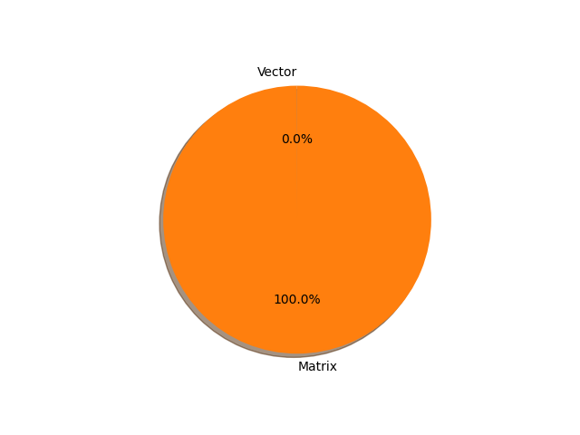

# t5-small parameter information

**Number of layers: [ 131 ]**

**Number of parameters: [ 60.51M ]**

**Proportional of each form** (%)

| Vector | Matrix | 
|  --- | --- |
| 24.43 | 75.57 | 

**Proportional of parameters by form** (%)

| Vector | Matrix | 
|  --- | --- |
| 0.03 | 99.97 | 

**Layer information**

| Name | Shape | Squeezed shape | Number of parameters | Form |
| --- | --- | --- | --- | --- |
| shared.weight | (32128, 512) | (32128, 512) | 16449536 | Matrix |
| encoder.block.0.layer.0.SelfAttention.q.weight | (512, 512) | (512, 512) | 262144 | Matrix |
| encoder.block.0.layer.0.SelfAttention.k.weight | (512, 512) | (512, 512) | 262144 | Matrix |
| encoder.block.0.layer.0.SelfAttention.v.weight | (512, 512) | (512, 512) | 262144 | Matrix |
| encoder.block.0.layer.0.SelfAttention.o.weight | (512, 512) | (512, 512) | 262144 | Matrix |
| encoder.block.0.layer.0.SelfAttention.relative_attention_bias.weight | (32, 8) | (32, 8) | 256 | Matrix |
| encoder.block.0.layer.0.layer_norm.weight | (512,) | (512,) | 512 | Vector |
| encoder.block.0.layer.1.DenseReluDense.wi.weight | (2048, 512) | (2048, 512) | 1048576 | Matrix |
| encoder.block.0.layer.1.DenseReluDense.wo.weight | (512, 2048) | (512, 2048) | 1048576 | Matrix |
| encoder.block.0.layer.1.layer_norm.weight | (512,) | (512,) | 512 | Vector |
| encoder.block.1.layer.0.SelfAttention.q.weight | (512, 512) | (512, 512) | 262144 | Matrix |
| encoder.block.1.layer.0.SelfAttention.k.weight | (512, 512) | (512, 512) | 262144 | Matrix |
| encoder.block.1.layer.0.SelfAttention.v.weight | (512, 512) | (512, 512) | 262144 | Matrix |
| encoder.block.1.layer.0.SelfAttention.o.weight | (512, 512) | (512, 512) | 262144 | Matrix |
| encoder.block.1.layer.0.layer_norm.weight | (512,) | (512,) | 512 | Vector |
| encoder.block.1.layer.1.DenseReluDense.wi.weight | (2048, 512) | (2048, 512) | 1048576 | Matrix |
| encoder.block.1.layer.1.DenseReluDense.wo.weight | (512, 2048) | (512, 2048) | 1048576 | Matrix |
| encoder.block.1.layer.1.layer_norm.weight | (512,) | (512,) | 512 | Vector |
| encoder.block.2.layer.0.SelfAttention.q.weight | (512, 512) | (512, 512) | 262144 | Matrix |
| encoder.block.2.layer.0.SelfAttention.k.weight | (512, 512) | (512, 512) | 262144 | Matrix |
| encoder.block.2.layer.0.SelfAttention.v.weight | (512, 512) | (512, 512) | 262144 | Matrix |
| encoder.block.2.layer.0.SelfAttention.o.weight | (512, 512) | (512, 512) | 262144 | Matrix |
| encoder.block.2.layer.0.layer_norm.weight | (512,) | (512,) | 512 | Vector |
| encoder.block.2.layer.1.DenseReluDense.wi.weight | (2048, 512) | (2048, 512) | 1048576 | Matrix |
| encoder.block.2.layer.1.DenseReluDense.wo.weight | (512, 2048) | (512, 2048) | 1048576 | Matrix |
| encoder.block.2.layer.1.layer_norm.weight | (512,) | (512,) | 512 | Vector |
| encoder.block.3.layer.0.SelfAttention.q.weight | (512, 512) | (512, 512) | 262144 | Matrix |
| encoder.block.3.layer.0.SelfAttention.k.weight | (512, 512) | (512, 512) | 262144 | Matrix |
| encoder.block.3.layer.0.SelfAttention.v.weight | (512, 512) | (512, 512) | 262144 | Matrix |
| encoder.block.3.layer.0.SelfAttention.o.weight | (512, 512) | (512, 512) | 262144 | Matrix |
| encoder.block.3.layer.0.layer_norm.weight | (512,) | (512,) | 512 | Vector |
| encoder.block.3.layer.1.DenseReluDense.wi.weight | (2048, 512) | (2048, 512) | 1048576 | Matrix |
| encoder.block.3.layer.1.DenseReluDense.wo.weight | (512, 2048) | (512, 2048) | 1048576 | Matrix |
| encoder.block.3.layer.1.layer_norm.weight | (512,) | (512,) | 512 | Vector |
| encoder.block.4.layer.0.SelfAttention.q.weight | (512, 512) | (512, 512) | 262144 | Matrix |
| encoder.block.4.layer.0.SelfAttention.k.weight | (512, 512) | (512, 512) | 262144 | Matrix |
| encoder.block.4.layer.0.SelfAttention.v.weight | (512, 512) | (512, 512) | 262144 | Matrix |
| encoder.block.4.layer.0.SelfAttention.o.weight | (512, 512) | (512, 512) | 262144 | Matrix |
| encoder.block.4.layer.0.layer_norm.weight | (512,) | (512,) | 512 | Vector |
| encoder.block.4.layer.1.DenseReluDense.wi.weight | (2048, 512) | (2048, 512) | 1048576 | Matrix |
| encoder.block.4.layer.1.DenseReluDense.wo.weight | (512, 2048) | (512, 2048) | 1048576 | Matrix |
| encoder.block.4.layer.1.layer_norm.weight | (512,) | (512,) | 512 | Vector |
| encoder.block.5.layer.0.SelfAttention.q.weight | (512, 512) | (512, 512) | 262144 | Matrix |
| encoder.block.5.layer.0.SelfAttention.k.weight | (512, 512) | (512, 512) | 262144 | Matrix |
| encoder.block.5.layer.0.SelfAttention.v.weight | (512, 512) | (512, 512) | 262144 | Matrix |
| encoder.block.5.layer.0.SelfAttention.o.weight | (512, 512) | (512, 512) | 262144 | Matrix |
| encoder.block.5.layer.0.layer_norm.weight | (512,) | (512,) | 512 | Vector |
| encoder.block.5.layer.1.DenseReluDense.wi.weight | (2048, 512) | (2048, 512) | 1048576 | Matrix |
| encoder.block.5.layer.1.DenseReluDense.wo.weight | (512, 2048) | (512, 2048) | 1048576 | Matrix |
| encoder.block.5.layer.1.layer_norm.weight | (512,) | (512,) | 512 | Vector |
| encoder.final_layer_norm.weight | (512,) | (512,) | 512 | Vector |
| decoder.block.0.layer.0.SelfAttention.q.weight | (512, 512) | (512, 512) | 262144 | Matrix |
| decoder.block.0.layer.0.SelfAttention.k.weight | (512, 512) | (512, 512) | 262144 | Matrix |
| decoder.block.0.layer.0.SelfAttention.v.weight | (512, 512) | (512, 512) | 262144 | Matrix |
| decoder.block.0.layer.0.SelfAttention.o.weight | (512, 512) | (512, 512) | 262144 | Matrix |
| decoder.block.0.layer.0.SelfAttention.relative_attention_bias.weight | (32, 8) | (32, 8) | 256 | Matrix |
| decoder.block.0.layer.0.layer_norm.weight | (512,) | (512,) | 512 | Vector |
| decoder.block.0.layer.1.EncDecAttention.q.weight | (512, 512) | (512, 512) | 262144 | Matrix |
| decoder.block.0.layer.1.EncDecAttention.k.weight | (512, 512) | (512, 512) | 262144 | Matrix |
| decoder.block.0.layer.1.EncDecAttention.v.weight | (512, 512) | (512, 512) | 262144 | Matrix |
| decoder.block.0.layer.1.EncDecAttention.o.weight | (512, 512) | (512, 512) | 262144 | Matrix |
| decoder.block.0.layer.1.layer_norm.weight | (512,) | (512,) | 512 | Vector |
| decoder.block.0.layer.2.DenseReluDense.wi.weight | (2048, 512) | (2048, 512) | 1048576 | Matrix |
| decoder.block.0.layer.2.DenseReluDense.wo.weight | (512, 2048) | (512, 2048) | 1048576 | Matrix |
| decoder.block.0.layer.2.layer_norm.weight | (512,) | (512,) | 512 | Vector |
| decoder.block.1.layer.0.SelfAttention.q.weight | (512, 512) | (512, 512) | 262144 | Matrix |
| decoder.block.1.layer.0.SelfAttention.k.weight | (512, 512) | (512, 512) | 262144 | Matrix |
| decoder.block.1.layer.0.SelfAttention.v.weight | (512, 512) | (512, 512) | 262144 | Matrix |
| decoder.block.1.layer.0.SelfAttention.o.weight | (512, 512) | (512, 512) | 262144 | Matrix |
| decoder.block.1.layer.0.layer_norm.weight | (512,) | (512,) | 512 | Vector |
| decoder.block.1.layer.1.EncDecAttention.q.weight | (512, 512) | (512, 512) | 262144 | Matrix |
| decoder.block.1.layer.1.EncDecAttention.k.weight | (512, 512) | (512, 512) | 262144 | Matrix |
| decoder.block.1.layer.1.EncDecAttention.v.weight | (512, 512) | (512, 512) | 262144 | Matrix |
| decoder.block.1.layer.1.EncDecAttention.o.weight | (512, 512) | (512, 512) | 262144 | Matrix |
| decoder.block.1.layer.1.layer_norm.weight | (512,) | (512,) | 512 | Vector |
| decoder.block.1.layer.2.DenseReluDense.wi.weight | (2048, 512) | (2048, 512) | 1048576 | Matrix |
| decoder.block.1.layer.2.DenseReluDense.wo.weight | (512, 2048) | (512, 2048) | 1048576 | Matrix |
| decoder.block.1.layer.2.layer_norm.weight | (512,) | (512,) | 512 | Vector |
| decoder.block.2.layer.0.SelfAttention.q.weight | (512, 512) | (512, 512) | 262144 | Matrix |
| decoder.block.2.layer.0.SelfAttention.k.weight | (512, 512) | (512, 512) | 262144 | Matrix |
| decoder.block.2.layer.0.SelfAttention.v.weight | (512, 512) | (512, 512) | 262144 | Matrix |
| decoder.block.2.layer.0.SelfAttention.o.weight | (512, 512) | (512, 512) | 262144 | Matrix |
| decoder.block.2.layer.0.layer_norm.weight | (512,) | (512,) | 512 | Vector |
| decoder.block.2.layer.1.EncDecAttention.q.weight | (512, 512) | (512, 512) | 262144 | Matrix |
| decoder.block.2.layer.1.EncDecAttention.k.weight | (512, 512) | (512, 512) | 262144 | Matrix |
| decoder.block.2.layer.1.EncDecAttention.v.weight | (512, 512) | (512, 512) | 262144 | Matrix |
| decoder.block.2.layer.1.EncDecAttention.o.weight | (512, 512) | (512, 512) | 262144 | Matrix |
| decoder.block.2.layer.1.layer_norm.weight | (512,) | (512,) | 512 | Vector |
| decoder.block.2.layer.2.DenseReluDense.wi.weight | (2048, 512) | (2048, 512) | 1048576 | Matrix |
| decoder.block.2.layer.2.DenseReluDense.wo.weight | (512, 2048) | (512, 2048) | 1048576 | Matrix |
| decoder.block.2.layer.2.layer_norm.weight | (512,) | (512,) | 512 | Vector |
| decoder.block.3.layer.0.SelfAttention.q.weight | (512, 512) | (512, 512) | 262144 | Matrix |
| decoder.block.3.layer.0.SelfAttention.k.weight | (512, 512) | (512, 512) | 262144 | Matrix |
| decoder.block.3.layer.0.SelfAttention.v.weight | (512, 512) | (512, 512) | 262144 | Matrix |
| decoder.block.3.layer.0.SelfAttention.o.weight | (512, 512) | (512, 512) | 262144 | Matrix |
| decoder.block.3.layer.0.layer_norm.weight | (512,) | (512,) | 512 | Vector |
| decoder.block.3.layer.1.EncDecAttention.q.weight | (512, 512) | (512, 512) | 262144 | Matrix |
| decoder.block.3.layer.1.EncDecAttention.k.weight | (512, 512) | (512, 512) | 262144 | Matrix |
| decoder.block.3.layer.1.EncDecAttention.v.weight | (512, 512) | (512, 512) | 262144 | Matrix |
| decoder.block.3.layer.1.EncDecAttention.o.weight | (512, 512) | (512, 512) | 262144 | Matrix |
| decoder.block.3.layer.1.layer_norm.weight | (512,) | (512,) | 512 | Vector |
| decoder.block.3.layer.2.DenseReluDense.wi.weight | (2048, 512) | (2048, 512) | 1048576 | Matrix |
| decoder.block.3.layer.2.DenseReluDense.wo.weight | (512, 2048) | (512, 2048) | 1048576 | Matrix |
| decoder.block.3.layer.2.layer_norm.weight | (512,) | (512,) | 512 | Vector |
| decoder.block.4.layer.0.SelfAttention.q.weight | (512, 512) | (512, 512) | 262144 | Matrix |
| decoder.block.4.layer.0.SelfAttention.k.weight | (512, 512) | (512, 512) | 262144 | Matrix |
| decoder.block.4.layer.0.SelfAttention.v.weight | (512, 512) | (512, 512) | 262144 | Matrix |
| decoder.block.4.layer.0.SelfAttention.o.weight | (512, 512) | (512, 512) | 262144 | Matrix |
| decoder.block.4.layer.0.layer_norm.weight | (512,) | (512,) | 512 | Vector |
| decoder.block.4.layer.1.EncDecAttention.q.weight | (512, 512) | (512, 512) | 262144 | Matrix |
| decoder.block.4.layer.1.EncDecAttention.k.weight | (512, 512) | (512, 512) | 262144 | Matrix |
| decoder.block.4.layer.1.EncDecAttention.v.weight | (512, 512) | (512, 512) | 262144 | Matrix |
| decoder.block.4.layer.1.EncDecAttention.o.weight | (512, 512) | (512, 512) | 262144 | Matrix |
| decoder.block.4.layer.1.layer_norm.weight | (512,) | (512,) | 512 | Vector |
| decoder.block.4.layer.2.DenseReluDense.wi.weight | (2048, 512) | (2048, 512) | 1048576 | Matrix |
| decoder.block.4.layer.2.DenseReluDense.wo.weight | (512, 2048) | (512, 2048) | 1048576 | Matrix |
| decoder.block.4.layer.2.layer_norm.weight | (512,) | (512,) | 512 | Vector |
| decoder.block.5.layer.0.SelfAttention.q.weight | (512, 512) | (512, 512) | 262144 | Matrix |
| decoder.block.5.layer.0.SelfAttention.k.weight | (512, 512) | (512, 512) | 262144 | Matrix |
| decoder.block.5.layer.0.SelfAttention.v.weight | (512, 512) | (512, 512) | 262144 | Matrix |
| decoder.block.5.layer.0.SelfAttention.o.weight | (512, 512) | (512, 512) | 262144 | Matrix |
| decoder.block.5.layer.0.layer_norm.weight | (512,) | (512,) | 512 | Vector |
| decoder.block.5.layer.1.EncDecAttention.q.weight | (512, 512) | (512, 512) | 262144 | Matrix |
| decoder.block.5.layer.1.EncDecAttention.k.weight | (512, 512) | (512, 512) | 262144 | Matrix |
| decoder.block.5.layer.1.EncDecAttention.v.weight | (512, 512) | (512, 512) | 262144 | Matrix |
| decoder.block.5.layer.1.EncDecAttention.o.weight | (512, 512) | (512, 512) | 262144 | Matrix |
| decoder.block.5.layer.1.layer_norm.weight | (512,) | (512,) | 512 | Vector |
| decoder.block.5.layer.2.DenseReluDense.wi.weight | (2048, 512) | (2048, 512) | 1048576 | Matrix |
| decoder.block.5.layer.2.DenseReluDense.wo.weight | (512, 2048) | (512, 2048) | 1048576 | Matrix |
| decoder.block.5.layer.2.layer_norm.weight | (512,) | (512,) | 512 | Vector |
| decoder.final_layer_norm.weight | (512,) | (512,) | 512 | Vector |

