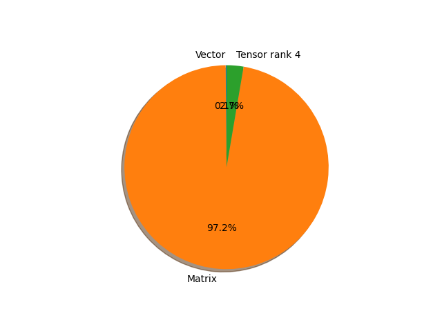

# vit_b_32 parameter information

**Number of layers: [ 152 ]**

**Number of parameters: [ 88.22M ]**

**Proportional of each form** (%)

| Vector | Matrix | Tensor rank 4 | 
|  --- | --- | --- |
| 66.45 | 32.89 | 0.66 | 

**Proportional of parameters by form** (%)

| Vector | Matrix | Tensor rank 4 | 
|  --- | --- | --- |
| 0.14 | 97.19 | 2.67 | 

**Layer information**

| Name | Shape | Squeezed shape | Number of parameters | Form |
| --- | --- | --- | --- | --- |
| class_token | (1, 1, 768) | (768,) | 768 | Vector |
| conv_proj.weight | (768, 3, 32, 32) | (768, 3, 32, 32) | 2359296 | Tensor rank 4 |
| conv_proj.bias | (768,) | (768,) | 768 | Vector |
| encoder.pos_embedding | (1, 50, 768) | (50, 768) | 38400 | Matrix |
| encoder.layers.encoder_layer_0.ln_1.weight | (768,) | (768,) | 768 | Vector |
| encoder.layers.encoder_layer_0.ln_1.bias | (768,) | (768,) | 768 | Vector |
| encoder.layers.encoder_layer_0.self_attention.in_proj_weight | (2304, 768) | (2304, 768) | 1769472 | Matrix |
| encoder.layers.encoder_layer_0.self_attention.in_proj_bias | (2304,) | (2304,) | 2304 | Vector |
| encoder.layers.encoder_layer_0.self_attention.out_proj.weight | (768, 768) | (768, 768) | 589824 | Matrix |
| encoder.layers.encoder_layer_0.self_attention.out_proj.bias | (768,) | (768,) | 768 | Vector |
| encoder.layers.encoder_layer_0.ln_2.weight | (768,) | (768,) | 768 | Vector |
| encoder.layers.encoder_layer_0.ln_2.bias | (768,) | (768,) | 768 | Vector |
| encoder.layers.encoder_layer_0.mlp.0.weight | (3072, 768) | (3072, 768) | 2359296 | Matrix |
| encoder.layers.encoder_layer_0.mlp.0.bias | (3072,) | (3072,) | 3072 | Vector |
| encoder.layers.encoder_layer_0.mlp.3.weight | (768, 3072) | (768, 3072) | 2359296 | Matrix |
| encoder.layers.encoder_layer_0.mlp.3.bias | (768,) | (768,) | 768 | Vector |
| encoder.layers.encoder_layer_1.ln_1.weight | (768,) | (768,) | 768 | Vector |
| encoder.layers.encoder_layer_1.ln_1.bias | (768,) | (768,) | 768 | Vector |
| encoder.layers.encoder_layer_1.self_attention.in_proj_weight | (2304, 768) | (2304, 768) | 1769472 | Matrix |
| encoder.layers.encoder_layer_1.self_attention.in_proj_bias | (2304,) | (2304,) | 2304 | Vector |
| encoder.layers.encoder_layer_1.self_attention.out_proj.weight | (768, 768) | (768, 768) | 589824 | Matrix |
| encoder.layers.encoder_layer_1.self_attention.out_proj.bias | (768,) | (768,) | 768 | Vector |
| encoder.layers.encoder_layer_1.ln_2.weight | (768,) | (768,) | 768 | Vector |
| encoder.layers.encoder_layer_1.ln_2.bias | (768,) | (768,) | 768 | Vector |
| encoder.layers.encoder_layer_1.mlp.0.weight | (3072, 768) | (3072, 768) | 2359296 | Matrix |
| encoder.layers.encoder_layer_1.mlp.0.bias | (3072,) | (3072,) | 3072 | Vector |
| encoder.layers.encoder_layer_1.mlp.3.weight | (768, 3072) | (768, 3072) | 2359296 | Matrix |
| encoder.layers.encoder_layer_1.mlp.3.bias | (768,) | (768,) | 768 | Vector |
| encoder.layers.encoder_layer_2.ln_1.weight | (768,) | (768,) | 768 | Vector |
| encoder.layers.encoder_layer_2.ln_1.bias | (768,) | (768,) | 768 | Vector |
| encoder.layers.encoder_layer_2.self_attention.in_proj_weight | (2304, 768) | (2304, 768) | 1769472 | Matrix |
| encoder.layers.encoder_layer_2.self_attention.in_proj_bias | (2304,) | (2304,) | 2304 | Vector |
| encoder.layers.encoder_layer_2.self_attention.out_proj.weight | (768, 768) | (768, 768) | 589824 | Matrix |
| encoder.layers.encoder_layer_2.self_attention.out_proj.bias | (768,) | (768,) | 768 | Vector |
| encoder.layers.encoder_layer_2.ln_2.weight | (768,) | (768,) | 768 | Vector |
| encoder.layers.encoder_layer_2.ln_2.bias | (768,) | (768,) | 768 | Vector |
| encoder.layers.encoder_layer_2.mlp.0.weight | (3072, 768) | (3072, 768) | 2359296 | Matrix |
| encoder.layers.encoder_layer_2.mlp.0.bias | (3072,) | (3072,) | 3072 | Vector |
| encoder.layers.encoder_layer_2.mlp.3.weight | (768, 3072) | (768, 3072) | 2359296 | Matrix |
| encoder.layers.encoder_layer_2.mlp.3.bias | (768,) | (768,) | 768 | Vector |
| encoder.layers.encoder_layer_3.ln_1.weight | (768,) | (768,) | 768 | Vector |
| encoder.layers.encoder_layer_3.ln_1.bias | (768,) | (768,) | 768 | Vector |
| encoder.layers.encoder_layer_3.self_attention.in_proj_weight | (2304, 768) | (2304, 768) | 1769472 | Matrix |
| encoder.layers.encoder_layer_3.self_attention.in_proj_bias | (2304,) | (2304,) | 2304 | Vector |
| encoder.layers.encoder_layer_3.self_attention.out_proj.weight | (768, 768) | (768, 768) | 589824 | Matrix |
| encoder.layers.encoder_layer_3.self_attention.out_proj.bias | (768,) | (768,) | 768 | Vector |
| encoder.layers.encoder_layer_3.ln_2.weight | (768,) | (768,) | 768 | Vector |
| encoder.layers.encoder_layer_3.ln_2.bias | (768,) | (768,) | 768 | Vector |
| encoder.layers.encoder_layer_3.mlp.0.weight | (3072, 768) | (3072, 768) | 2359296 | Matrix |
| encoder.layers.encoder_layer_3.mlp.0.bias | (3072,) | (3072,) | 3072 | Vector |
| encoder.layers.encoder_layer_3.mlp.3.weight | (768, 3072) | (768, 3072) | 2359296 | Matrix |
| encoder.layers.encoder_layer_3.mlp.3.bias | (768,) | (768,) | 768 | Vector |
| encoder.layers.encoder_layer_4.ln_1.weight | (768,) | (768,) | 768 | Vector |
| encoder.layers.encoder_layer_4.ln_1.bias | (768,) | (768,) | 768 | Vector |
| encoder.layers.encoder_layer_4.self_attention.in_proj_weight | (2304, 768) | (2304, 768) | 1769472 | Matrix |
| encoder.layers.encoder_layer_4.self_attention.in_proj_bias | (2304,) | (2304,) | 2304 | Vector |
| encoder.layers.encoder_layer_4.self_attention.out_proj.weight | (768, 768) | (768, 768) | 589824 | Matrix |
| encoder.layers.encoder_layer_4.self_attention.out_proj.bias | (768,) | (768,) | 768 | Vector |
| encoder.layers.encoder_layer_4.ln_2.weight | (768,) | (768,) | 768 | Vector |
| encoder.layers.encoder_layer_4.ln_2.bias | (768,) | (768,) | 768 | Vector |
| encoder.layers.encoder_layer_4.mlp.0.weight | (3072, 768) | (3072, 768) | 2359296 | Matrix |
| encoder.layers.encoder_layer_4.mlp.0.bias | (3072,) | (3072,) | 3072 | Vector |
| encoder.layers.encoder_layer_4.mlp.3.weight | (768, 3072) | (768, 3072) | 2359296 | Matrix |
| encoder.layers.encoder_layer_4.mlp.3.bias | (768,) | (768,) | 768 | Vector |
| encoder.layers.encoder_layer_5.ln_1.weight | (768,) | (768,) | 768 | Vector |
| encoder.layers.encoder_layer_5.ln_1.bias | (768,) | (768,) | 768 | Vector |
| encoder.layers.encoder_layer_5.self_attention.in_proj_weight | (2304, 768) | (2304, 768) | 1769472 | Matrix |
| encoder.layers.encoder_layer_5.self_attention.in_proj_bias | (2304,) | (2304,) | 2304 | Vector |
| encoder.layers.encoder_layer_5.self_attention.out_proj.weight | (768, 768) | (768, 768) | 589824 | Matrix |
| encoder.layers.encoder_layer_5.self_attention.out_proj.bias | (768,) | (768,) | 768 | Vector |
| encoder.layers.encoder_layer_5.ln_2.weight | (768,) | (768,) | 768 | Vector |
| encoder.layers.encoder_layer_5.ln_2.bias | (768,) | (768,) | 768 | Vector |
| encoder.layers.encoder_layer_5.mlp.0.weight | (3072, 768) | (3072, 768) | 2359296 | Matrix |
| encoder.layers.encoder_layer_5.mlp.0.bias | (3072,) | (3072,) | 3072 | Vector |
| encoder.layers.encoder_layer_5.mlp.3.weight | (768, 3072) | (768, 3072) | 2359296 | Matrix |
| encoder.layers.encoder_layer_5.mlp.3.bias | (768,) | (768,) | 768 | Vector |
| encoder.layers.encoder_layer_6.ln_1.weight | (768,) | (768,) | 768 | Vector |
| encoder.layers.encoder_layer_6.ln_1.bias | (768,) | (768,) | 768 | Vector |
| encoder.layers.encoder_layer_6.self_attention.in_proj_weight | (2304, 768) | (2304, 768) | 1769472 | Matrix |
| encoder.layers.encoder_layer_6.self_attention.in_proj_bias | (2304,) | (2304,) | 2304 | Vector |
| encoder.layers.encoder_layer_6.self_attention.out_proj.weight | (768, 768) | (768, 768) | 589824 | Matrix |
| encoder.layers.encoder_layer_6.self_attention.out_proj.bias | (768,) | (768,) | 768 | Vector |
| encoder.layers.encoder_layer_6.ln_2.weight | (768,) | (768,) | 768 | Vector |
| encoder.layers.encoder_layer_6.ln_2.bias | (768,) | (768,) | 768 | Vector |
| encoder.layers.encoder_layer_6.mlp.0.weight | (3072, 768) | (3072, 768) | 2359296 | Matrix |
| encoder.layers.encoder_layer_6.mlp.0.bias | (3072,) | (3072,) | 3072 | Vector |
| encoder.layers.encoder_layer_6.mlp.3.weight | (768, 3072) | (768, 3072) | 2359296 | Matrix |
| encoder.layers.encoder_layer_6.mlp.3.bias | (768,) | (768,) | 768 | Vector |
| encoder.layers.encoder_layer_7.ln_1.weight | (768,) | (768,) | 768 | Vector |
| encoder.layers.encoder_layer_7.ln_1.bias | (768,) | (768,) | 768 | Vector |
| encoder.layers.encoder_layer_7.self_attention.in_proj_weight | (2304, 768) | (2304, 768) | 1769472 | Matrix |
| encoder.layers.encoder_layer_7.self_attention.in_proj_bias | (2304,) | (2304,) | 2304 | Vector |
| encoder.layers.encoder_layer_7.self_attention.out_proj.weight | (768, 768) | (768, 768) | 589824 | Matrix |
| encoder.layers.encoder_layer_7.self_attention.out_proj.bias | (768,) | (768,) | 768 | Vector |
| encoder.layers.encoder_layer_7.ln_2.weight | (768,) | (768,) | 768 | Vector |
| encoder.layers.encoder_layer_7.ln_2.bias | (768,) | (768,) | 768 | Vector |
| encoder.layers.encoder_layer_7.mlp.0.weight | (3072, 768) | (3072, 768) | 2359296 | Matrix |
| encoder.layers.encoder_layer_7.mlp.0.bias | (3072,) | (3072,) | 3072 | Vector |
| encoder.layers.encoder_layer_7.mlp.3.weight | (768, 3072) | (768, 3072) | 2359296 | Matrix |
| encoder.layers.encoder_layer_7.mlp.3.bias | (768,) | (768,) | 768 | Vector |
| encoder.layers.encoder_layer_8.ln_1.weight | (768,) | (768,) | 768 | Vector |
| encoder.layers.encoder_layer_8.ln_1.bias | (768,) | (768,) | 768 | Vector |
| encoder.layers.encoder_layer_8.self_attention.in_proj_weight | (2304, 768) | (2304, 768) | 1769472 | Matrix |
| encoder.layers.encoder_layer_8.self_attention.in_proj_bias | (2304,) | (2304,) | 2304 | Vector |
| encoder.layers.encoder_layer_8.self_attention.out_proj.weight | (768, 768) | (768, 768) | 589824 | Matrix |
| encoder.layers.encoder_layer_8.self_attention.out_proj.bias | (768,) | (768,) | 768 | Vector |
| encoder.layers.encoder_layer_8.ln_2.weight | (768,) | (768,) | 768 | Vector |
| encoder.layers.encoder_layer_8.ln_2.bias | (768,) | (768,) | 768 | Vector |
| encoder.layers.encoder_layer_8.mlp.0.weight | (3072, 768) | (3072, 768) | 2359296 | Matrix |
| encoder.layers.encoder_layer_8.mlp.0.bias | (3072,) | (3072,) | 3072 | Vector |
| encoder.layers.encoder_layer_8.mlp.3.weight | (768, 3072) | (768, 3072) | 2359296 | Matrix |
| encoder.layers.encoder_layer_8.mlp.3.bias | (768,) | (768,) | 768 | Vector |
| encoder.layers.encoder_layer_9.ln_1.weight | (768,) | (768,) | 768 | Vector |
| encoder.layers.encoder_layer_9.ln_1.bias | (768,) | (768,) | 768 | Vector |
| encoder.layers.encoder_layer_9.self_attention.in_proj_weight | (2304, 768) | (2304, 768) | 1769472 | Matrix |
| encoder.layers.encoder_layer_9.self_attention.in_proj_bias | (2304,) | (2304,) | 2304 | Vector |
| encoder.layers.encoder_layer_9.self_attention.out_proj.weight | (768, 768) | (768, 768) | 589824 | Matrix |
| encoder.layers.encoder_layer_9.self_attention.out_proj.bias | (768,) | (768,) | 768 | Vector |
| encoder.layers.encoder_layer_9.ln_2.weight | (768,) | (768,) | 768 | Vector |
| encoder.layers.encoder_layer_9.ln_2.bias | (768,) | (768,) | 768 | Vector |
| encoder.layers.encoder_layer_9.mlp.0.weight | (3072, 768) | (3072, 768) | 2359296 | Matrix |
| encoder.layers.encoder_layer_9.mlp.0.bias | (3072,) | (3072,) | 3072 | Vector |
| encoder.layers.encoder_layer_9.mlp.3.weight | (768, 3072) | (768, 3072) | 2359296 | Matrix |
| encoder.layers.encoder_layer_9.mlp.3.bias | (768,) | (768,) | 768 | Vector |
| encoder.layers.encoder_layer_10.ln_1.weight | (768,) | (768,) | 768 | Vector |
| encoder.layers.encoder_layer_10.ln_1.bias | (768,) | (768,) | 768 | Vector |
| encoder.layers.encoder_layer_10.self_attention.in_proj_weight | (2304, 768) | (2304, 768) | 1769472 | Matrix |
| encoder.layers.encoder_layer_10.self_attention.in_proj_bias | (2304,) | (2304,) | 2304 | Vector |
| encoder.layers.encoder_layer_10.self_attention.out_proj.weight | (768, 768) | (768, 768) | 589824 | Matrix |
| encoder.layers.encoder_layer_10.self_attention.out_proj.bias | (768,) | (768,) | 768 | Vector |
| encoder.layers.encoder_layer_10.ln_2.weight | (768,) | (768,) | 768 | Vector |
| encoder.layers.encoder_layer_10.ln_2.bias | (768,) | (768,) | 768 | Vector |
| encoder.layers.encoder_layer_10.mlp.0.weight | (3072, 768) | (3072, 768) | 2359296 | Matrix |
| encoder.layers.encoder_layer_10.mlp.0.bias | (3072,) | (3072,) | 3072 | Vector |
| encoder.layers.encoder_layer_10.mlp.3.weight | (768, 3072) | (768, 3072) | 2359296 | Matrix |
| encoder.layers.encoder_layer_10.mlp.3.bias | (768,) | (768,) | 768 | Vector |
| encoder.layers.encoder_layer_11.ln_1.weight | (768,) | (768,) | 768 | Vector |
| encoder.layers.encoder_layer_11.ln_1.bias | (768,) | (768,) | 768 | Vector |
| encoder.layers.encoder_layer_11.self_attention.in_proj_weight | (2304, 768) | (2304, 768) | 1769472 | Matrix |
| encoder.layers.encoder_layer_11.self_attention.in_proj_bias | (2304,) | (2304,) | 2304 | Vector |
| encoder.layers.encoder_layer_11.self_attention.out_proj.weight | (768, 768) | (768, 768) | 589824 | Matrix |
| encoder.layers.encoder_layer_11.self_attention.out_proj.bias | (768,) | (768,) | 768 | Vector |
| encoder.layers.encoder_layer_11.ln_2.weight | (768,) | (768,) | 768 | Vector |
| encoder.layers.encoder_layer_11.ln_2.bias | (768,) | (768,) | 768 | Vector |
| encoder.layers.encoder_layer_11.mlp.0.weight | (3072, 768) | (3072, 768) | 2359296 | Matrix |
| encoder.layers.encoder_layer_11.mlp.0.bias | (3072,) | (3072,) | 3072 | Vector |
| encoder.layers.encoder_layer_11.mlp.3.weight | (768, 3072) | (768, 3072) | 2359296 | Matrix |
| encoder.layers.encoder_layer_11.mlp.3.bias | (768,) | (768,) | 768 | Vector |
| encoder.ln.weight | (768,) | (768,) | 768 | Vector |
| encoder.ln.bias | (768,) | (768,) | 768 | Vector |
| heads.head.weight | (1000, 768) | (1000, 768) | 768000 | Matrix |
| heads.head.bias | (1000,) | (1000,) | 1000 | Vector |

